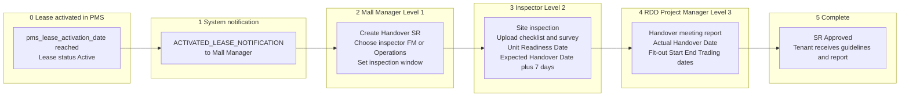
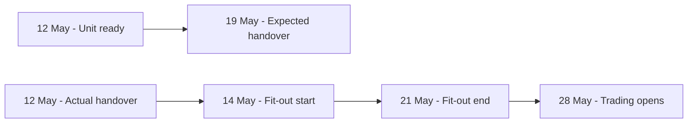
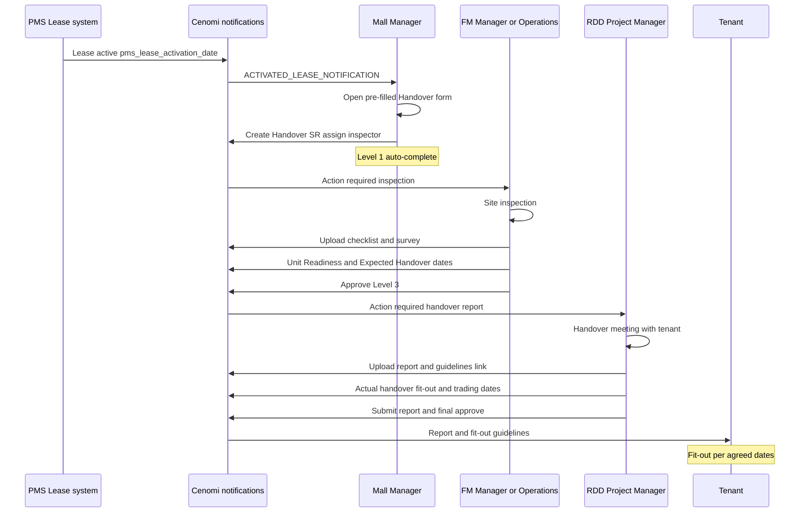

# Handover — Business User Journey & Process Flow

**Audience:** Mall operations, leasing, RDD, and business stakeholders  
**Scope:** Fit-Out & Handover → **Handover** service request only  
**Technical API reference:** [`handover-service-request.md`](./handover-service-request.md)

This document describes **what happens, who does it, and which dates matter** — from the day a lease becomes active in PMS through physical handover and the tenant’s fit-out / trading plan.

---

## Purpose

When a tenant’s lease is **activated** in the property management system (PMS), Cenomi must formally **hand over the unit** so the tenant can begin fit-out and eventually open for trading. The Handover service request orchestrates:

1. **Who** inspects the unit before handover  
2. **When** the unit is ready and when handover is expected  
3. **When** handover actually happened  
4. **When** fit-out starts, ends, and trading begins  

Those dates feed later mall operations (fit-out tracking, confirmations, and reporting).

---

## End-to-end journey (summary)

---

## Phase 0 — Lease activation (trigger)

| What happens | Detail |
|---|---|
| **Trigger** | PMS records **`pms_lease_activation_date`** — the date the lease becomes active. |
| **System action** | Backend sends **`ACTIVATED_LEASE_NOTIFICATION`** to the **Mall Manager** for that mall / lease. |
| **Mall Manager action** | Opens the notification in Cenomi Tenant Web. The link pre-fills **tenant** and **lease** on the new Handover form (`serviceReqWrapper` activated-lease landing). |
| **Who can start the SR** | Primarily **Mall Manager**; users with `CAN_RAISE_HANDOVER_SR` / Super Admin may also open the flow. |

> Until the Mall Manager creates the Handover SR, no formal inspection or handover timeline exists in Cenomi for that lease.

---

## Phase 1 — Mall Manager creates the Handover request (Workflow Level 1)

**Role:** Mall Manager  
**Outcome:** Handover service request is created; Mall Manager’s step is **auto-completed**; the assigned inspector’s step becomes **In progress**.

### What the Mall Manager provides

| Field (business meaning) | Description |
|---|---|
| **Tenant / Lease / Unit** | Which brand and unit are being handed over. |
| **Title & description** | Short summary of the handover request. |
| **Inspection window** | **Start date** and **end date** — when the pre-handover inspection should take place. |
| **Inspection done by** | Who will run the site inspection at Level 2: **FM Manager** or **Operations**. |
| **Comments** | Context for downstream approvers. |

### Decision: FM Manager vs Operations

| Choice | Typical use |
|---|---|
| **FM Manager** | Facility-led inspection (MEP, base build, common services). |
| **Operations** | Mall operations–led inspection (mall standards, coordination). |

The selected role becomes the **Level 2 approver** in the workflow (`inspection_done_by`).

### After submission

| Workflow level | Role | Status |
|---|---|---|
| 1 | Mall Manager | **Finished** (automatic) |
| 2 | FM Manager *or* Operations | **In progress** |
| 3 | RDD Project Manager (`DD_ENGINEER`) | Yet to start |

---

## Phase 2 — Site inspection & readiness dates (Workflow Level 2)

**Role:** **FM Manager** or **Operations** (whoever was assigned in Phase 1)  
**Outcome:** Unit is inspected, evidence is uploaded, and **planned** handover dates are recorded.

### Activities

1. **Conduct on-site inspection** within the window set by the Mall Manager.  
2. **Upload supporting documents**, for example:
   - Handover checklist  
   - Site survey  
   - COP / other checklist documents  
3. **Record readiness dates** (required at this level):

| Date | Business meaning | How it is set |
|---|---|---|
| **Unit Readiness Date** | The date the **unit is physically ready** to be handed over to the tenant (shell complete, services available per contract). | Entered by FM / Operations at Level 2. |
| **Expected Handover Date** | The date by which handover **should be completed** — business rule: **Unit Readiness Date + 7 calendar days**. | **Auto-calculated** in the UI when Unit Readiness Date is set (read-only field; default +7 days). |

4. **Approve** the request to pass work to the RDD Project Manager.

### Example (Level 2 dates)

| Date type | Example |
|---|---|
| Unit Readiness Date | 12 May 2026 |
| Expected Handover Date | 19 May 2026 *(12 May + 7 days)* |

> **Expected Handover Date** is a **planning** date. The **actual** handover date is confirmed later by RDD (Phase 3).

---

## Phase 3 — Handover meeting & contractual dates (Workflow Level 3)

**Role:** **RDD Project Manager** (`DD_ENGINEER`)  
**Outcome:** Handover meeting report is filed, **actual** handover and **fit-out / trading** dates are agreed and locked in.

### Activities

1. **Attend / chair handover meeting** with tenant and mall stakeholders.  
2. **Upload Handover Meeting Report** (`DR_SR_HANDOVER_REPORT`) with outcome:
   - **Approved**  
   - **Approved with changes**  
   - **Disapproved** (rejected report type if applicable)  
3. **Add guidelines link** (tenant fit-out guidelines URL) — RDD-only field.  
4. **Enter four key dates** on the handover report:

| Date | Business meaning |
|---|---|
| **Actual Handover Date** | The date the unit was **physically handed over** to the tenant. |
| **Fit-out Start Date** | When the tenant **starts** fit-out works in the unit. |
| **Fit-out End Date** | When the tenant **completes** fit-out works. |
| **Trading Date** | When the store is **expected to open** for trading / operations. |

5. **Submit report** (status moves to **Report submitted**).  
6. **Final approve** — Handover SR reaches **Approved**.

### Date ordering rule

The system enforces chronological order:

**Actual Handover Date** → **Fit-out Start Date** → **Fit-out End Date** → **Trading Date**

Each date must be **on or after** the previous one.

### Example (Level 3 dates)

Building on the Level 2 example:

| Date | Example | Notes |
|---|---|---|
| Unit Readiness Date *(from L2)* | 12 May 2026 | Plan — unit ready |
| Expected Handover Date *(from L2)* | 19 May 2026 | Plan — handover target |
| **Actual Handover Date** | 12 May 2026 | Handover physically done |
| **Fit-out Start Date** | 14 May 2026 | Tenant starts build-out |
| **Fit-out End Date** | 21 May 2026 | Fit-out complete |
| **Trading Date** | 28 May 2026 | Store opens |

---

## Phase 4 — Completion & tenant communication

| What happens | Detail |
|---|---|
| **SR status** | **Approved** after RDD final approval. |
| **Tenant** | Receives handover report and guidelines via fit-out / handover notifications (e.g. report & guidelines to tenant). |
| **Downstream** | Actual handover, fit-out, and trading dates support later **Operations confirmation** SRs (confirm handover, fit-out start/complete, trading) and fit-out dashboard tracking. |

---

## Roles & responsibilities

| Role | Phase | Responsibility |
|---|---|---|
| **PMS / Backend** | 0 | Activate lease on `pms_lease_activation_date`; fire notification. |
| **Mall Manager** | 1 | Create Handover SR; assign inspector; set inspection window. |
| **FM Manager** or **Operations** | 2 | Inspect unit; upload evidence; set Unit Readiness & Expected Handover dates; approve. |
| **RDD Project Manager** | 3 | Run handover meeting; upload report; record actual handover + fit-out + trading dates; final approve. |
| **Tenant** | 4+ | Receives report/guidelines; proceeds with fit-out per agreed dates. |

---

## Documents (business names)

| Document | Who typically uploads | Purpose |
|---|---|---|
| Handover checklist | FM / Operations | Confirms handover prerequisites. |
| Site survey | FM / Operations | Records site condition. |
| COP / other checklist | FM / Operations | Compliance or mall-specific checks. |
| Other handover documents | Leasing Admin / others | Supporting material. |
| **Handover meeting report** | RDD Project Manager | Official record of handover + the four contractual dates. |
| Rejected handover report | RDD Project Manager | If handover is not approved. |

---

## Status progression (business view)

| Stage | Who | Business state |
|---|---|---|
| Lease activated | System | Notification sent to Mall Manager |
| SR created | Mall Manager | Handover process started |
| Inspection in progress | FM / Operations | Site visit & documents |
| Awaiting RDD | RDD PM | Handover meeting & report |
| Report submitted | RDD PM | Dates captured, pending final sign-off |
| **Approved** | RDD PM | Handover complete in Cenomi |

---

## Key dates glossary

| Term | Set by | Meaning |
|---|---|---|
| `pms_lease_activation_date` | PMS | Lease became active; starts the handover process. |
| Inspection start / end | Mall Manager | Window for pre-handover site inspection. |
| **Unit Readiness Date** | FM / Operations (L2) | Unit is ready to hand over. |
| **Expected Handover Date** | System default (+7 from readiness) | Target date handover should be done. |
| **Actual Handover Date** | RDD PM (L3) | Date handover actually occurred. |
| **Fit-out Start Date** | RDD PM (L3) | Tenant fit-out begins. |
| **Fit-out End Date** | RDD PM (L3) | Tenant fit-out ends. |
| **Trading Date** | RDD PM (L3) | Store opening / trading start. |

---

## Swimlane — detailed user journey

---

## Related material

| Document | Content |
|---|---|
| [`handover-service-request.md`](./handover-service-request.md) | API payloads, `sr_operations`, file upload parameters |
| [`docs/service-request-v2-developer-guide.md`](../../../../../docs/service-request-v2-developer-guide.md) | V2 workflow patterns (Handover uses legacy fit-out flow) |
