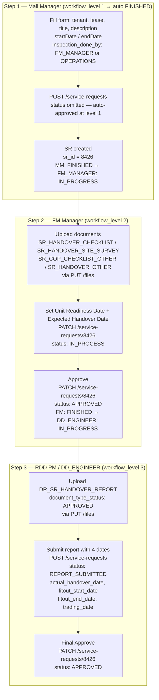

# Handover Service Request — Complete Technical Reference

**Service Category:** `FIT_OUT_AND_HANDOVER` | **Sub Category:** `HANDOVER`  
**Assignment Type:** `workflow`  
**Base URL:** `http://localhost:4200/backend_api` (proxied via `NEXT_PUBLIC_API_BASE_PATH`)

---

## Workflow Overview



---

## Step 1 — Mall Manager: Create SR

**`POST /service-requests`**

The SR is **auto-approved at workflow level 1** for Mall Manager. No `status` field is sent. The backend creates the SR and immediately moves `MALL_MANAGER` to `FINISHED`, setting `FM_MANAGER` to `IN_PROGRESS`.

### Request Body

```json
{
  "payload": {
    "mall": "Jawharat Jeddah",
    "brand": "Brand Under Armour",
    "lease": "t0105712",
    "notes": "",
    "title": "Testing",
    "endDate": "2026-05-13T13:50:00.000Z",
    "comments": "Test",
    "startDate": "2026-05-12T13:50:00.000Z",
    "attachments": "",
    "description": "test",
    "documents_ids": [],
    "guideLineLink": "",
    "inspectionDoneBy": "FM_MANAGER",
    "lease_brand_mall": "t0105712 - Brand Under Armour - Jawharat Jeddah",
    "inspection_done_by": "FM_MANAGER",
    "document_status_map": [],
    "unit_readiness_date": "",
    "expected_handover_date": "",
    "company_name": "116",
    "tenant_contact": "",
    "user_action": null,
    "unit_codes": ["FF050"],
    "contracted_area": 420,
    "city": "Jeddah",
    "brand_id": 267,
    "tenant_profile_id": 116,
    "contract_id": 95404,
    "property_id": 3041,
    "startDateLT": "12/05/2026 07:20 PM",
    "endDateLT": "13/05/2026 07:20 PM"
  },
  "title": "Testing",
  "tenant_profile_id": 116,
  "property_id": 3041,
  "service_category": "FIT_OUT_AND_HANDOVER",
  "sub_category": "HANDOVER",
  "lease_code": "t0105712",
  "lease_id": 95404,
  "service_request_id": ""
}
```

### Key fields

| Field | Value | Notes |
|---|---|---|
| `service_category` | `FIT_OUT_AND_HANDOVER` | Fixed for this SR type |
| `sub_category` | `HANDOVER` | Fixed |
| `inspection_done_by` | `FM_MANAGER` or `OPERATIONS` | Who performs inspection |
| `service_request_id` | `""` | Empty on create |
| `status` | _(not sent)_ | Auto-approved at level 1 |
| `startDate` / `endDate` | ISO 8601 UTC | Inspection window |
| `startDateLT` / `endDateLT` | `DD/MM/YYYY HH:MM AM/PM` | Local-time display strings |

### `sr_operations` after creation

| level | role | status |
|---|---|---|
| 1 | `MALL_MANAGER` | `FINISHED` (auto) |
| 2 | `FM_MANAGER` | `IN_PROGRESS` |
| 3 | `DD_ENGINEER` | `YET_TO_START` |

---

## Step 2a — FM Manager: Upload Document

**`PUT /files` (query params only — binary file as body)**

Called once per document. Repeat for each of: `SR_HANDOVER_CHECKLIST`, `SR_HANDOVER_SITE_SURVEY`, `SR_COP_CHECKLIST_OTHER`, `SR_HANDOVER_OTHER`.

```
PUT /files
  ?query=SERVICE_REQUEST
  &file_extension=pdf
  &document_type_id=SR_HANDOVER_CHECKLIST
  &lease_id=95404
  &brand_id=267
  &property_id=3041
  &lease_code=t0105712
  &sr_id=8426
  &tenant_profile_id=116
  &document_type_status=
  &signed_url=true
  &file_name=Invoice-O6N7AWAR-0001%20(1).pdf___
```

| Param | Description |
|---|---|
| `query` | Always `SERVICE_REQUEST` for SR attachments |
| `document_type_id` | One of `SR_HANDOVER_CHECKLIST`, `SR_HANDOVER_SITE_SURVEY`, `SR_COP_CHECKLIST_OTHER`, `SR_HANDOVER_OTHER` |
| `sr_id` | SR id returned from Step 1 |
| `document_type_status` | Empty for FM uploads |
| `signed_url` | `true` — backend returns a signed URL |
| `file_name` | Original filename suffixed with `___` |

**Response** returns `document_id` (UUID) — e.g. `a74ef88b-b1fa-483d-8d3e-a74cb9d2833c`. Add this to `documents_ids` in the next PATCH.

---

## Step 2b — FM Manager: Save Unit Readiness + Uploaded Docs

**`PATCH /service-requests/8426`**

After uploading files and setting unit readiness / expected handover dates, FM saves progress with `status: IN_PROCESS`.

### Request Body

```json
{
  "payload": {
    "mall": "Jawharat Jeddah",
    "brand": "Brand Under Armour",
    "lease": "t0105712",
    "notes": "",
    "title": "Testing",
    "endDate": "2026-05-13T13:50:00.000Z",
    "comments": "Test",
    "startDate": "2026-05-12T13:50:00.000Z",
    "attachments": "",
    "description": "test",
    "documents_ids": [
      "a74ef88b-b1fa-483d-8d3e-a74cb9d2833c"
    ],
    "guideLineLink": "",
    "inspectionDoneBy": "FM_MANAGER",
    "lease_brand_mall": "t0105712 - Brand Under Armour - Jawharat Jeddah",
    "inspection_done_by": "FM_MANAGER",
    "document_status_map": [
      {
        "id": "a74ef88b-b1fa-483d-8d3e-a74cb9d2833c",
        "document_status": "",
        "handover_date": "",
        "actual_handover_date": "",
        "fitout_start_date": "",
        "fitout_end_date": "",
        "trading_date": ""
      }
    ],
    "unit_readiness_date": "2026-05-12",
    "expected_handover_date": "2026-05-20",
    "company_name": "116",
    "tenant_contact": "",
    "brand_id": 267,
    "city": "Jeddah",
    "contract_id": 95404,
    "contracted_area": 420,
    "endDateLT": "13/05/2026 07:20 PM",
    "property_id": 3041,
    "startDateLT": "12/05/2026 07:20 PM",
    "tenant_profile_id": 116,
    "unit_codes": ["FF050"],
    "user_action": null,
    "ref_no": "8426",
    "updated_at": "2026-05-11T13:50:43.277381Z",
    "created_at": "2026-05-11T13:50:43.277381Z",
    "sub_category": "HANDOVER",
    "document_id": "",
    "lease_id": "t0105712",
    "sr_id": "8426",
    "current_sr_status": "IN_PROCESS",
    "sr_operations": [
      {
        "service_request_operation_id": 18842,
        "assigned_role": "MALL_MANAGER",
        "workflow_level": 1,
        "status": "FINISHED",
        "updated_by": "mall manager",
        "role_name_en": "Mall Manager",
        "role_name_ar": "مدير المجمع التجاري"
      },
      {
        "service_request_operation_id": 18843,
        "assigned_role": "FM_MANAGER",
        "workflow_level": 2,
        "status": "IN_PROGRESS",
        "updated_by": "mall manager",
        "role_name_en": "FM Manager",
        "role_name_ar": "مدير إدارة المرافق"
      },
      {
        "service_request_operation_id": 18844,
        "assigned_role": "DD_ENGINEER",
        "workflow_level": 3,
        "status": "YET_TO_START",
        "updated_by": "mall manager",
        "role_name_en": "RDD Project Manager",
        "role_name_ar": "مدير المشاريع RDD"
      }
    ],
    "document_saved": true
  },
  "title": "Testing",
  "tenant_profile_id": 116,
  "property_id": 3041,
  "service_category": "FIT_OUT_AND_HANDOVER",
  "sub_category": "HANDOVER",
  "lease_code": "t0105712",
  "lease_id": 95404,
  "status": "IN_PROCESS",
  "service_request_id": "8426"
}
```

### Key fields

| Field | Value | Notes |
|---|---|---|
| `unit_readiness_date` | `YYYY-MM-DD` | Date unit is ready |
| `expected_handover_date` | `YYYY-MM-DD` | Typically unit readiness + 7 days |
| `documents_ids` | `[uuid, …]` | All uploaded document UUIDs accumulated |
| `document_status_map` | `[{id, document_status, …dates}]` | One entry per document; dates empty at this stage |
| `status` | `IN_PROCESS` | Saves without advancing workflow |

---

## Step 2c — FM Manager: Approve

**`PATCH /service-requests/8426`**

FM Manager clicks Approve. This advances `FM_MANAGER` → `FINISHED` and `DD_ENGINEER` → `IN_PROGRESS`.

### Request Body

```json
{
  "payload": {
    "mall": "Jawharat Jeddah",
    "brand": "Brand Under Armour",
    "lease": "t0105712",
    "notes": "",
    "title": "Testing",
    "endDate": "2026-05-13T13:50:00.000Z",
    "comments": "Test",
    "startDate": "2026-05-12T13:50:00.000Z",
    "attachments": "",
    "description": "test",
    "documents_ids": [
      "a74ef88b-b1fa-483d-8d3e-a74cb9d2833c"
    ],
    "guideLineLink": "",
    "inspectionDoneBy": "FM_MANAGER",
    "lease_brand_mall": "t0105712 - Brand Under Armour - Jawharat Jeddah",
    "inspection_done_by": "FM_MANAGER",
    "document_status_map": [
      {
        "actual_handover_date": "",
        "document_status": "",
        "expected_handover_date": "2026-05-20",
        "fitout_end_date": "",
        "fitout_start_date": "",
        "handover_date": "",
        "id": "a74ef88b-b1fa-483d-8d3e-a74cb9d2833c",
        "trading_date": ""
      }
    ],
    "unit_readiness_date": "2026-05-12",
    "expected_handover_date": "2026-05-20",
    "company_name": "116",
    "tenant_contact": "",
    "brand_id": 267,
    "city": "Jeddah",
    "contract_id": 95404,
    "contracted_area": 420,
    "created_at": "2026-05-11T13:50:43.277381Z",
    "current_sr_status": "IN_PROCESS",
    "document_id": "",
    "document_saved": true,
    "endDateLT": "13/05/2026 07:20 PM",
    "lease_id": "t0105712",
    "property_id": 3041,
    "ref_no": "8426",
    "sr_id": "8426",
    "sr_operations": [
      {
        "service_request_operation_id": 18842,
        "assigned_role": "MALL_MANAGER",
        "workflow_level": 1,
        "status": "FINISHED",
        "updated_by": "mall manager",
        "role_name_en": "Mall Manager",
        "role_name_ar": "مدير المجمع التجاري"
      },
      {
        "service_request_operation_id": 18843,
        "assigned_role": "FM_MANAGER",
        "workflow_level": 2,
        "status": "IN_PROGRESS",
        "updated_by": "mall manager",
        "role_name_en": "FM Manager",
        "role_name_ar": "مدير إدارة المرافق"
      },
      {
        "service_request_operation_id": 18844,
        "assigned_role": "DD_ENGINEER",
        "workflow_level": 3,
        "status": "YET_TO_START",
        "updated_by": "mall manager",
        "role_name_en": "RDD Project Manager",
        "role_name_ar": "مدير المشاريع RDD"
      }
    ],
    "startDateLT": "12/05/2026 07:20 PM",
    "sub_category": "HANDOVER",
    "tenant_profile_id": 116,
    "unit_codes": ["FF050"],
    "updated_at": "2026-05-11T13:50:43.277381Z",
    "user_action": null
  },
  "user_action": null,
  "status": "APPROVED",
  "comment": "ok",
  "title": "Testing",
  "sub_category": "HANDOVER"
}
```

### Key differences from Step 2b

| Field | Value | Notes |
|---|---|---|
| `status` | `APPROVED` | Top-level — advances workflow |
| `comment` | `"ok"` | Approval comment |
| `user_action` | `null` | Top-level |
| No `service_category` / `lease_id` / `service_request_id` | — | Minimal PATCH shape |

### `sr_operations` after FM approval

| level | role | status |
|---|---|---|
| 1 | `MALL_MANAGER` | `FINISHED` |
| 2 | `FM_MANAGER` | `FINISHED` |
| 3 | `DD_ENGINEER` | `IN_PROGRESS` |

---

## Step 3a — RDD PM: Upload Handover Meeting Report

**`PUT /files` (query params only — binary file as body)**

```
PUT /files
  ?query=SERVICE_REQUEST
  &file_extension=pdf
  &document_type_id=DR_SR_HANDOVER_REPORT
  &lease_id=95404
  &brand_id=267
  &property_id=3041
  &lease_code=t0105712
  &sr_id=8426
  &tenant_profile_id=116
  &document_type_status=APPROVED
  &signed_url=true
  &file_name=Invoice-O6N7AWAR-0001%20(1).pdf___
```

| Param | Value | Notes |
|---|---|---|
| `document_type_id` | `DR_SR_HANDOVER_REPORT` | Draft handover report; use `SR_REJECTED_HANDOVER_REPORT` on disapproval |
| `document_type_status` | `APPROVED` | Required for the handover report document |

**Response** returns `document_id` — e.g. `184c1912-31af-4822-a0c9-cf47d0afc7cd`.

---

## Step 3b — RDD PM: Submit Report (with four dates)

**`POST /service-requests`**

RDD PM submits the handover meeting report with `status: REPORT_SUBMITTED`. The four key dates are carried inside `document_status_map` for the `DR_SR_HANDOVER_REPORT` document.

> Date ordering rule (validated in `MultipleAttachments.tsx`):  
> **`actual_handover_date`** ≤ **`fitout_start_date`** ≤ **`fitout_end_date`** ≤ **`trading_date`**

### Request Body

```json
{
  "payload": {
    "mall": "Jawharat Jeddah",
    "brand": "Brand Under Armour",
    "lease": "t0105712",
    "notes": "",
    "title": "Testing",
    "endDate": "2026-05-13T13:50:00.000Z",
    "comments": "Test",
    "startDate": "2026-05-12T13:50:00.000Z",
    "attachments": "",
    "description": "test",
    "documents_ids": [
      "a74ef88b-b1fa-483d-8d3e-a74cb9d2833c",
      "184c1912-31af-4822-a0c9-cf47d0afc7cd"
    ],
    "guideLineLink": "http://google.com",
    "inspectionDoneBy": "FM_MANAGER",
    "lease_brand_mall": "t0105712 - Brand Under Armour - Jawharat Jeddah",
    "inspection_done_by": "FM_MANAGER",
    "document_status_map": [
      {
        "actual_handover_date": "",
        "document_status": "",
        "expected_handover_date": "2026-05-20",
        "fitout_end_date": "",
        "fitout_start_date": "",
        "handover_date": "",
        "id": "a74ef88b-b1fa-483d-8d3e-a74cb9d2833c",
        "trading_date": ""
      },
      {
        "id": "184c1912-31af-4822-a0c9-cf47d0afc7cd",
        "document_status": "APPROVED",
        "handover_date": "",
        "actual_handover_date": "12/05/2026",
        "fitout_start_date": "14/05/2026",
        "fitout_end_date": "21/05/2026",
        "trading_date": "28/05/2026"
      }
    ],
    "unit_readiness_date": "2026-05-12",
    "expected_handover_date": "2026-05-20",
    "company_name": "116",
    "tenant_contact": "",
    "brand_id": 267,
    "city": "Jeddah",
    "contract_id": 95404,
    "contracted_area": 420,
    "created_at": "2026-05-11T13:50:43.277381Z",
    "current_sr_status": "IN_PROCESS",
    "document_id": "",
    "document_saved": true,
    "endDateLT": "13/05/2026 07:20 PM",
    "lease_id": "t0105712",
    "property_id": 3041,
    "ref_no": "8426",
    "sr_id": "8426",
    "sr_operations": [
      {
        "service_request_operation_id": 18842,
        "assigned_role": "MALL_MANAGER",
        "workflow_level": 1,
        "status": "FINISHED",
        "updated_by": "mall manager",
        "role_name_en": "Mall Manager",
        "role_name_ar": "مدير المجمع التجاري"
      },
      {
        "service_request_operation_id": 18843,
        "assigned_role": "FM_MANAGER",
        "workflow_level": 2,
        "status": "FINISHED",
        "updated_by": "Facility Manager",
        "role_name_en": "FM Manager",
        "role_name_ar": "مدير إدارة المرافق"
      },
      {
        "service_request_operation_id": 18844,
        "assigned_role": "DD_ENGINEER",
        "workflow_level": 3,
        "status": "IN_PROGRESS",
        "updated_by": "Facility Manager",
        "role_name_en": "RDD Project Manager",
        "role_name_ar": "مدير المشاريع RDD"
      }
    ],
    "startDateLT": "12/05/2026 07:20 PM",
    "sub_category": "HANDOVER",
    "tenant_profile_id": 116,
    "unit_codes": ["FF050"],
    "updated_at": "2026-05-11T13:50:43.277381Z",
    "user_action": null
  },
  "title": "Testing",
  "tenant_profile_id": 116,
  "property_id": 3041,
  "service_category": "FIT_OUT_AND_HANDOVER",
  "sub_category": "HANDOVER",
  "lease_code": "t0105712",
  "lease_id": 95404,
  "status": "REPORT_SUBMITTED",
  "service_request_id": "8426"
}
```

### The four handover dates (inside `document_status_map` for `DR_SR_HANDOVER_REPORT`)

| Field | Example value | Format | Description |
|---|---|---|---|
| `actual_handover_date` | `12/05/2026` | `DD/MM/YYYY` | When unit was physically handed to tenant |
| `fitout_start_date` | `14/05/2026` | `DD/MM/YYYY` | Tenant fitout work begins |
| `fitout_end_date` | `21/05/2026` | `DD/MM/YYYY` | Tenant fitout work ends |
| `trading_date` | `28/05/2026` | `DD/MM/YYYY` | Store opens for trading |

These four dates are also echoed in `document_status_map` of the PATCH in Step 3c.

---

## Step 3c — RDD PM: Final Approve

**`PATCH /service-requests/8426`**

RDD PM clicks Approve after submitting the report. This is the final step — SR moves to `APPROVED`.

### Request Body

```json
{
  "payload": {
    "mall": "Jawharat Jeddah",
    "brand": "Brand Under Armour",
    "lease": "t0105712",
    "notes": "",
    "title": "Testing",
    "endDate": "2026-05-13T13:50:00.000Z",
    "comments": "Test",
    "startDate": "2026-05-12T13:50:00.000Z",
    "attachments": "",
    "description": "test",
    "documents_ids": [
      "a74ef88b-b1fa-483d-8d3e-a74cb9d2833c",
      "184c1912-31af-4822-a0c9-cf47d0afc7cd"
    ],
    "guideLineLink": "http://google.com",
    "inspectionDoneBy": "FM_MANAGER",
    "lease_brand_mall": "t0105712 - Brand Under Armour - Jawharat Jeddah",
    "inspection_done_by": "FM_MANAGER",
    "document_status_map": [
      {
        "actual_handover_date": "",
        "document_status": "",
        "expected_handover_date": "2026-05-20",
        "fitout_end_date": "",
        "fitout_start_date": "",
        "handover_date": "",
        "id": "a74ef88b-b1fa-483d-8d3e-a74cb9d2833c",
        "trading_date": "",
        "unit_readiness_date": "2026-05-12"
      },
      {
        "actual_handover_date": "12/05/2026",
        "document_status": "APPROVED",
        "expected_handover_date": "2026-05-20",
        "fitout_end_date": "21/05/2026",
        "fitout_start_date": "14/05/2026",
        "handover_date": "",
        "id": "184c1912-31af-4822-a0c9-cf47d0afc7cd",
        "trading_date": "28/05/2026",
        "unit_readiness_date": "2026-05-12"
      }
    ],
    "unit_readiness_date": "2026-05-12",
    "expected_handover_date": "2026-05-20",
    "company_name": "116",
    "tenant_contact": "",
    "brand_id": 267,
    "city": "Jeddah",
    "contract_id": 95404,
    "contracted_area": 420,
    "created_at": "2026-05-11T13:50:43.277381Z",
    "current_sr_status": "REPORT_SUBMITTED",
    "document_id": "",
    "document_saved": true,
    "endDateLT": "13/05/2026 07:20 PM",
    "lease_id": "t0105712",
    "property_id": 3041,
    "ref_no": "8426",
    "sr_id": "8426",
    "sr_operations": [
      {
        "service_request_operation_id": 18842,
        "assigned_role": "MALL_MANAGER",
        "workflow_level": 1,
        "status": "FINISHED",
        "updated_by": "mall manager",
        "role_name_en": "Mall Manager",
        "role_name_ar": "مدير المجمع التجاري"
      },
      {
        "service_request_operation_id": 18843,
        "assigned_role": "FM_MANAGER",
        "workflow_level": 2,
        "status": "FINISHED",
        "updated_by": "Facility Manager",
        "role_name_en": "FM Manager",
        "role_name_ar": "مدير إدارة المرافق"
      },
      {
        "service_request_operation_id": 18844,
        "assigned_role": "DD_ENGINEER",
        "workflow_level": 3,
        "status": "IN_PROGRESS",
        "updated_by": "Facility Manager",
        "role_name_en": "RDD Project Manager",
        "role_name_ar": "مدير المشاريع RDD"
      }
    ],
    "startDateLT": "12/05/2026 07:20 PM",
    "sub_category": "HANDOVER",
    "tenant_profile_id": 116,
    "unit_codes": ["FF050"],
    "updated_at": "2026-05-11T13:50:43.277381Z",
    "user_action": null
  },
  "user_action": null,
  "status": "APPROVED",
  "comment": "apporved",
  "title": "Testing",
  "sub_category": "HANDOVER"
}
```

---

## SR Status Progression

```
(created) → IN_PROCESS → IN_PROCESS → IN_PROCESS → REPORT_SUBMITTED → APPROVED
              MM auto     FM saves     FM approves   RDD PM submits     RDD PM approves
```

| Step | Actor | HTTP | Status sent | Resulting SR status |
|---|---|---|---|---|
| 1 — Create | Mall Manager | POST | _(none)_ | `IN_PROCESS` (auto-approved at level 1) |
| 2b — Save docs + dates | FM Manager | PATCH | `IN_PROCESS` | `IN_PROCESS` |
| 2c — Approve | FM Manager | PATCH | `APPROVED` | `IN_PROCESS` (level 2 done, level 3 starts) |
| 3b — Submit report | RDD PM | POST | `REPORT_SUBMITTED` | `REPORT_SUBMITTED` |
| 3c — Final approve | RDD PM | PATCH | `APPROVED` | `APPROVED` |

---

## `sr_operations` State Machine

| `workflow_level` | `assigned_role` | Statuses across the workflow |
|---|---|---|
| 1 | `MALL_MANAGER` | `FINISHED` (immediately on create) |
| 2 | `FM_MANAGER` | `IN_PROGRESS` → `FINISHED` (after Step 2c) |
| 3 | `DD_ENGINEER` | `YET_TO_START` → `IN_PROGRESS` → _(FINISHED on final approve)_ |

---

## Document Types per Role

| Role (id) | Allowed document types | `document_type_status` |
|---|---|---|
| FM Manager (20) | `SR_HANDOVER_CHECKLIST`, `SR_HANDOVER_SITE_SURVEY`, `SR_COP_CHECKLIST_OTHER` | _(empty)_ |
| Operations (81) | `SR_HANDOVER_CHECKLIST`, `SR_HANDOVER_SITE_SURVEY`, `SR_COP_CHECKLIST_OTHER` | _(empty)_ |
| Leasing Admin (11) | `SR_HANDOVER_OTHER` | _(empty)_ |
| RDD PM (12) | `SR_HANDOVER_OTHER`, `DR_SR_HANDOVER_REPORT`, `SR_REJECTED_HANDOVER_REPORT` | `APPROVED` / `APPROVED_WITH_CHANGES` / `DISAPPROVED` |

---

## Form Skeleton (from workflow API)

```json
{
  "skelton": [
    {
      "title": "handover",
      "section": [
        {
          "id": 500, "grid": true,
          "fields": [
            { "id": 501, "name": "tenant", "type": "TenantSelect", "admin": true, "label": "formtenant", "required": true, "showUsers": false, "placeHolder": "placeholderTenant" },
            { "id": 502, "name": "lease_brand_mall", "type": "LeaseBrandMall", "label": "LeaseID", "required": true, "tenantReq": true, "placeHolder": "formLeaseBrandMall", "fieldsUpdate": ["unit_codes","city","contracted_area","brand_id","tenant_profile_id"], "enableUnitCodes": true },
            { "id": 504, "name": "city", "type": "input", "label": "location", "disabled": true, "readonly": true, "placeHolder": "formPlaceholderLocation" },
            { "id": 505, "name": "contracted_area", "type": "input", "label": "AreaSqm", "disabled": true, "readonly": true, "placeHolder": "formPlaceholderArea" }
          ]
        },
        { "id": 506, "fields": [{ "id": 507, "name": "title", "type": "input", "label": "formTitle", "required": true, "tenantReq": true, "placeHolder": "formPlaceholderTitle" }] },
        { "id": 508, "fields": [{ "id": 509, "name": "description", "type": "textarea", "label": "formDescription", "required": true, "tenantReq": true, "placeHolder": "" }] },
        {
          "id": 510, "grid": true, "grid_col": 3,
          "fields": [
            { "id": 511, "name": "startDate", "type": "dateTimePicker", "label": "Start Date", "required": true, "tenantReq": true },
            { "id": 512, "name": "endDate", "type": "dateTimePicker", "label": "End Date", "required": true, "tenantReq": true },
            { "id": 513, "name": "inspection_done_by", "type": "dropdown", "label": "formInspectionDoneBy", "options": [{ "label": "formInspectionDoneByFMManager", "value": "FM_MANAGER" }, { "label": "formInspectionDoneByOperations", "value": "OPERATIONS" }], "required": true, "tenantReq": true, "placeHolder": "formPlaceholderInspectionDoneBy" }
          ]
        },
        { "id": 514, "grid": false, "fields": [{ "id": 515, "name": "notes", "type": "textarea", "label": "notes", "placeHolder": "" }] },
        { "id": 520, "roles": [12], "fields": [{ "id": 521, "name": "guideLineLink", "type": "linkInput", "label": "GuideLinesLink", "required": true, "placeHolder": "formGuideLineLink" }] },
        {
          "id": 516, "grid": false, "admin": true, "tenantVisible": false, "roles": [12, 11, 20],
          "fields": [{
            "id": 517, "name": "documents", "type": "multipleAttachments",
            "documentTypeOptions": [
              { "role": 20, "documents": [{ "name": "SR_COP_CHECKLIST_OTHER", "statuses": [] }, { "name": "SR_HANDOVER_CHECKLIST", "statuses": [] }, { "name": "SR_HANDOVER_SITE_SURVEY", "statuses": [] }] },
              { "role": 81, "documents": [{ "name": "SR_COP_CHECKLIST_OTHER", "statuses": [] }, { "name": "SR_HANDOVER_CHECKLIST", "statuses": [] }, { "name": "SR_HANDOVER_SITE_SURVEY", "statuses": [] }] },
              { "role": 11, "documents": [{ "name": "SR_HANDOVER_OTHER", "statuses": [] }] },
              { "role": 12, "documents": [{ "name": "SR_HANDOVER_OTHER", "statuses": [] }, { "name": "DR_SR_HANDOVER_REPORT", "statuses": ["APPROVED", "APPROVED_WITH_CHANGES"] }, { "name": "SR_REJECTED_HANDOVER_REPORT", "statuses": ["DISAPPROVED"] }] }
            ]
          }]
        },
        { "id": 518, "grid": false, "fields": [{ "id": 519, "name": "comments", "type": "textarea", "label": "formComments", "required": true, "tenantReq": true, "placeHolder": "" }] },
        {
          "id": 522, "grid": true, "roles": [20, 81], "title": "Unit readiness and expected handover",
          "fields": [
            { "id": 523, "name": "unit_readiness_date", "type": "date", "label": "Unit Readiness Date", "required": true, "placeHolder": "Select unit readiness date" },
            { "id": 524, "name": "expected_handover_date", "type": "date", "label": "Expected Handover Date (Unit Readiness + 7 days)", "required": true, "placeHolder": "Select expected handover date" }
          ]
        }
      ]
    }
  ],
  "intialState": {
    "admin": { "company_name": "", "tenant_contact": "" },
    "common": {
      "mall": "", "brand": "", "lease": "", "notes": "", "title": "", "endDate": "",
      "comments": "", "documents": [{ "comment": "", "document_id": "", "document_type_id": "SR_HANDOVER_OTHER" }],
      "startDate": "", "attachments": "", "description": "", "documents_ids": [],
      "guideLineLink": "", "inspectionDoneBy": "FM_MANAGER", "lease_brand_mall": "",
      "inspection_done_by": "FM_MANAGER", "document_status_map": [],
      "unit_readiness_date": "", "expected_handover_date": ""
    }
  },
  "assignmentType": "workflow"
}
```

---

## Permissions

Defined in `apps/cenomi-tenant-web/app/api/authenticate-user/route.ts`:

| Capability | Roles |
|---|---|
| `CAN_RAISE_HANDOVER_SR` | Mall Manager, and others per config |
| `CAN_APPROVE_HANDOVER_SR` | FM Manager, DD Engineer |
| `VIEW_FIT_OUT_HANDOVER` | All involved roles |
| `VIEW_FIT_OUT_HANDOVER_INSPECTION` | FM Manager, Operations, DD Engineer |
