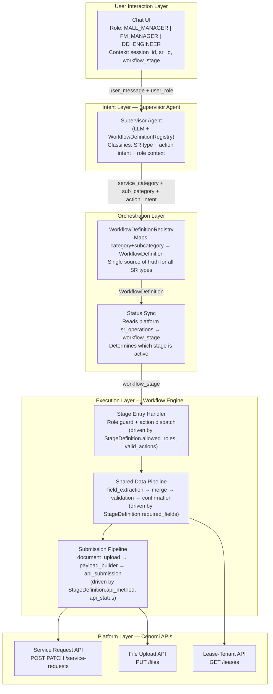

# Agent Architecture — Cenomi Service Request Chatbot

## Contents

1. [The Cenomi Platform — Service Requests as the Operational Model](#1-the-cenomi-platform--service-requests-as-the-operational-model)
2. [Current Architecture (as of RDD Handover Sprint 1)](#2-current-architecture-as-of-rdd-handover-sprint-1)
3. [The Service Request Abstraction](#3-the-service-request-abstraction)
4. [Target Agent Architecture](#4-target-agent-architecture)
5. [Agent Roles and Responsibilities](#5-agent-roles-and-responsibilities)
6. [The Supervisor as an SR Router — Design Deep Dive](#6-the-supervisor-as-an-sr-router--design-deep-dive)
7. [LLM vs Code Boundary per Layer](#7-llm-vs-code-boundary-per-layer)
8. [Evolution Path](#8-evolution-path)
9. [Design Principles](#9-design-principles)

---

## 1. The Cenomi Platform — Service Requests as the Operational Model

Every business operation in the Cenomi mall ecosystem is modeled as a **Service Request (SR)**. An SR is not just a ticket — it is a structured, multi-stage, role-governed workflow that captures:

- **Who initiates it** (a Mall Manager, a Tenant, a leasing admin)
- **What it's about** (service_category + sub_category)
- **Who reviews/approves at each stage** (role assignments per workflow level)
- **What data is required at each stage** (fields, documents, dates)
- **What the final platform state is** (approved, rejected, completed)

This is the operational model of the platform. The chatbot is a **conversational interface over this SR system** — not a general-purpose assistant, but a structured SR creation and lifecycle management tool.

### Known SR types (Cenomi platform)

```
FIT_OUT_AND_HANDOVER
  └── HANDOVER                     ← reference implementation (this chatbot)
  └── OPERATIONS_CONFIRMATION      ← confirm handover milestones (next target)

MAINTENANCE
  └── GENERAL
  └── EMERGENCY

LEASE
  └── RENEWAL
  └── MODIFICATION

FACILITY
  └── PARKING
  └── COMMON_AREA
```

Each SR type has its own `service_category`, `sub_category`, workflow stages, roles, required fields, and platform API shape. The chatbot architecture must be designed to serve **all of them** through the same agent infrastructure.

**The implication:** The agent system is not a Handover chatbot — it is a **Service Request Orchestration Platform** built on a conversational interface. The RDD Handover is the first workflow onboarded; it is the reference for how all future workflows will be onboarded.

---

## 2. Current Architecture (as of RDD Handover Sprint 1)

### What exists today

A single-agent, multi-stage LangGraph implemented for `FIT_OUT_AND_HANDOVER / HANDOVER`.

```
┌─────────────────────────────────────────────────────────────────────┐
│  Next.js Frontend (role selector, chat UI, action buttons)          │
└───────────────────────────────────┬─────────────────────────────────┘
                                    │ POST /api/chat/service-request
┌───────────────────────────────────▼─────────────────────────────────┐
│  FastAPI — ChatOrchestrationService                                  │
│  • Injection guard → session load → trace start → graph invoke      │
└───────────────────────────────────┬─────────────────────────────────┘
                                    │ ainvoke(initial_state)
┌───────────────────────────────────▼─────────────────────────────────┐
│  LangGraph — ServiceRequestGraph (single compiled graph)            │
│                                                                      │
│  [load_session] → [sr_status_sync] → [supervisor] → [registry]      │
│       ↓                                                              │
│  [handover_entry | fm_review_entry | rdd_review_entry]              │
│       ↓                                                              │
│  [field_extraction] → [merge_state] → [lease_lookup] → [validation] │
│       ↓                                                              │
│  [confirmation | fm_confirmation | rdd_confirmation]                 │
│       ↓                                                              │
│  [document_upload] → [payload_builder] → [api_submission]           │
│       ↓                                                              │
│  [response_generation] → [save_state]                               │
└───────────────────────────────────┬─────────────────────────────────┘
                                    │
┌───────────────────────────────────▼─────────────────────────────────┐
│  Cenomi Platform APIs                                                │
│  • Lease-Tenant API     • Service Request API     • File Upload API │
└─────────────────────────────────────────────────────────────────────┘
```

### What works (Sprint 1 baseline)

- `FIT_OUT_AND_HANDOVER / HANDOVER` — all 4 lifecycle phases E2E
- `CREATE_SR` (Mall Manager): lease lookup, field collection, confirmation, POST
- `FM_REVIEW` (FM Manager): document upload bridge, readiness date, PATCH approve
- `RDD_REVIEW` (DD Engineer): report upload, 4 contractual dates, POST REPORT_SUBMITTED, PATCH APPROVED
- Role/auth pipeline: `user_role` → `AuthContext.roles` → permission enforcement
- Observability: full trace hierarchy per turn

### Current limitations

- **Single workflow hardcoded**: All schema, node logic, supervisor intents tied to HANDOVER
- **No workflow registry abstraction**: Adding a second SR type requires duplicating files
- **Supervisor is SR-type-specific**: Intents are `CREATE_HANDOVER_SERVICE_REQUEST`, not generic
- **Stage entry nodes are per-workflow**: `fm_review_entry_node.py` knows it's FM/Handover
- **No cross-SR context**: User cannot have an active Handover SR and ask about Maintenance in the same session

---

## 3. The Service Request Abstraction

The key architectural insight is:

> **Service Requests are the operational layer. The agent's job is to help users work with the right SR at the right stage.**

This means the chatbot is not "a handover bot" — it is a **Service Request assistant** that happens to currently support the Handover workflow. The agent architecture should be designed around the SR abstraction, not around any specific workflow.

### The SR as the Unit of Work

Every agent interaction maps to one of:

| User intent | SR operation |
|---|---|
| "I want to raise a handover request" | CREATE a new SR of type HANDOVER |
| "I completed the site inspection" | UPDATE an existing HANDOVER SR (FM_REVIEW stage) |
| "Submit the handover report" | SUBMIT action on HANDOVER SR (RDD_REVIEW stage) |
| "What's the status of my handover?" | READ an existing SR |
| "I need to report a maintenance issue" | CREATE a new SR of type MAINTENANCE |

The supervisor's classification job is therefore:
1. **Which SR type?** (`service_category + sub_category`) → resolved via WorkflowDefinitionRegistry
2. **What operation?** (`CREATE | UPDATE | APPROVE | SUBMIT | CHECK_STATUS`) → resolved via intent classification
3. **Which specific SR?** (existing `sr_id` or new) → resolved via session state + status sync

Once these three questions are answered, the system can route deterministically. No further LLM involvement in routing.

### The Layered SR Model

```
┌──────────────────────────────────────────────────────┐
│                    INTENT LAYER                      │
│  "What SR type + what action does the user want?"    │
│  Handled by: Supervisor Agent (LLM classification)  │
└──────────────────────────────┬───────────────────────┘
                               │
┌──────────────────────────────▼───────────────────────┐
│                 ORCHESTRATION LAYER                  │
│  "Which workflow definition handles this SR?"        │
│  "What stage are we at? Who is acting?"              │
│  Handled by: WorkflowDefinitionRegistry + routing    │
└──────────────────────────────┬───────────────────────┘
                               │
┌──────────────────────────────▼───────────────────────┐
│                  EXECUTION LAYER                     │
│  "Collect data, validate, confirm, submit to API"    │
│  Handled by: Workflow Execution Engine (LangGraph)   │
└──────────────────────────────┬───────────────────────┘
                               │
┌──────────────────────────────▼───────────────────────┐
│                  PLATFORM LAYER                      │
│  Cenomi Service Request API, File Upload API, etc.  │
└──────────────────────────────────────────────────────┘
```

---

## 4. Target Agent Architecture

### Overview



### The Three Agents

#### Agent 1 — Supervisor Agent (SR Router)

The supervisor is **the gateway** into the SR system. Its sole job is to answer three questions and then hand off to the orchestration layer:

```
Input:  user_message + user_role + conversation_history + registered_workflows
Output: { service_category, sub_category, action_intent, confidence }
```

It does NOT collect form fields. It does NOT know about stages. It does NOT decide on routing — that is code's job.

**Two-level classification:**
- **Level 1 — SR Identification**: Which workflow category and sub-category does this request belong to? (reads from WorkflowDefinitionRegistry)
- **Level 2 — Action Identification**: What does the user want to DO? (CREATE / APPROVE / UPDATE / CHECK_STATUS / PREVIEW)

#### Agent 2 — Workflow Execution Engine

This is not a single LLM-based agent — it is a **deterministic execution engine** backed by LangGraph. It reads the `WorkflowDefinition` for the current SR type and:
- Routes to the correct stage based on `workflow_stage`
- Enforces role guards per stage
- Drives field collection (LLM extracts, code validates)
- Manages confirmation gates
- Submits to the platform API

The LLM is used **within** the engine for:
- Field extraction from natural language
- Generating clarifying questions when fields are missing
- Generating natural-language responses

All routing, validation, and submission decisions are **pure code**.

#### Agent 3 — Response Generation Agent

A dedicated LLM call that generates the final natural-language response, with full context:
- Current stage + workflow
- Role persona (FM Manager language vs Mall Manager language vs DD Engineer language)
- Missing fields or validation errors
- Platform API result (success / failure)

This agent never makes decisions — it only narrates what has already been decided by the execution layer.

---

## 5. Agent Roles and Responsibilities

### Responsibility Matrix

```
┌─────────────────────────────────────────────────────────────────────────┐
│                      RESPONSIBILITY MATRIX                             │
├────────────────────┬──────────────────────────────────────────────────┤
│   Component        │   Responsibility                                  │
├────────────────────┼──────────────────────────────────────────────────┤
│ Supervisor Agent   │ Identify SR type + action intent                  │
│ (LLM)              │ Route to correct workflow via registry             │
│                    │ Handle multi-turn continuity ("same SR")           │
│                    │ Handle ambiguity (ask clarifying questions)        │
│                    │ NEVER: collect form fields, validate data,         │
│                    │         make routing decisions                     │
├────────────────────┼──────────────────────────────────────────────────┤
│ WorkflowDefinition │ Declare: stages, roles, fields, docs, API config  │
│ Registry           │ Single source of truth for all SR workflows        │
│ (pure data)        │ New workflow = one declaration (no new code)       │
│                    │ Powers: supervisor prompt, routing, validation,    │
│                    │         payload building, permission enforcement   │
├────────────────────┼──────────────────────────────────────────────────┤
│ Status Sync        │ Fetch platform SR status → derive workflow_stage   │
│ (code)             │ Map sr_operations roles+statuses → stage           │
│                    │ Detect stage transitions (FM→RDD→COMPLETED)        │
│                    │ NEVER: modify SR data                              │
├────────────────────┼──────────────────────────────────────────────────┤
│ Stage Entry Node   │ Enforce role guard (allowed_roles from StageDef)  │
│ (code)             │ Dispatch action_override → stage action key        │
│                    │ NEVER: call LLM, build payload, call API           │
├────────────────────┼──────────────────────────────────────────────────┤
│ Field Extraction   │ LLM extraction of field values from user message   │
│ (LLM)              │ Confidence scoring per field                       │
│                    │ NEVER: validate values, make routing decisions      │
├────────────────────┼──────────────────────────────────────────────────┤
│ Merge + Validate   │ Protect backend fields from LLM overwrite          │
│ (code)             │ Auto-compute derived fields (e.g. +7 days rule)    │
│                    │ Validate types, formats, business rules            │
│                    │ Identify missing required fields                   │
├────────────────────┼──────────────────────────────────────────────────┤
│ Confirmation Node  │ Build confirmation card for user review            │
│ (code + LLM)       │ Parse confirm/reject from text or button click     │
│                    │ Gate: no submission without explicit confirmation   │
│                    │ NEVER: decide what to confirm (that's code logic)  │
├────────────────────┼──────────────────────────────────────────────────┤
│ Document Upload    │ Read state["documents"] (from upload API)          │
│ Node (code)        │ Partition FM docs vs RDD report by doc_type_id     │
│                    │ Populate backend_refs for payload builders          │
├────────────────────┼──────────────────────────────────────────────────┤
│ Payload Builder    │ Assemble platform API payload from collected_data  │
│ (code)             │ Apply date format conversions, enrichment          │
│                    │ NEVER: validate data, call LLM                     │
├────────────────────┼──────────────────────────────────────────────────┤
│ API Submission     │ Permission check → HTTP call → result capture      │
│ (code)             │ Audit log + observability                          │
│                    │ NEVER: build payload, call LLM, modify state       │
│                    │         beyond API result fields                   │
├────────────────────┼──────────────────────────────────────────────────┤
│ Response Gen.      │ Generate natural-language response for user         │
│ (LLM)              │ Role-persona aware (FM/MM/DD language)             │
│                    │ Stage-context aware (what to do next)              │
│                    │ NEVER: make routing or submission decisions         │
└────────────────────┴──────────────────────────────────────────────────┘
```

---

## 6. The Supervisor as an SR Router — Design Deep Dive

### Current State: Single-Workflow Classifier

```
user_message → [LLM] → { intent: "CREATE_HANDOVER_SERVICE_REQUEST", confidence: 0.9 }
                                    ↓ hardcoded routing
                          handover_service_request_agent
```

The intent string is tied to one workflow. The supervisor does not know about other SR types.

### Target State: Two-Level SR Router

```
user_message
  + user_role
  + registered_workflows (injected from WorkflowDefinitionRegistry)
  + conversation_history
      ↓
  [LLM — two-level classification]
      ↓
  {
    service_category: "FIT_OUT_AND_HANDOVER",    ← Level 1: which SR domain
    sub_category: "HANDOVER",                     ← Level 1: which SR type
    action_intent: "APPROVE",                     ← Level 2: what to do
    confidence: 0.92
  }
      ↓ pure code routing via WorkflowDefinitionRegistry
  WorkflowDefinition → agent_name → stage routing
```

### How the Supervisor Knows About All SR Types

The supervisor prompt is **dynamically generated** from the `WorkflowDefinitionRegistry`. Every registered workflow is injected into the prompt context at startup:

```python
def build_supervisor_prompt() -> str:
    workflows = all_registered_workflows()
    workflow_context = "\n".join([
        f"- {wf.service_category}/{wf.sub_category}: {wf.display_name}\n"
        f"  Stages: {' → '.join(s.stage for s in wf.stages)}\n"
        f"  Roles: {', '.join(wf.stakeholders)}\n"
        f"  Description: {wf.description}"
        for wf in workflows
    ])
    return SUPERVISOR_TEMPLATE.format(
        registered_workflows=workflow_context
    )
```

**When a new SR type is registered in the registry → the supervisor automatically understands it. No prompt editing required.**

### Role-Aware SR Routing

The supervisor is aware of the user's role and uses it for disambiguation:

```
user_role = "FM_MANAGER" + message = "I want to approve"
→ Supervisor knows: FM Manager only acts on FIT_OUT_AND_HANDOVER/HANDOVER at FM_REVIEW stage
→ Classifies: service_category=FIT_OUT_AND_HANDOVER, sub_category=HANDOVER, action_intent=APPROVE
→ No ambiguity needed

user_role = "MALL_MANAGER" + message = "I want to create a request for the unit"
→ Could be HANDOVER or OPERATIONS_CONFIRMATION
→ Supervisor asks: "Would you like to raise a Handover SR or an Operations Confirmation SR?"

user_role = "DD_ENGINEER" + message = "submit the report"
→ Only workflow for DD_ENGINEER is HANDOVER / RDD_REVIEW
→ Classifies with high confidence
```

### Proactive Routing (Bypassing Supervisor)

When role + stage + sr_id are all known, the supervisor is bypassed entirely:

```python
def _route_after_sync(state):
    workflow_stage = state.get("workflow_stage")
    user_role = state.get("user_role")

    # Role matches current stage → skip supervisor, go directly to stage entry
    if workflow_stage == "FM_REVIEW" and user_role in ("FM_MANAGER", "OPERATIONS"):
        return "fm_review_entry"   # supervisor bypassed
    if workflow_stage == "RDD_REVIEW" and user_role == "DD_ENGINEER":
        return "rdd_review_entry"  # supervisor bypassed
    ...
```

This means FM Manager and DD Engineer almost never touch the supervisor — their workflow is already known. The supervisor is primarily used by Mall Manager (creating new SRs) and for cross-SR disambiguation.

### Supervisor Decision Schema Evolution

```python
# Current (Sprint 1) — single-workflow
class SupervisorDecision(BaseModel):
    intent: Literal[
        "CREATE_HANDOVER_SERVICE_REQUEST",
        "APPROVE_HANDOVER_SERVICE_REQUEST",
        ...
    ]
    service_category: str | None
    sub_category: str | None
    target_agent: str | None
    confidence: float
    reasoning: str

# Target (Sprint 2+) — multi-workflow SR router
class SupervisorDecision(BaseModel):
    # Level 1: SR identification (workflow-agnostic)
    service_category: str | None        # "FIT_OUT_AND_HANDOVER" | "MAINTENANCE" | ...
    sub_category: str | None            # "HANDOVER" | "OPERATIONS_CONFIRMATION" | ...

    # Level 2: action classification (workflow-agnostic)
    action_intent: Literal[
        "CREATE",           # new SR
        "APPROVE",          # approve/submit at current stage
        "UPDATE",           # modify existing SR
        "CHECK_STATUS",     # read status
        "PREVIEW",          # summary view
        "UNKNOWN",
    ]

    # Resolved from registry, not LLM-generated
    target_agent: str | None

    confidence: float
    reasoning: str

    # Legacy compat during transition
    intent: str | None = None
```

**The `action_intent` values are workflow-agnostic.** `APPROVE` means FM approval for HANDOVER, final approval for RDD review, or approval for any future workflow. The meaning is resolved by routing + stage context, not by the supervisor.

---

## 7. LLM vs Code Boundary per Layer

A core design principle: **LLM proposes, code decides.** This applies at every layer.

```
┌─────────────────────────────────────────────────────────────────────┐
│                  LLM vs CODE BOUNDARY                               │
│                                                                     │
│  LLM RESPONSIBILITIES (flexible, natural language)                  │
│  ───────────────────────────────────────────────────────────────── │
│  • Classify SR type + action intent from free-form message           │
│  • Extract field values from user input (dates, names, URLs)        │
│  • Generate clarifying questions when fields are missing            │
│  • Generate natural-language response text                          │
│  • Adapt tone and vocabulary to user role/context                   │
│                                                                     │
│  CODE RESPONSIBILITIES (deterministic, auditable)                   │
│  ───────────────────────────────────────────────────────────────── │
│  • All routing decisions (which node runs next)                      │
│  • All validation (types, formats, business rules, date ordering)   │
│  • Confirmation gating (keyword match + button click — no LLM)     │
│  • Backend field protection (LLM cannot overwrite lease_id, etc.)  │
│  • Permission enforcement (PermissionService.check)                 │
│  • Payload construction (PayloadBuilderService)                     │
│  • API calls (ServiceRequestAPIService)                             │
│  • Auto-computed fields (expected_handover_date = readiness + 7)   │
│  • Stage transitions (sr_operations → workflow_stage mapping)       │
└─────────────────────────────────────────────────────────────────────┘
```

**Why this boundary matters:**
- **Security**: The confirmation gate uses regex keyword matching, not LLM judgment. A prompt injection cannot bypass "please confirm the SR submission" by making the LLM say "confirmed."
- **Reliability**: Business rules (date ordering, required fields, permission checks) are never delegated to a model that may hallucinate.
- **Auditability**: Every platform API call is made by code with a full audit trail, not by an LLM spontaneously deciding to submit.
- **Cost**: Only 3 LLM calls per turn at most (supervisor + field extraction + response generation). Code handles the rest.

---

## 8. Evolution Path

### Sprint 1 — Reference Implementation (Current)

**What:** Complete the RDD Handover lifecycle (4 phases, 3 roles, all platform API calls wired)  
**Agent shape:** Single LangGraph, single workflow, hardcoded stage nodes  
**Key foundations laid:**
- `WorkflowDefinition` data structure (enriched `StageDefinition`)
- `ROLE_PERMISSION_MAP` (central role → permissions store)
- `document_upload_node` (first generic node — serves FM + RDD stages)
- Role-aware supervisor prompt
- Role-aware response generation

```
Supervisor (hardcoded Handover intents)
    ↓
Registry (maps HANDOVER → handover_agent)
    ↓
LangGraph (handover_entry + fm_review_entry + rdd_review_entry)
```

### Sprint 2 — Workflow Abstraction

**What:** Extract `WorkflowDefinitionRegistry`; introduce `generic_stage_entry_node`; onboard second workflow  
**Agent shape:** Single LangGraph, multi-workflow registry, generic stage handling  
**Key changes:**
- `WorkflowDefinitionRegistry` replaces `SERVICE_REQUEST_AGENT_REGISTRY`
- `generic_stage_entry_node` replaces `fm_review_entry_node` + `rdd_review_entry_node`
- Supervisor prompt generated dynamically from registry
- `SupervisorDecision` evolves to two-level (`service_category + action_intent`)
- Second workflow (OPERATIONS_CONFIRMATION) registered with zero new node files

```
Supervisor (dynamic prompt from registry, two-level classification)
    ↓
WorkflowDefinitionRegistry (HANDOVER + OPERATIONS_CONFIRMATION + ...)
    ↓
LangGraph (generic_stage_entry + shared pipeline)
```

### Sprint 3 — Full Generic Execution Engine

**What:** Generic payload builder + API submission; all hardcoded workflow nodes deprecated  
**Agent shape:** Single LangGraph, fully config-driven execution  
**Key changes:**
- `generic_payload_builder_node` driven by `StageDefinition.api_method`
- `generic_api_submission_node` driven by `StageDefinition.api_status_on_submit`
- `handover_entry_node` refactored as `generic_create_entry_node`
- Third+ workflows onboarded with zero code changes

```
Supervisor (multi-workflow SR router)
    ↓
WorkflowDefinitionRegistry (N workflows)
    ↓
LangGraph (all generic nodes — zero per-workflow code)
```

### Sprint 4+ — Multi-Agent / Sub-Graph Architecture

**What:** When workflows become complex enough, split into per-workflow sub-graphs  
**Agent shape:** Top-level supervisor routes to per-workflow sub-graphs  
**When needed:**
- Workflows require different LLM models or temperatures
- Parallel SR handling (user active on two SRs simultaneously)
- Workflow-specific guardrails or observability
- Team boundaries (different teams owning different workflow agents)

```
Meta-Supervisor (SR Router)
    ├──► Handover Sub-Graph (own LangGraph)
    ├──► Operations Confirmation Sub-Graph
    ├──► Maintenance Sub-Graph
    └──► Lease Sub-Graph
```

### Evolution Timeline

```
Sprint 1   Sprint 2           Sprint 3              Sprint 4+
────────   ──────────────     ──────────────────     ─────────────────────────
RDD done   WorkflowRegistry   Generic exec engine    Multi-agent / sub-graphs
           generic_stage      generic_payload        Per-workflow isolation
           2nd workflow       generic_api            Parallel SR handling
           dynamic prompt     N workflows            Team-owned agents
```

---

## 9. Design Principles

These principles govern every architectural decision in the agent system. They must not be violated when adding new workflows or extending existing ones.

### P1 — LLM Proposes, Code Decides

LLM classifies intent and extracts field values. Code routes, validates, builds payloads, and calls APIs. No platform write without code-enforced confirmation.

### P2 — Service Request is the Unit of Work

Every agent interaction maps to an SR operation. The architecture is built around the SR model — not around conversational patterns, not around specific workflow knowledge baked into agent logic.

### P3 — Workflow as Configuration, Not Code

A new SR type should require a `WorkflowDefinition` declaration, not new agent nodes or graph edges. The agent system is a generic SR execution engine; workflows are its configuration.

### P4 — Role Guards are Mandatory and Early

Every stage entry point checks the user's role against `StageDefinition.allowed_roles`. Role guards are code — not LLM judgment. They run before any field collection or API call.

### P5 — Stateless Graph, Stateful Database

The LangGraph `ServiceRequestGraphState` is populated from PostgreSQL at `load_session_node` and persisted at `save_state_node`. The graph has no memory between turns — all state is in the DB.

### P6 — No LangGraph Interrupt/Resume

Each HTTP request invokes the full graph from `START`. There is no mid-graph suspension. Human-in-the-loop is implemented as explicit `status = WAITING_FOR_USER` with the graph ending at `save_state`. The next user message starts a fresh graph invocation that reads state from DB.

### P7 — Proactive Routing for Known Role+Stage

When the user's role and current SR stage are both known, bypass the supervisor and route directly to the stage entry node. The supervisor adds latency and consumes LLM tokens — avoid it when the routing is deterministic.

### P8 — Backend Fields Are Immutable After Set

Fields derived from the platform (lease_id, property_id, brand_id, tenant_profile_id) are set once by the lease lookup API and never overwritten by LLM extraction. `merge_state_node` enforces this via `BACKEND_ONLY_FIELDS` stripping.

### P9 — Full Observability on Every Turn

Every node is decorated with `@trace_node`. Every LLM call, tool call, state snapshot, and diff is captured in the observability tables. This is non-negotiable for production use.

### P10 — One SR Type, One Session

A chat session is scoped to a single SR (one `session_id` → one `service_request_drafts` row → one `sr_id`). Cross-SR operations (checking status of multiple SRs, switching workflows mid-session) are handled by starting new sessions, not by extending the current session state model.

---

## Appendix A — Current Node Inventory

| Node | Type | LLM? | Description |
|---|---|---|---|
| `load_session` | CHAIN | No | Load DB state into graph |
| `sr_status_sync` | TOOL | No | GET platform SR → derive `workflow_stage` |
| `supervisor` | SUPERVISOR | **Yes** | SR type + action intent classification |
| `preview` | AGENT | No | Fetch/summarise current SR |
| `registry` | AGENT | No | Resolve `WorkflowDefinition` from registry |
| `handover_entry` | AGENT | No | CREATE_SR boundary — cancel + confirm parsing |
| `fm_review_entry` | AGENT | No | FM_REVIEW boundary — role guard + action dispatch |
| `rdd_review_entry` | AGENT | No | RDD_REVIEW boundary — role guard + action dispatch |
| `field_extraction` | AGENT | **Yes** | Extract field values from user message |
| `merge_state` | CHAIN | No | Merge extracted fields; protect backend fields; auto-compute dates |
| `lease_lookup` | TOOL | No | GET tenant leases; disambiguation card |
| `validation` | AGENT | No | Validate required fields, types, business rules |
| `missing_field` | AGENT | **Yes** | Generate clarifying question for next missing field |
| `confirmation` | AGENT | No | Build confirmation card; parse confirm/reject |
| `fm_confirmation` | AGENT | No | FM-stage confirmation gate (shared node) |
| `rdd_confirmation` | AGENT | No | RDD-stage confirmation gate (shared node) |
| `document_upload` | CHAIN | No | Bridge `state["documents"]` → `backend_refs` |
| `payload_builder` | AGENT | No | Build CREATE_SR POST payload |
| `fm_payload_builder` | AGENT | No | Build FM PATCH payload |
| `rdd_payload_builder` | AGENT | No | Build RDD POST/PATCH payload |
| `api_submission` | TOOL | No | POST /service-requests (CREATE) |
| `fm_api_submission` | TOOL | No | PATCH /service-requests (FM save/approve) |
| `rdd_api_submission` | TOOL | No | POST/PATCH (RDD submit/final approve) |
| `response_generation` | AGENT | **Yes** | Generate natural-language response |
| `save_state` | CHAIN | No | Persist graph state to DB |

**LLM calls per turn (max): 3** — supervisor + field_extraction + response_generation (or missing_field instead of field_extraction on short turns).

---

## Appendix B — WorkflowDefinition Data Contract

The `WorkflowDefinition` is the single source of truth for everything the agent system needs to know about an SR workflow. It is the configuration that drives all generic nodes.

```python
@dataclass(frozen=True)
class StageDefinition:
    stage: str                              # "FM_REVIEW"
    allowed_roles: tuple[str, ...]          # ("FM_MANAGER", "OPERATIONS")
    required_permissions: tuple[str, ...]   # ("CAN_FM_REVIEW_HANDOVER_SR",)
    required_fields: tuple[str, ...]        # ("unit_readiness_date",)
    required_documents: tuple[str, ...] = ()
    auto_computed_fields: tuple[str, ...] = ()  # ("expected_handover_date",)
    valid_actions: tuple[str, ...] = ()     # ("save_fm_progress", "approve_fm_review")
    api_method: str = "POST"               # "POST" | "PATCH"
    api_status_on_submit: str = ""         # "APPROVED"
    api_status_on_secondary: str = ""      # for 2-step stages (REPORT_SUBMITTED → APPROVED)

@dataclass(frozen=True)
class WorkflowDefinition:
    workflow_id: str                        # "handover_service_request"
    service_category: str                   # "FIT_OUT_AND_HANDOVER"
    sub_category: str                       # "HANDOVER"
    display_name: str
    description: str
    agent_name: str                         # registered agent name
    entry_stage: str                        # first user-facing stage
    stages: tuple[StageDefinition, ...]     # ordered by workflow level
    stakeholders: tuple[str, ...]           # all roles across all stages

    def get_stage(self, stage_name: str) -> StageDefinition | None: ...
    def stage_for_role(self, role: str) -> StageDefinition | None: ...
    def is_terminal_stage(self, stage_name: str) -> bool: ...
```

Every generic node reads from `WorkflowDefinition` at runtime. The workflow itself contains no executable code — only data declarations.
