# Agent Design

## Overview

The backend agent system is built on [LangGraph](https://github.com/langchain-ai/langgraph). Each user turn compiles and runs a deterministic directed graph. There is **no LangGraph interrupt/resume** — every turn invokes `get_compiled_graph().ainvoke(initial_state)` from scratch, with the prior conversation state loaded from PostgreSQL.

---

## Supervisor Agent

**File:** `app/agents/graph/nodes/supervisor_node.py`  
**Schema:** `app/agents/schemas/supervisor_schema.py`

The supervisor runs at the beginning of every turn where no `active_agent` is set. It makes a single LLM call to classify the user's intent and, optionally, extract an initial `service_category` / `sub_category`.

**`SupervisorDecision` schema:**

```python
class SupervisorDecision(BaseModel):
    intent: Literal[
        "CREATE_HANDOVER_SERVICE_REQUEST",
        "UPDATE_SERVICE_REQUEST",
        "APPROVE_SERVICE_REQUEST",
        "CHECK_SERVICE_REQUEST_STATUS",
        "UNKNOWN",
    ]
    service_category: str | None
    sub_category: str | None
    confidence: float
    reasoning: str  # chain-of-thought, stripped before trace persistence
```

**Behaviour:**

- If confidence < `CONFIDENCE_THRESHOLD` (0.6) the supervisor sets `intent = "UNKNOWN"` and routes to `response_generation` with a clarification prompt.
- If a prior `active_agent` already exists in state (loaded from `ChatSession`) the supervisor node is **skipped** — `_route_after_load` directly routes to `handover_entry_node`.
- The supervisor also handles session continuity: if the session has a saved `intent` and `service_category`, those are injected into the state before the LLM call so the model has context.

**Tracing:** Decorated with `@trace_node("supervisor", "SUPERVISOR")`. Opens a nested `LLM` run and calls `TraceManager.capture_llm_call`.

---

## Agent Registry

**File:** `app/agents/registries/service_request_registry.py`

The registry maps `(service_category, sub_category)` pairs to a concrete agent name and schema key.

```python
SERVICE_REQUEST_AGENT_REGISTRY = {
    ("FIT_OUT_AND_HANDOVER", "HANDOVER"): {
        "agent_name": "handover_service_request_agent",
        "schema_key": "handover_service_request_schema",
    },
    # Additional entries for future service categories
}
```

**`registry_node` logic:**

1. Calls `lookup_agent(service_category, sub_category)`.
2. If a registry entry is found, the registry result wins over any LLM-generated agent name — the registry is the single source of truth for agent routing.
3. Sets `state["active_agent"]` and `state["schema_key"]`.
4. If no match is found and no `active_agent` is set, routes to `response_generation` with an unsupported category message.

---

## Handover Agent

The handover agent is not a separate class — it is the collection of nodes that execute once `active_agent = "handover_service_request_agent"` is set. These nodes share the `HandoverExtractedFields` schema and the `CREATE_SR_STAGE` configuration.

**`handover_entry_node`** (`app/agents/graph/nodes/handover_entry_node.py`):

- **UI action override (priority 0):** If `action_override == "confirm"` (explicit button press), immediately sets `confirmation_status = "CONFIRMED"`. If `action_override == "cancel"`, sets `confirmation_status = "REJECTED"` and returns a correction prompt — routing continues to `merge_state`.
- **Workflow cancel / restart:** If the user message matches any phrase in `_CANCEL_WORKFLOW_PHRASES` (e.g. `"start over"`, `"restart"`, `"new request"`), clears all workflow state (`active_agent`, `intent`, `collected_data`, `confirmation_status`, lease data, etc.) and sets `status = "WAITING_FOR_USER"`. The routing function then sends the turn directly to `response_generation` (not back to `supervisor`).
- **Confirmation response parsing:** If `confirmation_status == "PENDING"`, checks the user message against `_CONFIRM_PHRASES` and `_REJECT_PHRASES` keyword sets using word-boundary regex matching.
  - Match in `_CONFIRM_PHRASES` → `confirmation_status = "CONFIRMED"`.
  - Match in `_REJECT_PHRASES` → `confirmation_status = "REJECTED"`, returns a correction prompt.
  - No match (ambiguous input) → returns a clarification prompt; does not change `confirmation_status`.
- This node runs **before** any LLM or field extraction — confirmation is resolved by keyword matching, not LLM judgment.

---

## Graph Nodes

| Node | File | Trace run_type | Description |
|------|------|---------------|-------------|
| `load_session_node` | `nodes/load_session_node.py` | — | `ConversationStateService.load` merges draft into state |
| `supervisor_node` | `nodes/supervisor_node.py` | `SUPERVISOR` | LLM intent classification |
| `registry_node` | `nodes/registry_node.py` | `AGENT` | Lookup agent by `(service_category, sub_category)` |
| `handover_entry_node` | `nodes/handover_entry_node.py` | `AGENT` | Cancel + confirmation parsing |
| `field_extraction_node` | `nodes/field_extraction_node.py` | `AGENT` | LLM field extraction via `FieldExtractionService` |
| `merge_state_node` | `nodes/merge_state_node.py` | `CHAIN` | Merge extracted fields into `collected_data`; protect backend fields; auto-generate title |
| `lease_lookup_node` | `nodes/lease_lookup_node.py` | `TOOL` | Resolve tenant lease from Lease-Tenant API |
| `validation_node` | `nodes/validation_node.py` | `AGENT` | `ValidationService` — required fields, types, constraints |
| `missing_field_node` | `nodes/missing_field_node.py` | `AGENT` | Generate next clarifying question |
| `confirmation_node` | `nodes/confirmation_node.py` | `AGENT` | Build `confirmation_card` UI, set `confirmation_status = PENDING` |
| `payload_builder_node` | `nodes/payload_builder_node.py` | `AGENT` | `build_create_handover_payload` → `backend_refs.create_payload` |
| `api_submission_node` | `nodes/api_submission_node.py` | `TOOL` | POST to Service Request API |
| `response_generation_node` | `nodes/response_generation_node.py` | `AGENT` | Default message + set `WAITING_FOR_USER` |
| `save_state_node` | `nodes/save_state_node.py` | — | `ConversationStateService.save_checkpoint` |

---

## State Design

**Type:** `ServiceRequestGraphState(TypedDict, total=False)` in `app/agents/graph/state.py`.

All keys are optional (`total=False`) because state is incrementally populated across graph nodes.

```python
class ServiceRequestGraphState(TypedDict, total=False):
    # Session identity
    session_id: str
    user_id: str
    user_message: str             # current user message (field name is user_message, not message)
    attachments: list[dict]       # uploaded file attachment metadata
    trace_id: str                 # observability trace ID for this turn
    conversation_history: list[dict]  # recent chat history [{role, content}, ...]

    # Routing
    active_agent: str | None      # e.g. "handover_service_request_agent"
    intent: str | None            # e.g. "CREATE_HANDOVER_SERVICE_REQUEST"
    workflow_stage: str | None    # e.g. "CREATE_SR", "SR_CREATED"
    status: str | None            # "IN_PROGRESS" | "WAITING_FOR_USER" | "READY_TO_SUBMIT"
                                  # | "SUBMITTED" | "COMPLETED" | "FAILED"

    # Service classification
    service_category: str | None  # e.g. "FIT_OUT_AND_HANDOVER"
    sub_category: str | None      # e.g. "HANDOVER"

    # Data collection
    collected_data: dict          # validated, merged user-supplied + lease data
    extracted_fields: dict        # raw LLM extraction output {field: {value, confidence}}
    missing_fields: list[str]     # fields still required

    # Lease
    selected_lease: dict | None   # user-selected lease from disambiguation UI
    lease_matches: list[dict]     # all leases returned by API (for disambiguation)

    # Documents
    documents: list[dict]         # uploaded document metadata

    # Confirmation
    confirmation_required: bool
    confirmation_status: str | None  # None | "PENDING" | "CONFIRMED" | "REJECTED"

    # Submission
    backend_refs: dict            # {"create_payload": {...}, "sr_id": "..."}
    validation_errors: list[dict] # [{"field": str, "validation_type": str,
                                  #   "status": str, "message": str, "blocking": bool}]

    # Response
    response_message: str         # text to display to user
    response_ui: dict             # structured UI component data

    # UI-layer overrides (injected by API layer; not persisted to DB)
    action_override: str | None   # "confirm" | "cancel" | None
    corrected_fields: dict | None # inline field edits from the confirmation card

    # Runtime-only services (injected by orchestration layer; not serialized)
    trace_manager: Any            # TraceManager instance
    conversation_state_service: Any  # ConversationStateService instance
```

**Key invariants:**

- `collected_data` only contains fields that passed `merge_state_node` validation (backend-protected fields cannot be overwritten by LLM extraction).
- `extracted_fields` uses the rich shape `{field_name: {"value": str, "confidence": float}}` set by `field_extraction_node`; consumed and cleared by `merge_state_node`.
- `backend_refs.create_payload` is set only by `payload_builder_node` and is the authoritative payload POSTed to the SR API.
- `action_override` and `corrected_fields` are injected from the HTTP request body and intentionally not saved to the DB by `save_state_node`.
- `confirmation_status` uses `"REJECTED"` (not `"DENIED"`) for declined confirmations.

---

## Routing Rules

All routing is implemented as pure functions in `service_request_graph.py`. No LLM is involved in routing decisions.

```mermaid
flowchart TD
    RL["_route_after_load"] -->|active_agent set| HE["handover_entry"]
    RL -->|no active_agent| SV["supervisor"]

    RS["_route_after_supervisor"] -->|WAITING_FOR_USER| RG["response_generation"]
    RS -->|intent classified| REG["registry"]

    RR["_route_after_registry"] -->|WAITING_FOR_USER| RG
    RR -->|agent resolved| HE

    RHE["_route_after_handover_entry"] -->|active_agent=None + WAITING_FOR_USER| RG
    RHE -->|action_override=cancel| MS["merge_state"]
    RHE -->|normal turn| FE["field_extraction"]

    RM["_route_after_merge"] -->|selected_lease set or lease_id missing| LL["lease_lookup"]
    RM -->|lease_id in collected_data| VA["validation"]

    RLL["_route_after_lease"] -->|WAITING_FOR_USER| RG
    RLL -->|lease resolved| VA

    RV["_route_after_validation"] -->|blocking validation_errors| MF["missing_field"]
    RV -->|get_missing_fields returns fields| MF
    RV -->|no errors + all fields present| CN["confirmation"]

    RC["_route_after_confirmation"] -->|confirmation_status == CONFIRMED| PB["payload_builder"]
    RC -->|not CONFIRMED| RG
```



**`get_missing_fields(stage, collected_data)`** — utility that diffs `collected_data.keys()` against `stage.required_fields` and returns the list of absent keys. Used by `_route_after_validation` to decide whether all required fields are collected.

---

## Why LLM Extracts but Code Validates

This is a deliberate security and reliability boundary in the design.

**LLM responsibilities (flexible, natural language):**

- Understanding intent from free-form conversation.
- Extracting field values from user messages (dates, names, descriptions, unit codes, etc.).
- Generating natural clarifying questions when fields are missing.
- Generating confirmation and response text.

**Code responsibilities (deterministic, auditable):**

- **Validation** (`ValidationService`) — type checking, format constraints, business rules (e.g. `endDate > startDate`). These rules are too critical to delegate to an LLM that may hallucinate.
- **Routing** — all routing functions are pure Python; no LLM decides which node runs next.
- **Confirmation gating** (`handover_entry_node`) — yes/no confirmation is parsed by keyword matching (word-boundary regex against `_CONFIRM_PHRASES` / `_REJECT_PHRASES`), not LLM judgment. UI button actions (`action_override`) take priority over text parsing. This prevents a prompt-injection attack from bypassing the confirmation step.
- **Backend field protection** (`merge_state_node`) — `BACKEND_PROTECTED_FIELDS` are never overwriteable by LLM extraction output. `HandoverExtractedFields` Pydantic validator strips `BACKEND_ONLY_FIELDS` before they reach `merge_state_node`. Additionally, once `lease_id` is present (`lease_resolved = True`), the `_LEASE_CONFIRMED_FIELDS` (`lease_code`, `mall`, `brand`) become immutable.
- **Auto-generated fields** (`merge_state_node`) — `title` is auto-generated as `handover-{lease_code}-{description_slug}` once both `lease_code` and `description` are available. The bot never asks the user for `title` directly.
- **Payload construction** (`PayloadBuilderService`) — the API payload is assembled by code from `collected_data`, not generated by the LLM.
- **Submission gating** (`api_submission_node`) — hard-coded guards (`confirmation_status == "CONFIRMED"`, no blocking errors, `backend_refs.create_payload` present) run before any API call.

The pattern: **LLM provides; code decides.**
