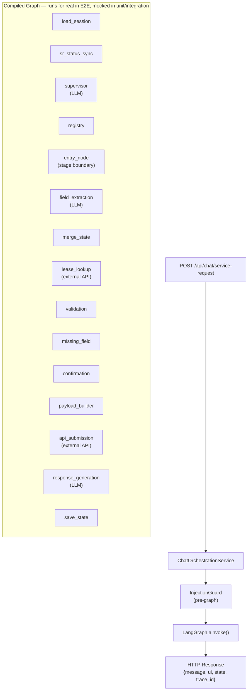

# Agent Pipeline Testing Guide

> **Scope:** This document defines the complete testing strategy for LangGraph-based conversational agents built on the Cenomi chatbot platform. It covers every layer of the test pyramid — unit, functional, integration, end-to-end, evaluation, and security — and is written as a reusable reference for implementing and verifying any new agent.
>
> **Current implementation reference:** The Handover SR agent (`rdd_agent`) and Work Permit agent (`work_permit_agent`) are the canonical examples used throughout. All patterns apply equally to future agents.
>
> **Test counts (July 2026 baseline):**
> - Unit tests: **1,126**
> - Integration tests: **104**
> - E2E tests: **10**
> - Eval scenarios: **33**
> - Manual test blocks: **26**

---

## Table of Contents

1. [Architecture Overview](#1-architecture-overview)
2. [Test Pyramid](#2-test-pyramid)
3. [Layer 1 — Unit Tests](#3-layer-1--unit-tests)
4. [Layer 2 — Functional Tests (Node-level)](#4-layer-2--functional-tests-node-level)
5. [Layer 3 — Integration Tests](#5-layer-3--integration-tests)
6. [Layer 4 — End-to-End Tests](#6-layer-4--end-to-end-tests)
7. [Layer 5 — Evaluation Suite (LLM Behaviour)](#7-layer-5--evaluation-suite-llm-behaviour)
8. [Layer 6 — Security Tests](#8-layer-6--security-tests)
9. [Mocking Reference](#9-mocking-reference)
10. [Test Data Reference](#10-test-data-reference)
11. [Checklist for a New Agent](#11-checklist-for-a-new-agent)
12. [Running Tests](#12-running-tests)
13. [Coverage Targets](#13-coverage-targets)

---

## 1. Architecture Overview

Every agent runs inside a LangGraph compiled graph. Understanding the node execution path is essential for writing targeted tests.



### Key principle: LLM proposes — code decides

| Layer | Responsibility |
|---|---|
| LLM (`supervisor`, `field_extraction`, `response_generation`) | Intent classification, field value proposals, natural language responses |
| Code (all other nodes) | Routing, validation, payload building, permission enforcement, API calls, state persistence |

**Tests must verify the code boundary.** LLM calls are always mocked in unit and integration tests. The evaluation layer is where LLM behaviour is verified.

---

## 2. Test Pyramid

```
               ┌─────────────────────────────────────┐
               │   Eval / Manual (26 blocks / 33 scen)│  Live LLM + platform
               ├─────────────────────────────────────┤
               │         E2E (10 tests)               │  Full HTTP stack, graph runs real
               ├─────────────────────────────────────┤
               │     Integration (104 tests)          │  Node chains, graph routing
               ├─────────────────────────────────────┤
               │        Unit (1,126 tests)             │  Pure functions, no I/O
               └─────────────────────────────────────┘
```

| Layer | What runs for real | What is mocked | Speed |
|---|---|---|---|
| **Unit** | Target function only | All I/O, LLM, DB, HTTP | < 1 ms/test |
| **Integration** | Graph nodes, routing, validation | LLM, DB, external APIs | < 50 ms/test |
| **E2E** | Full FastAPI app, LangGraph | LLM, DB, external APIs | < 200 ms/test |
| **Eval** | Full stack including LLM | Nothing | Seconds/scenario |

---

## 3. Layer 1 — Unit Tests

**Location:** `tests/unit/`  
**Command:** `pytest tests/unit/ -v`  
**Coverage target:** 100% of all service functions, validators, payload builders, schema helpers, node pure-logic paths

### 3.1 What to unit test

Every new agent requires unit tests for each of the following:

#### Schema (`schemas/{agent}_schema.py`)

```python
# What to test
class TestAgentSchema:
    def test_required_fields_tuple_is_non_empty(self): ...
    def test_stage_registry_contains_expected_stages(self): ...
    def test_backend_derived_fields_not_in_user_supplied(self): ...
    def test_extractable_fields_excludes_backend_only(self): ...
    def test_get_missing_fields_returns_absent_fields(self): ...
    def test_get_missing_fields_treats_empty_string_as_present_for_optional(self): ...
    def test_get_missing_fields_treats_none_as_missing_for_optional(self): ...
    def test_role_can_act_on_stage_correct_role(self): ...
    def test_role_can_act_on_stage_wrong_role(self): ...

# Reference: tests/unit/test_handover_schema.py
```

#### Payload Builder (`services/payload_builder_service.py`)

```python
class TestPayloadBuilder:
    def test_all_required_keys_present(self): ...
    def test_raises_value_error_on_missing_required_key(self): ...
    def test_inspection_done_by_appears_twice(self): ...   # inspectionDoneBy + inspection_done_by
    def test_documents_ids_is_empty_list_for_new_sr(self): ...
    def test_no_top_level_status_on_create(self): ...
    def test_service_request_id_is_empty_string_on_create(self): ...
    def test_start_date_lt_and_end_date_lt_present(self): ...
    def test_fm_payload_includes_sr_id(self): ...
    def test_rdd_payload_includes_fm_and_rdd_doc_ids(self): ...
    def test_rdd_dates_formatted_as_dd_mm_yyyy(self): ...   # NOT ISO

# Reference: tests/unit/test_payload_builder_service.py
```

#### Validation Service (`services/validation_service.py`)

```python
class TestValidationService:
    # Required field rules
    def test_absent_key_is_failed(self): ...
    def test_none_value_is_failed(self): ...
    def test_empty_string_is_failed_for_required(self): ...
    def test_integer_zero_is_valid(self): ...
    def test_false_boolean_is_valid(self): ...
    def test_empty_string_is_valid_for_optional(self): ...

    # Date validation
    def test_start_before_end_passes(self): ...
    def test_start_equal_end_fails(self): ...
    def test_start_after_end_fails(self): ...
    def test_unparseable_date_fails(self): ...

    # Enum validation
    def test_allowed_enum_value_passes(self): ...
    def test_unknown_enum_value_fails(self): ...

    # RDD date chain
    def test_full_valid_chain_passes(self): ...
    def test_reversed_pair_fails(self): ...
    def test_equal_dates_pass(self): ...   # ≤ not <

    # Document validation
    def test_document_count_zero_fails_for_fm(self): ...
    def test_document_count_one_passes_for_fm(self): ...
    def test_missing_required_report_fails_for_rdd(self): ...
    def test_report_present_passes_for_rdd(self): ...
    def test_wrong_stage_doc_type_fails(self): ...
    def test_correct_stage_doc_type_passes(self): ...

    # Permission hook
    def test_authorised_role_passes(self): ...
    def test_unauthorised_role_fails(self): ...

    # validate_draft() integration
    def test_returns_only_failed_results(self): ...
    def test_blocking_true_on_all_failures(self): ...
    def test_no_errors_when_all_valid(self): ...

# Reference: tests/unit/test_validation_service.py
#            tests/unit/test_document_count_validation.py
```

#### Confirmation Node (`graph/nodes/{agent}/confirmation_node.py`)

```python
class TestConfirmationNode:
    # No-op conditions
    def test_returns_empty_when_fields_missing(self): ...
    def test_returns_empty_when_confirmed_already(self): ...
    def test_returns_empty_when_rejected_without_corrections(self): ...
    def test_returns_empty_when_collected_data_absent(self): ...

    # Card generation
    def test_confirmation_required_is_true(self): ...
    def test_confirmation_status_is_pending(self): ...
    def test_status_is_ready_to_submit(self): ...
    def test_response_ui_type_is_confirmation_card(self): ...
    def test_card_fields_match_stage(self): ...      # FM card ≠ RDD card ≠ CREATE card
    def test_card_values_match_collected_data(self): ...
    def test_card_is_deterministic(self): ...
    def test_does_not_mutate_collected_data(self): ...

    # Stage-specific display
    def test_fm_card_shows_readiness_dates_not_inspection_dates(self): ...
    def test_rdd_card_shows_rdd_dates_not_create_sr_dates(self): ...
    def test_unknown_stage_falls_back_to_create_sr_card(self): ...

# Reference: tests/unit/test_confirmation_node.py
```

#### Permission Service (`services/permission_service.py`)

```python
class TestPermissionService:
    def test_known_action_allowed_role_does_not_raise(self): ...
    def test_known_action_wrong_role_raises_permission_denied(self): ...
    def test_unknown_action_raises_fail_closed(self): ...
    def test_error_has_correct_action_attribute(self): ...
    def test_error_has_required_role_attribute(self): ...
    def test_unknown_action_error_required_role_is_unknown_action(self): ...

    # Per-agent actions
    def test_create_sr_only_mall_manager(self): ...
    def test_fm_review_fm_and_operations_only(self): ...
    def test_rdd_review_dd_engineer_only(self): ...
    def test_work_permit_only_mall_manager(self): ...

# Reference: tests/unit/test_permission_service.py
#            tests/unit/test_work_permit_permissions.py
```

#### Merge State Node (`graph/nodes/shared/merge_state_node.py`)

```python
class TestMergeStateNode:
    def test_extracted_fields_merged_into_collected(self): ...
    def test_backend_protected_fields_not_overwritten(self): ...
    def test_low_confidence_below_threshold_skipped(self): ...
    def test_high_confidence_accepted(self): ...
    def test_none_sentinel_normalised_to_empty_string(self): ...
    def test_corrected_fields_bypass_confidence_threshold(self): ...
    def test_corrected_fields_cannot_overwrite_backend_protected(self): ...
    def test_lease_confirmed_fields_immutable_after_lease_resolved(self): ...
    def test_title_auto_generated_from_lease_code_and_description(self): ...
    def test_title_not_overwritten_when_already_present(self): ...
    def test_expected_handover_date_auto_computed_for_fm_stage(self): ...
    def test_correction_recorded_in_corrections_log(self): ...

# Reference: tests/unit/test_merge_state_node.py
```

#### Supervisor Routing (`graph/help_agent_graph.py`)

```python
class TestSupervisorRouting:
    def test_route_after_load_sr_id_goes_to_status_sync(self): ...
    def test_route_after_load_active_agent_goes_to_entry(self): ...
    def test_route_after_load_no_context_goes_to_supervisor(self): ...
    def test_route_after_sync_fm_goes_to_fm_entry(self): ...
    def test_route_after_sync_rdd_goes_to_rdd_entry(self): ...
    def test_route_after_sync_terminal_goes_to_supervisor(self): ...
    def test_route_after_validation_missing_goes_to_missing_field(self): ...
    def test_route_after_validation_complete_goes_to_confirmation(self): ...
    def test_route_after_confirmation_confirmed_goes_to_payload_builder(self): ...
    def test_route_after_confirmation_pending_goes_to_response_gen(self): ...

# Reference: tests/unit/test_help_agent_graph.py
#            tests/unit/test_supervisor_routing.py
```

### 3.2 DB repository tests

All repository tests use `AsyncMock(spec=AsyncSession)` and the `make_execute_result` fixture. No real DB needed.

```python
# Pattern — from tests/unit/conftest.py
@pytest.fixture()
def mock_session() -> AsyncMock:
    session = AsyncMock(spec=AsyncSession)
    session.add = MagicMock()
    session.flush = AsyncMock()
    return session

@pytest.fixture()
def make_execute_result():
    def _factory(scalar=None, scalars=None) -> MagicMock:
        result = MagicMock()
        result.scalar_one_or_none.return_value = scalar
        result.scalar_one.return_value = scalar
        scalars_mock = MagicMock()
        scalars_mock.__iter__ = MagicMock(return_value=iter(scalars or []))
        result.scalars.return_value = scalars_mock
        return result
    return _factory

# Usage
async def test_creates_draft(mock_session, make_execute_result):
    mock_session.execute.return_value = make_execute_result(scalar=None)
    repo = ServiceRequestDraftRepository(mock_session)
    await repo.create(session_id=uuid4(), collected_data={})
    mock_session.add.assert_called_once()
    mock_session.commit.assert_awaited_once()
```

### 3.3 Observability / tracing tests

Test `TraceManager` in isolation — no graph invocation needed.

```python
# Reference: tests/unit/test_trace_manager.py
class TestTraceManager:
    async def test_start_trace_returns_trace_id(self): ...
    async def test_finish_trace_marks_completed(self): ...
    async def test_fail_trace_marks_failed(self): ...
    async def test_capture_node_span_records_duration(self): ...
    async def test_no_error_when_trace_id_missing(self): ...
```

---

## 4. Layer 2 — Functional Tests (Node-level)

**Location:** `tests/unit/` (single-node async tests)  
**Purpose:** Test individual async node functions with a minimal state dict. No graph compilation needed.

### 4.1 Node state pattern

All node functions receive a `ServiceRequestGraphState` dict and return a partial state update dict. Tests inject minimal state and assert the returned patch.

```python
# Generic node test pattern
@pytest.mark.asyncio
async def test_node_name_happy_path():
    state: dict[str, Any] = {
        "workflow_stage": "CREATE_SR",
        "collected_data": {
            # Only the keys the node actually reads
        },
        "backend_refs": {},
        "action_override": None,
        "validation_errors": [],
        "auth_context": _auth("MALL_MANAGER"),
    }

    result = await node_function(state)

    # Assert only the keys the node writes
    assert result["status"] == "expected_value"
    assert "unexpected_key" not in result
```

### 4.2 Entry node tests

Each stage has an entry node that handles role guards and `action_override` dispatch.

```python
# Reference: tests/unit/test_fm_nodes.py, tests/unit/test_rdd_nodes.py
class TestFMReviewEntryNode:
    async def test_wrong_role_returns_waiting_with_denial(self): ...
    async def test_save_fm_progress_sets_fm_action(self): ...
    async def test_approve_fm_review_sets_fm_action(self): ...
    async def test_reject_fm_review_returns_waiting(self): ...
    async def test_cancel_update_returns_waiting(self): ...
    async def test_no_action_override_falls_through(self): ...
    async def test_no_user_role_falls_through(self): ...

class TestRDDReviewEntryNode:
    async def test_non_dd_engineer_denied(self): ...
    async def test_submit_rdd_report_sets_rdd_action(self): ...
    async def test_approve_rdd_final_sets_rdd_action(self): ...
    async def test_upload_document_returns_waiting(self): ...
    async def test_no_action_falls_through(self): ...
```

### 4.3 API submission node tests

```python
# Reference: tests/unit/test_api_submission_node.py
class TestApiSubmissionNode:
    # Guard sequence (all three must pass)
    async def test_blocked_when_not_confirmed(self): ...
    async def test_blocked_when_blocking_validation_errors(self): ...
    async def test_blocked_when_no_payload(self): ...

    # Success path
    async def test_stores_sr_id_in_backend_refs(self): ...
    async def test_sets_workflow_stage_to_sr_created(self): ...
    async def test_response_message_contains_sr_reference(self): ...

    # Failure path
    async def test_api_error_sets_status_failed(self): ...
    async def test_api_error_response_message_is_human_friendly(self): ...
```

### 4.4 Payload builder node tests

```python
class TestPayloadBuilderNode:
    async def test_creates_payload_in_backend_refs(self): ...
    async def test_payload_contains_service_category(self): ...
    async def test_payload_contains_sub_category(self): ...
    async def test_missing_required_field_raises_or_returns_error(self): ...
    async def test_does_not_mutate_collected_data(self): ...
    async def test_fm_payload_includes_sr_id(self): ...
    async def test_rdd_payload_includes_both_doc_ids(self): ...
```

---

## 5. Layer 3 — Integration Tests

**Location:** `tests/integration/`  
**Command:** `pytest tests/integration/ -v`  
**What runs:** Full node chains, compiled LangGraph routing, real `ValidationService`, real `PayloadBuilderService`  
**What is mocked:** LLM, DB session, Lease API, SR platform API

### 5.1 Standard fixtures

```python
# tests/integration/conftest.py — key fixtures

@pytest.fixture()
def mock_db() -> AsyncMock:
    """AsyncSession stub — all queries return empty, all writes no-op."""
    session = AsyncMock(spec=AsyncSession)
    session.add = MagicMock()
    session.flush = AsyncMock()
    session.commit = AsyncMock()
    # SELECT returns nothing by default; override per test
    result_mock = MagicMock()
    result_mock.scalar_one_or_none.return_value = None
    session.execute = AsyncMock(return_value=result_mock)
    return session

@pytest.fixture()
def mock_llm_gateway() -> MagicMock:
    """Returns CREATE_RDD_SERVICE_REQUEST supervisor decision at confidence 0.92."""
    gateway = MagicMock(spec=LLMGateway)
    gateway.complete_json = AsyncMock(
        return_value=(
            SupervisorDecision(
                intent="CREATE_RDD_SERVICE_REQUEST",
                service_category="FIT_OUT_AND_HANDOVER",
                sub_category="HANDOVER",
                confidence=0.92,
                reasoning="User wants handover SR",
            ),
            {"intent": "CREATE_RDD_SERVICE_REQUEST"},
        )
    )
    return gateway

@pytest.fixture()
def sample_lease() -> LeaseRecord:
    return LeaseRecord(
        lease_code="t0105712",
        lease_id=456,
        contract_id=456,
        brand="Brand Under Armour",
        brand_id=267,
        mall="Jawharat Jeddah",
        property_id=3041,
        tenant_profile_id=116,
        unit_codes=["FF050"],
        contracted_area=420.0,
        city="Jeddah",
        lease_brand_mall="t0105712 - Brand Under Armour - Jawharat Jeddah",
    )

@pytest.fixture()
def mock_lease_api(sample_lease) -> AsyncMock:
    service = AsyncMock()
    service.lookup.return_value = LeaseLookupResult(
        matches=[sample_lease], endpoint="mock", status_code=200
    )
    return service

@pytest.fixture()
def mock_sr_api() -> AsyncMock:
    service = AsyncMock()
    service.create_service_request.return_value = ServiceRequestCreationResult(
        sr_id="SR-TEST-001", status_code=201, error=None, correlation_id="corr-001"
    )
    service.patch_service_request.return_value = ServiceRequestCreationResult(
        sr_id="SR-TEST-001", status_code=200, error=None
    )
    return service
```

### 5.2 Lifecycle integration tests

The full Create → FM → RDD chain is tested node-by-node with mocked APIs.

```python
# Reference: tests/integration/test_handover_lifecycle.py

class TestHandoverLifecycle:
    """End-to-end node chain: CREATE_SR → FM_REVIEW → RDD_REVIEW."""

    async def test_create_sr_happy_path(self, mock_sr_api):
        """payload_builder → api_submission stores sr_id in backend_refs."""
        state = _base_state(confirmation_status="CONFIRMED")
        state["collected_data"] = _full_collected_data()

        with patch("...get_service_request_api_service", return_value=mock_sr_api):
            pb_result = await payload_builder_node(state)
            state.update(pb_result)
            sub_result = await api_submission_node(state)

        assert sub_result["backend_refs"]["sr_id"] == "SR-TEST-001"
        assert sub_result["workflow_stage"] == "SR_CREATED"

    async def test_fm_approve_chain(self, mock_sr_api):
        """fm_payload_builder → fm_api_submission sets fm_status=APPROVED."""

    async def test_rdd_submit_chain(self, mock_sr_api):
        """rdd_payload_builder → rdd_api_submission sets workflow_stage=SR_COMPLETED."""

    async def test_wrong_role_blocked_at_fm_entry(self):
        """MALL_MANAGER attempting fm_review_entry returns denial."""

    async def test_wrong_role_blocked_at_rdd_entry(self):
        """FM_MANAGER attempting rdd_review_entry returns denial."""

    async def test_fm_approve_blocked_without_documents(self):
        """approve_fm_review with no documents returns blocking validation error."""

    async def test_rdd_submit_blocked_without_report(self):
        """submit_rdd_report with no DR_SR_HANDOVER_REPORT returns blocking error."""
```

### 5.3 Role-stage access matrix tests

```python
# Reference: tests/integration/test_role_stage_access.py

# Matrix:
# Role          | CREATE_SR | FM_REVIEW | RDD_REVIEW
# MALL_MANAGER  |   PASS    |   DENY    |   DENY
# FM_MANAGER    |   DENY    |   PASS    |   DENY
# OPERATIONS    |   DENY    |   PASS    |   DENY
# DD_ENGINEER   |   DENY    |   DENY    |   PASS

# For a new agent, create the equivalent matrix test:
class TestNewAgentRoleMatrix:
    @pytest.mark.parametrize("role,expected", [
        ("MALL_MANAGER", "allowed"),
        ("FM_MANAGER",   "denied"),
        ("DD_ENGINEER",  "denied"),
    ])
    async def test_create_stage_access(self, role, expected): ...
```

### 5.4 Chat endpoint integration test

```python
# Reference: tests/integration/test_chat_endpoint.py

class TestChatEndpoint:
    """POST /api/chat/service-request integration — full ASGI stack."""

    async def test_returns_session_id(self, app_client): ...
    async def test_returns_message_string(self, app_client): ...
    async def test_returns_state_with_workflow_stage(self, app_client): ...
    async def test_returns_ui_type(self, app_client): ...
    async def test_session_continuity_across_turns(self, app_client): ...
    async def test_action_confirm_advances_workflow(self, app_client): ...
    async def test_sr_id_triggers_status_sync(self, app_client): ...
    async def test_401_without_token_when_rbac_enforced(self, app_client): ...
    async def test_403_for_wrong_role(self, app_client): ...
```

### 5.5 Status sync integration

```python
# Tests that sr_id in request body triggers sr_status_sync → correct stage entry

class TestStatusSync:
    async def test_sr_id_routes_to_fm_entry_when_fm_in_progress(self): ...
    async def test_sr_id_routes_to_rdd_entry_when_dd_in_progress(self): ...
    async def test_sr_id_routes_to_supervisor_when_terminal(self): ...
    async def test_no_sr_id_routes_to_supervisor_directly(self): ...
    async def test_platform_get_failure_falls_back_gracefully(self): ...
```

---

## 6. Layer 4 — End-to-End Tests

**Location:** `tests/e2e/`  
**Command:** `pytest tests/e2e/ -v`  
**What runs:** Full FastAPI app via `httpx.AsyncClient + ASGITransport`, real LangGraph, real `ChatOrchestrationService`, real routing and validation  
**What is mocked:** LLM, DB, Lease API, SR API

### 6.1 App client fixture

```python
# tests/e2e/conftest.py

@pytest.fixture(scope="function")
async def app_client(
    mock_db_session,
    mock_llm_gateway,
    mock_lease_api,
    mock_sr_api,
) -> AsyncGenerator[AsyncClient, None]:
    """
    Full ASGI test client.

    - LangGraph graph is NOT patched — all routing, validation, payload building runs real.
    - DB is overridden with AsyncMock so no real Postgres needed.
    - LLM calls are intercepted to return deterministic outputs.
    - Lease and SR API clients are patched at the module level.
    """
    async with AsyncClient(
        transport=ASGITransport(app=app),
        base_url="http://test",
    ) as client:
        yield client

# Helper for posting a turn
async def post_turn(
    client: AsyncClient,
    message: str,
    session_id: str | None = None,
    action: str | None = None,
    sr_id: str | None = None,
    token: str | None = None,
) -> dict:
    payload = {"user_id": "test_user", "message": message}
    if session_id: payload["session_id"] = session_id
    if action: payload["action"] = action
    if sr_id: payload["sr_id"] = sr_id
    headers = {"Authorization": f"Bearer {token}"} if token else {}
    resp = await client.post("/api/chat/service-request", json=payload, headers=headers)
    assert resp.status_code == 200
    return resp.json()
```

### 6.2 Required E2E test scenarios

Every agent must have E2E tests covering at minimum:

```python
# Reference: tests/e2e/test_handover_sr_e2e.py

class TestAgentE2E:
    # 1. Happy path — all fields in sequence
    async def test_full_create_sr_sequential(self, app_client): ...

    # 2. All fields in one message
    async def test_all_fields_single_message(self, app_client): ...

    # 3. Multi-match lease selection
    async def test_multi_lease_selection_card(self, app_client): ...

    # 4. Invalid field → bot asks to correct
    async def test_invalid_date_range_blocks_confirmation(self, app_client): ...

    # 5. Cancel and re-confirm
    async def test_cancel_then_reconfirm(self, app_client): ...

    # 6. Permission denied for wrong role
    async def test_wrong_role_receives_denial_message(self, app_client): ...

    # 7. Prompt injection attempt
    async def test_injection_attempt_blocked(self, app_client): ...

    # 8. API failure during submission
    async def test_api_failure_handled_gracefully(self, app_client): ...

    # 9. Session continuity (session_id preserved across turns)
    async def test_session_id_preserved_across_turns(self, app_client): ...

    # 10. Inline card edit (corrected_fields)
    async def test_inline_edit_corrected_fields_applied(self, app_client): ...
```

### 6.3 E2E lifecycle scenarios (multi-actor)

For agents with multi-stage workflows (like Handover SR), add lifecycle E2E tests:

```python
class TestLifecycleE2E:
    async def test_fm_review_entry_via_sr_id(self, app_client): ...
    async def test_rdd_review_entry_via_sr_id(self, app_client): ...
    async def test_fm_approve_blocked_without_documents(self, app_client): ...
    async def test_rdd_submit_blocked_without_report(self, app_client): ...
```

### 6.4 LLM mock side_effect pattern

When a multi-turn test needs different LLM responses per turn, use `side_effect`:

```python
mock_llm.complete_json.side_effect = [
    # Turn 1: supervisor classifies intent
    (SupervisorDecision(intent="CREATE_RDD_SERVICE_REQUEST", ...), {...}),
    # Turn 2: field extraction returns lease code
    (HandoverExtractedFields(fields={"lease_code": ExtractedFieldValue(value="t0105712")}), {}),
    # Turn 3: field extraction returns description
    (HandoverExtractedFields(fields={"description": ExtractedFieldValue(value="...")}), {}),
    # etc.
]
```

---

## 7. Layer 5 — Evaluation Suite (LLM Behaviour)

**Location:** `tests/eval/`  
**Not pytest** — requires a running backend on `localhost:8000`

### 7.1 What eval tests verify

Unlike unit/integration/e2e tests which mock the LLM, eval tests run with the real LLM to verify:
- Intent classification accuracy
- Field extraction accuracy and completeness
- Response quality (naturalness, helpfulness)
- Confirmation flow correctness end-to-end
- Error recovery phrasing

### 7.2 Running the eval suite

```bash
# Start the backend first
cd backend && uvicorn app.main:app --reload

# In a separate terminal
cd backend

# Run all 33 automated scenarios
PYTHONPATH=$(pwd) python tests/eval/run_eval.py --verbose

# Run a subset
PYTHONPATH=$(pwd) python tests/eval/run_eval.py --scenarios 1,2,3

# Run by tag
PYTHONPATH=$(pwd) python tests/eval/run_eval.py --tags happy-path,fm-review

# Run manual block tests (requires seeded user accounts)
PYTHONPATH=$(pwd) python tests/eval/test_manual_blocks.py --verbose

# Score a specific session post-hoc
PYTHONPATH=$(pwd) python tests/eval/eval_session.py --session-id <uuid>

# Generate report
PYTHONPATH=$(pwd) python tests/eval/report_writer.py
```

### 7.3 Eval scenario structure

```python
# tests/eval/scenarios.py
SCENARIOS = [
    EvalScenario(
        id=1,
        name="happy-path-lease-code",
        tags=["happy-path", "core"],
        turns=[
            EvalTurn(
                message="I want to create a handover service request",
                assert_ui_type="text",
                assert_workflow_stage="CREATE_RDD_SERVICE_REQUEST",
                assert_keywords=["lease", "brand"],
            ),
            EvalTurn(
                message="t0105712",
                assert_ui_type="text",
                assert_collected_data={"lease_code": "t0105712"},
            ),
            # ... continue through all field collection turns
            EvalTurn(
                message="",
                action="confirm",
                assert_ui_type="text",
                assert_workflow_stage="SR_CREATED",
                assert_sr_id_returned=True,
            ),
        ],
    ),
    # ... 32 more scenarios
]
```

### 7.4 Adding a new eval scenario for a new agent

```python
# Minimum: happy path + injection + wrong role + missing field recovery
new_agent_scenarios = [
    EvalScenario(id=34, name="work-permit-happy-path", tags=["work-permit", "happy-path"], ...),
    EvalScenario(id=35, name="work-permit-wrong-permit-type", tags=["work-permit", "validation"], ...),
    EvalScenario(id=36, name="work-permit-injection-attempt", tags=["work-permit", "security"], ...),
]
```

### 7.5 Eval scoring criteria

Each eval session is automatically scored on 7 axes:

| Criterion | What it checks | Pass threshold |
|---|---|---|
| `STATUS` | HTTP 200 on all turns | 100% |
| `LATENCY` | p95 < 5s per turn | p95 < 5s |
| `INTENT` | `workflow_stage` correct | First turn correct |
| `STAGE` | Correct stage transitions | All transitions |
| `EXTRACTION` | `collected_data` fully populated | All required fields |
| `CONFIRMATION` | `confirmation_card` shown when ready | Card appears at right turn |
| `SUBMISSION` | SR submitted, `sr_id` returned | `SR_CREATED` status |

---

## 8. Layer 6 — Security Tests

**Location:** `tests/unit/test_injection_guard.py`, `tests/unit/test_security_guardrails.py`, `tests/e2e/test_handover_sr_e2e.py`

### 8.1 What security tests cover

```python
# Reference: tests/unit/test_security_guardrails.py

class TestInjectionGuard:
    def test_high_risk_threshold_is_0_7(self): ...
    def test_direct_instruction_hijack_blocked(self): ...
    def test_system_prompt_leak_attempt_blocked(self): ...
    def test_bypass_validation_attempt_blocked(self): ...
    def test_force_submit_attempt_blocked(self): ...
    def test_normal_message_passes(self): ...
    def test_arabic_message_passes(self): ...      # not injection
    def test_question_about_submission_passes(self): ...
    def test_xss_script_tag_handled_safely(self): ...
    def test_sql_injection_handled_safely(self): ...

class TestBackendFieldProtection:
    def test_tenant_profile_id_not_overwritten_by_llm(self): ...
    def test_property_id_not_overwritten_by_llm(self): ...
    def test_brand_id_not_overwritten_by_llm(self): ...
    def test_lease_id_not_overwritten_by_llm(self): ...
    def test_lease_code_immutable_after_lease_resolved(self): ...

class TestConfirmationBypassPrevention:
    def test_api_submission_blocked_without_confirmed_status(self): ...
    def test_api_submission_blocked_with_pending_status(self): ...
    def test_api_submission_blocked_with_rejected_status(self): ...
    def test_confirm_phrases_keyword_matched_not_llm_processed(self): ...
    def test_injection_in_confirm_phrase_does_not_bypass(self): ...

class TestPermissionEnforcement:
    def test_unknown_action_fails_closed(self): ...
    def test_wrong_role_cannot_submit_sr(self): ...
    def test_wrong_role_cannot_approve_fm(self): ...
    def test_wrong_role_cannot_submit_rdd(self): ...
```

### 8.2 Security test checklist for new agents

For every new agent, verify:

- [ ] Injection guard score ≥ 0.7 blocks message before graph
- [ ] All backend-derived fields are in `BACKEND_PROTECTED_FIELDS`
- [ ] All backend-only fields are in `BACKEND_ONLY_FIELDS` (stripped by Pydantic)
- [ ] Submission node has triple guard: CONFIRMED + no blocking errors + payload present
- [ ] Unknown `action` values are fail-closed in `PermissionService`
- [ ] Every action in `ACTION_PERMISSION_MAP` is explicitly mapped to a role
- [ ] Wrong role gets a clear denial message, never a silent pass

---

## 9. Mocking Reference

### 9.1 Mock the LLM gateway

```python
from unittest.mock import AsyncMock, MagicMock, patch
from app.agents.schemas.supervisor_schema import SupervisorDecision
from app.agents.schemas.handover_schema import HandoverExtractedFields, ExtractedFieldValue

# --- Single fixed response ---
mock_llm = AsyncMock()
mock_llm.complete_json.return_value = (
    SupervisorDecision(intent="CREATE_RDD_SERVICE_REQUEST", confidence=0.92, ...),
    {"intent": "CREATE_RDD_SERVICE_REQUEST"},
)

# --- Multi-turn: different response per call ---
mock_llm.complete_json.side_effect = [
    (supervisor_decision_1, {}),    # Turn 1: supervisor
    (extraction_result_1, {}),      # Turn 2: field extraction
    (extraction_result_2, {}),      # Turn 3: next extraction
]

# --- Patch at module level ---
with patch("app.agents.llm.gateway.get_default_gateway", return_value=mock_llm):
    result = await some_node(state)
```

### 9.2 Mock the Lease API

```python
from app.agents.services.lease_lookup_service import LeaseRecord, LeaseLookupResult, MockLeaseLookupService

# Single match
mock_lease_svc = AsyncMock()
mock_lease_svc.lookup.return_value = LeaseLookupResult(
    matches=[sample_lease],
    endpoint="mock",
    status_code=200,
    latency_ms=5,
)

# No match
mock_lease_svc.lookup.return_value = LeaseLookupResult(matches=[], endpoint="mock", status_code=200)

# Multiple matches
mock_lease_svc.lookup.return_value = LeaseLookupResult(matches=[lease1, lease2], ...)

# Patch at node level
with patch("app.agents.graph.nodes.shared.lease_lookup_node.get_lease_lookup_service",
           return_value=mock_lease_svc):
    result = await lease_lookup_node(state)
```

### 9.3 Mock the SR platform API

```python
from app.agents.services.service_request_api_service import ServiceRequestCreationResult

# Successful create
mock_sr_api = AsyncMock()
mock_sr_api.create_service_request.return_value = ServiceRequestCreationResult(
    sr_id="SR-TEST-001",
    status_code=201,
    error=None,
    correlation_id="corr-001",
)

# Failed create
mock_sr_api.create_service_request.return_value = ServiceRequestCreationResult(
    sr_id=None,
    status_code=500,
    error="Internal server error",
)

# Successful patch (FM approve, RDD final approve)
mock_sr_api.patch_service_request.return_value = ServiceRequestCreationResult(
    sr_id="SR-TEST-001",
    status_code=200,
    error=None,
)

# Patch at node level
with patch("app.agents.graph.nodes.handover.api_submission_node.get_service_request_api_service",
           return_value=mock_sr_api):
    result = await api_submission_node(state)
```

### 9.4 Mock the file upload API

```python
from app.agents.services.document_upload_service import DocumentUploadResult

mock_upload_svc = AsyncMock()
mock_upload_svc.upload_document.return_value = DocumentUploadResult(
    document_id="uuid-doc-001",
    signed_url="https://example.com/signed/doc.pdf",
    file_path="documents/uuid-doc-001.pdf",
    error=None,
)

# Failed upload
mock_upload_svc.upload_document.return_value = DocumentUploadResult(
    document_id=None,
    error="Upload failed: connection timeout",
)
```

### 9.5 Mock the AuthContext

```python
from app.types.chat import AuthContext
from app.agents.services.permission_service import ROLE_PERMISSION_MAP

def make_auth(role: str) -> AuthContext:
    """Build a minimal AuthContext for a given role."""
    return AuthContext(
        subject_id=f"{role.lower()}-uuid",
        tenant_id=None,
        roles=ROLE_PERMISSION_MAP.get(role, frozenset()),
    )

# Usage
auth_mm = make_auth("MALL_MANAGER")
auth_fm = make_auth("FM_MANAGER")
auth_dd = make_auth("DD_ENGINEER")
```

---

## 10. Test Data Reference

### 10.1 Canonical lease records

```python
# Mock lease data — matches MockLeaseLookupService seed data

UNDER_ARMOUR_LEASE = LeaseRecord(
    lease_code="t0105712",
    lease_id=456,
    contract_id=456,
    brand="Brand Under Armour",
    brand_id=267,
    mall="Jawharat Jeddah",
    property_id=3041,
    tenant_profile_id=116,
    unit_codes=["FF050"],
    contracted_area=420.0,
    city="Jeddah",
    lease_brand_mall="t0105712 - Brand Under Armour - Jawharat Jeddah",
)

NIKE_RIYADH_LEASE = LeaseRecord(
    lease_code="t0208831",
    lease_id=789,
    contract_id=789,
    brand="Nike",
    brand_id=312,
    mall="Riyadh Park",
    property_id=5001,
    tenant_profile_id=204,
    unit_codes=["GF101", "GF102"],
    contracted_area=680.0,
    city="Riyadh",
    lease_brand_mall="t0208831 - Nike - Riyadh Park",
)

ZARA_DUBAI_LEASE = LeaseRecord(
    lease_code="t0419977",
    lease_id=321,
    contract_id=321,
    brand="Zara",
    brand_id=451,
    mall="Dubai Festival City",
    property_id=6200,
    tenant_profile_id=338,
    unit_codes=["UF301"],
    contracted_area=900.0,
    city="Dubai",
    lease_brand_mall="t0419977 - Zara - Dubai Festival City",
)
```

### 10.2 Complete collected_data fixtures

```python
# CREATE_SR — all required fields populated
COMPLETE_CREATE_SR_DATA = {
    "tenant_profile_id": 116,
    "property_id": 3041,
    "lease_code": "t0105712",
    "lease_id": 456,
    "contract_id": 456,
    "brand_id": 267,
    "mall": "Jawharat Jeddah",
    "brand": "Brand Under Armour",
    "lease": "t0105712",
    "unit_codes": ["FF050"],
    "city": "Jeddah",
    "contracted_area": 420,
    "title": "handover-t0105712-standard-fitout-inspection",
    "description": "Standard fit-out inspection for new tenant unit",
    "startDate": "2026-07-01",
    "endDate": "2026-07-03",
    "inspection_done_by": "FM_MANAGER",
    "comments": "High priority",
    "notes": "",
    "lease_brand_mall": "t0105712 - Brand Under Armour - Jawharat Jeddah",
    "startDateLT": "01/07/2026 12:00 PM",
    "endDateLT": "03/07/2026 12:00 PM",
}

# FM_REVIEW — fields added on top of CREATE_SR data
COMPLETE_FM_REVIEW_DATA = {
    **COMPLETE_CREATE_SR_DATA,
    "unit_readiness_date": "2026-07-10",
    "expected_handover_date": "2026-07-17",
}

# RDD_REVIEW — fields added on top of FM data
COMPLETE_RDD_REVIEW_DATA = {
    **COMPLETE_FM_REVIEW_DATA,
    "guideLineLink": "https://cenomi.com/guidelines/handover-2026",
    "actual_handover_date": "2026-07-15",
    "fitout_start_date": "2026-07-16",
    "fitout_end_date": "2026-07-20",
    "trading_date": "2026-07-28",
}

# Document fixtures
FM_DOCUMENT = {
    "document_id": "uuid-fm-doc-001",
    "document_type_id": "SR_HANDOVER_CHECKLIST",
    "document_type": "SR_HANDOVER_CHECKLIST",
    "filename": "checklist.pdf",
    "signed_url": "https://example.com/signed/checklist.pdf",
}

RDD_DOCUMENT = {
    "document_id": "uuid-rdd-doc-001",
    "document_type_id": "DR_SR_HANDOVER_REPORT",
    "document_type": "DR_SR_HANDOVER_REPORT",
    "filename": "handover-report.pdf",
    "signed_url": "https://example.com/signed/handover-report.pdf",
}
```

### 10.3 Minimal state builders

```python
def base_state(**overrides) -> dict:
    """Minimal graph state for node tests."""
    state = {
        "session_id": str(uuid4()),
        "user_id": "test-user",
        "trace_id": None,
        "trace_manager": None,
        "validation_errors": [],
        "collected_data": {},
        "backend_refs": {},
        "action_override": None,
        "workflow_stage": "CREATE_SR",
        "active_agent": "rdd_agent",
        "confirmation_status": None,
        "documents": [],
        "auth_context": None,
    }
    state.update(overrides)
    return state

def confirmed_state(data: dict, sr_id: str = "SR-TEST-001") -> dict:
    """State ready for api_submission."""
    return base_state(
        collected_data=data,
        backend_refs={
            "sr_id": sr_id,
            "create_payload": {"payload": data, "service_category": "FIT_OUT_AND_HANDOVER"},
        },
        confirmation_status="CONFIRMED",
        workflow_stage="CREATE_SR",
    )
```

---

## 11. Checklist for a New Agent

Use this checklist when implementing a new agent (e.g. `fit_out_agent`, `maintenance_agent`).

### 11.1 Schema checklist

- [ ] `schemas/{agent}_schema.py` created
- [ ] `StageDefinition` instances for all stages
- [ ] `STAGE_REGISTRY` dict populated
- [ ] `required_fields` tuples non-empty per stage
- [ ] `BACKEND_DERIVED_FIELDS` frozenset defined
- [ ] `BACKEND_ONLY_FIELDS` frozenset defined (stripped by Pydantic)
- [ ] `OPTIONAL_FIELDS` frozenset defined
- [ ] `get_missing_fields()` function implemented
- [ ] `role_can_act_on_stage()` function implemented or `PERMISSION_MAP` defined
- [ ] `HandoverExtractedFields` equivalent Pydantic model with `model_validator` stripping `BACKEND_ONLY_FIELDS`
- [ ] Document types registered if applicable

### 11.2 Node checklist

For each stage, create:
- [ ] `{stage}_entry_node.py` — role guard + `action_override` dispatch
- [ ] `{stage}_payload_builder_node.py` — delegates to service, no direct HTTP
- [ ] `{stage}_api_submission_node.py` — triple guard: CONFIRMED + no blocking errors + payload
- [ ] `{stage}_confirmation_node.py` (or reuse shared) — stage-specific display fields
- [ ] Register all in `help_agent_graph.py`

### 11.3 Service checklist

- [ ] `payload_builder_service.py` function: `build_{stage}_payload(data, backend_refs) -> dict`
- [ ] `validation_service.py` extended: `validate_draft()` handles new stage's `workflow_stage` value
- [ ] `permission_service.py` extended: new actions in `ACTION_PERMISSION_MAP`, new permissions in `ROLE_PERMISSION_MAP`
- [ ] `WorkflowConfig` registered in `registries/workflow_config.py`
- [ ] `SERVICE_REQUEST_AGENT_REGISTRY` entry in `registry.py`
- [ ] Supervisor prompt updated with new intent

### 11.4 Unit test checklist

- [ ] `test_{agent}_schema.py` — required fields, missing fields, backend field protection
- [ ] `test_{agent}_payload_builder.py` — all required keys, no top-level status, correct shape
- [ ] `test_{agent}_validation.py` — stage-specific rules, document count, enum validation
- [ ] `test_{agent}_permissions.py` — action map, role map, fail-closed unknown action
- [ ] `test_{stage}_confirmation_node.py` — stage-specific card fields, no-op conditions
- [ ] `test_{stage}_entry_node.py` — role guard, action dispatch
- [ ] `test_{stage}_api_submission_node.py` — triple guard, success/failure paths

### 11.5 Integration test checklist

- [ ] `tests/integration/test_{agent}_lifecycle.py` — full node chain per stage
- [ ] Role-stage access matrix test — every role tested against every stage
- [ ] Status sync routing test — platform status maps to correct entry node
- [ ] Document count blocking test (if documents required)
- [ ] Missing required field loop test

### 11.6 E2E test checklist

- [ ] Happy path (sequential field collection → submission)
- [ ] All fields in one message
- [ ] Invalid field → correction loop
- [ ] Wrong role denied
- [ ] Injection attempt blocked
- [ ] API failure handled

### 11.7 Eval checklist

- [ ] At least 4 scenarios added to `tests/eval/scenarios.py`:
  - Happy path
  - Validation error recovery
  - Injection attempt
  - Wrong role
- [ ] At least 4 manual test blocks added to `docs/manual-testing-script.md`
- [ ] Scenarios included in `e2e-lifecycle-test-scenarios.md`

---

## 12. Running Tests

### 12.1 Run all tests

```bash
cd service-request-chatbot/backend

# All unit + integration tests
pytest tests/unit/ tests/integration/ -v

# E2E tests (requires no external services)
pytest tests/e2e/ -v

# All automated tests
pytest tests/unit/ tests/integration/ tests/e2e/ -v

# With coverage
pytest tests/unit/ tests/integration/ --cov=app --cov-report=html
```

### 12.2 Run specific layers

```bash
# Unit only — fastest feedback
pytest tests/unit/ -v -x    # -x: stop on first failure

# Single test file
pytest tests/unit/test_validation_service.py -v

# Single test class
pytest tests/unit/test_validation_service.py::TestValidationServiceDraft -v

# Single test
pytest tests/unit/test_validation_service.py::TestValidationServiceDraft::test_returns_only_failed_results -v

# By marker
pytest tests/unit/ -m "not slow" -v
pytest tests/integration/ -m "rbac" -v
```

### 12.3 Run by agent / feature

```bash
# All handover tests
pytest tests/ -k "handover" -v

# All FM review tests
pytest tests/ -k "fm_review or fm_nodes" -v

# All RDD review tests
pytest tests/ -k "rdd" -v

# Permission tests
pytest tests/ -k "permission" -v

# Document validation tests
pytest tests/unit/test_document_count_validation.py tests/unit/test_validation_service.py -v

# Confirmation card tests
pytest tests/unit/test_confirmation_node.py -v
```

### 12.4 Run the eval suite (requires running backend)

```bash
# Start backend
cd service-request-chatbot/backend
uvicorn app.main:app --reload --port 8000

# In another terminal
cd service-request-chatbot/backend
PYTHONPATH=$(pwd) python tests/eval/run_eval.py --verbose
PYTHONPATH=$(pwd) python tests/eval/test_manual_blocks.py --verbose
PYTHONPATH=$(pwd) python tests/eval/report_writer.py
```

### 12.5 pytest markers

```ini
# pyproject.toml
[tool.pytest.ini_options]
markers = [
    "unit: Pure unit tests (no I/O)",
    "integration: Graph + node tests with mocked I/O",
    "e2e: Full HTTP stack tests",
    "slow: Tests that take > 2s",
    "auth: JWT and authentication tests",
    "rbac: Role-based access control tests",
    "security: Injection, bypass, and adversarial tests",
    "lifecycle: Multi-stage handover lifecycle tests",
    "fm_review: FM Manager review stage tests",
    "rdd_review: RDD review stage tests",
    "work_permit: Work permit agent tests",
]
asyncio_mode = "auto"
```

---

## 13. Coverage Targets

| Layer | Target | Current |
|---|---|---|
| Unit — services | 100% | ✅ Achieved |
| Unit — schemas | 100% | ✅ Achieved |
| Unit — nodes (pure logic) | 100% | ✅ Achieved |
| Unit — repositories | 95%+ | ✅ Achieved |
| Integration — node chains | All lifecycle paths | ✅ Achieved |
| Integration — role matrix | All role × stage combinations | ✅ Achieved |
| E2E — happy path | Every agent | ✅ Achieved |
| E2E — negative paths | Injection, wrong role, API failure | ✅ Achieved |
| Eval — LLM accuracy | ≥ 31/33 scenarios | ✅ 31/33 |
| Manual — blocks | All roles × all actions | ✅ 26/26 blocks |

### Coverage gaps (known, acceptable)

| Gap | Reason | Mitigation |
|---|---|---|
| `test_auth.py` — JWT signing | Requires real crypto setup | Covered in eval + manual |
| Platform 401 retry | Requires real token expiry timing | Covered by mock retry logic |
| Redis session store | Redis not available in CI | Feature flag; Postgres is primary |
| Real Cenomi platform API | Not accessible in test env | Postman collection covers it |

---

## Appendix A — Test File Map

| File | Layer | What it covers |
|---|---|---|
| `test_handover_schema.py` | Unit | Stage definitions, field sets, extraction model |
| `test_payload_builder_service.py` | Unit | All 5 payload builder functions |
| `test_validation_service.py` | Unit | All 7 validation rules, orchestrator |
| `test_document_count_validation.py` | Unit | FM/RDD document count rules, new doc types |
| `test_confirmation_node.py` | Unit | Card generation, stage-specific fields, no-op conditions |
| `test_merge_state_node.py` | Unit | Backend field protection, confidence, auto-compute |
| `test_permission_service.py` | Unit | Action map, role map, fail-closed |
| `test_permission_service_extended.py` | Unit | Extended permission scenarios |
| `test_work_permit_permissions.py` | Unit | WP actions, roles, submission guard |
| `test_fm_nodes.py` | Unit | FM entry, FM payload builder |
| `test_rdd_nodes.py` | Unit | RDD entry, RDD payload builder, final approve |
| `test_api_submission_node.py` | Unit | Triple guard, success, failure |
| `test_lease_lookup_node.py` | Unit | Lease node state transitions |
| `test_lease_lookup_service.py` | Unit | HttpLeaseLookupService, MockLeaseLookupService |
| `test_field_extraction.py` | Unit | LLM extraction, confidence filtering |
| `test_injection_guard.py` | Unit | Pattern catalog, threshold |
| `test_security_guardrails.py` | Unit | Backend protection, confirmation bypass prevention |
| `test_help_agent_graph.py` | Unit | All routing functions (`_route_after_*`) |
| `test_supervisor_routing.py` | Unit | Supervisor decisions, RBAC |
| `test_help_agent_schema.py` | Unit | `intents_for_roles()`, role-intent mapping |
| `test_workflow_config.py` | Unit | Registry, get/register/list |
| `test_trace_manager.py` | Unit | TraceManager lifecycle |
| `test_confirmation_node.py::TestStageSpecificConfirmationCards` | Unit | FM card, RDD card, stage isolation |
| `test_handover_lifecycle.py` | Integration | Full CREATE → FM → RDD node chain |
| `test_role_stage_access.py` | Integration | All 4 roles × 3 stages matrix |
| `test_fm_review_e2e.py` | Integration | FM pipeline: upload → merge → builder → submit |
| `test_rdd_review_e2e.py` | Integration | RDD pipeline: Phase 3a and 3b |
| `test_chat_endpoint.py` | Integration | HTTP layer, session continuity |
| `test_trace_lifecycle.py` | Integration | TraceManager + observability |
| `test_role_stage_access.py` | Integration | Role boundary enforcement at node level |
| `test_handover_sr_e2e.py` | E2E | 10 full HTTP scenarios |

---

## Appendix B — Anti-Patterns

Avoid these in agent tests:

| Anti-pattern | Problem | Fix |
|---|---|---|
| Testing LLM output in unit tests | Non-deterministic, slow | Mock `complete_json`, test only code paths |
| Calling `graph.ainvoke()` in unit tests | Tests too broad, slow | Test individual node functions |
| Not patching `get_service_request_api_service` | Real HTTP in unit tests | Always patch at the module where it's called |
| Using production DB in tests | Pollutes data, slow | Always use `AsyncMock(spec=AsyncSession)` |
| Asserting on `response_message` text exactly | Fragile to wording changes | Assert on `status`, `workflow_stage`, or key substrings |
| Testing the LangGraph graph structure | Tests platform internals | Test routing functions (`_route_after_*`) separately |
| Skipping permission tests for new nodes | Security gap | Every submission node must have permission tests |
| Not testing the triple guard | Logic gap | Every api_submission_node must test all 3 guards |
| Mocking `ValidationService` in integration tests | Misses real validation bugs | Let `ValidationService` run for real in integration tests |
