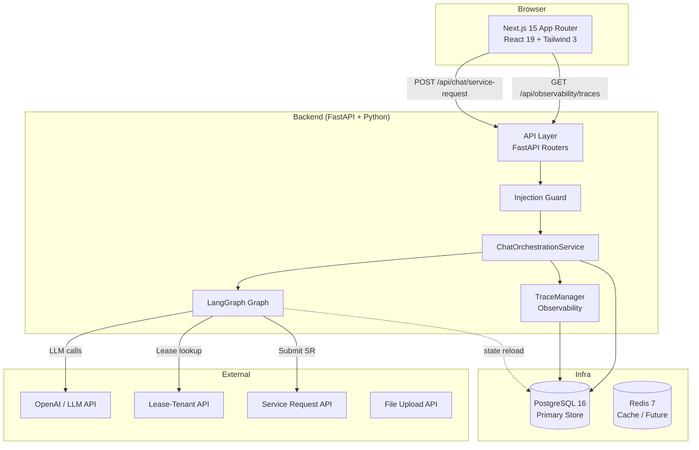
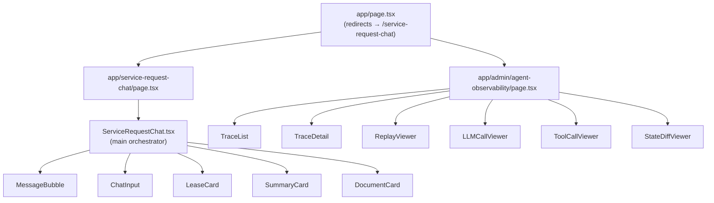
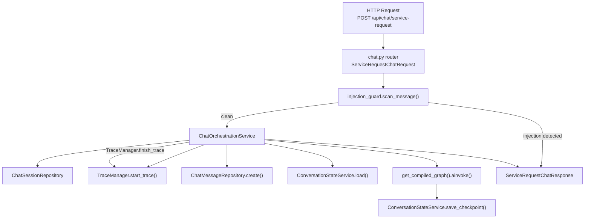
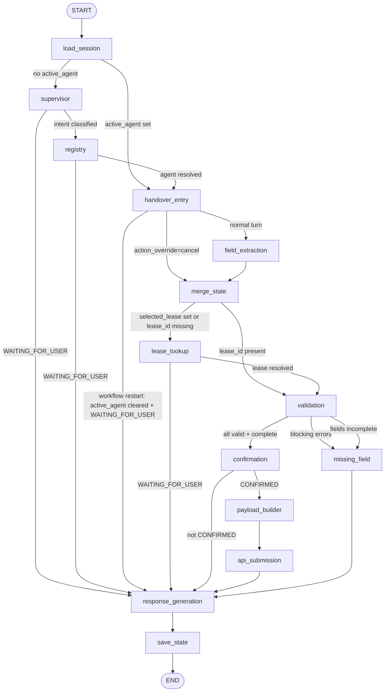
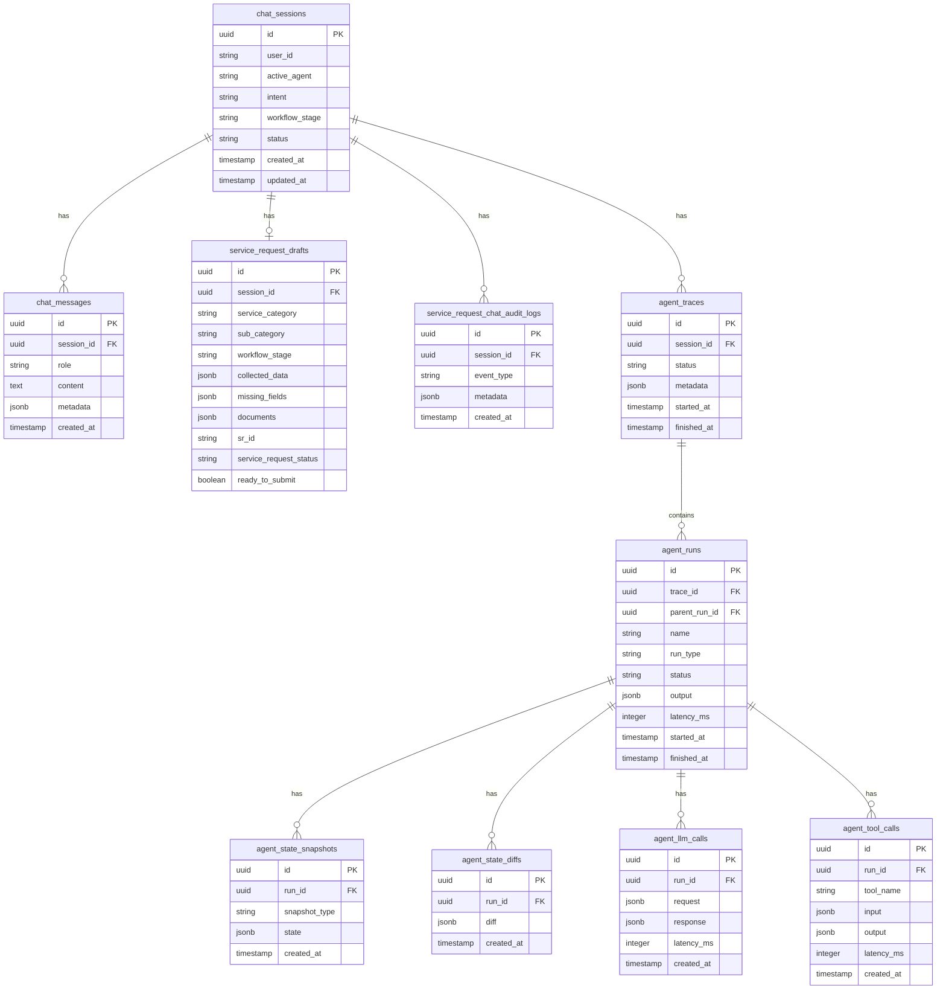
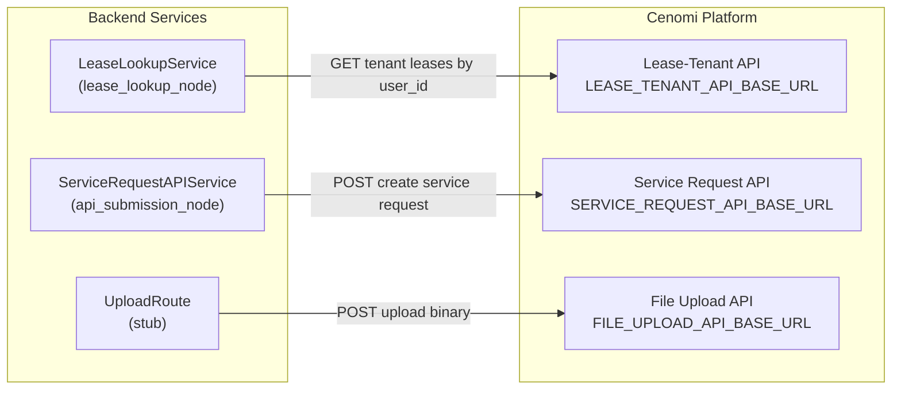

# Architecture

## High-Level Architecture

The Service Request Chatbot is a full-stack application that allows Cenomi mall tenants to submit handover service requests through a conversational interface. A LangGraph-based multi-agent backend orchestrates the conversation, collects required data, validates it, and submits it to the Cenomi Service Request API.

**Key design decisions:**

- **No LangGraph interrupt/resume** — each HTTP turn runs the full graph from scratch; conversation state is reloaded from PostgreSQL at the start of every turn via `ConversationStateService.load`.
- **Stateless graph, stateful DB** — the LangGraph `ServiceRequestGraphState` is populated from the database at `load_session_node` and persisted at `save_state_node`.
- **Pre-graph injection guard** — prompt injection scanning happens before the user message is persisted or the graph is invoked.

---

## Frontend Architecture

**Framework:** Next.js 15 App Router, React 19, TypeScript 5, Tailwind CSS 3.

**State management:** Local React `useState` / `useCallback` in `ServiceRequestChat`. No Redux or Zustand. State tracked per component: `messages`, `sessionId`, `latestUI`, `workflowSteps`.

**API clients:**

- `frontend/lib/api/chat-client.ts` — `postServiceRequestChat` sends `fetch` to `${NEXT_PUBLIC_API_BASE_URL}${NEXT_PUBLIC_API_V1_PREFIX}/chat/service-request` with fields: `session_id`, `message`, `attachment_ids`, `selected_lease_id`, `corrected_fields`, `action`.
- `frontend/lib/api/observability-client.ts` — `listTraces`, `getTrace` (at `/api/observability/...`), metrics at `/api/v1/observability/metrics/summary`.

**URL prefix mismatch:** The frontend default `NEXT_PUBLIC_API_V1_PREFIX=/api/v1` targets `/api/v1/chat/service-request`, but the backend mounts the chat route at `/api/chat/service-request` (no v1 prefix). Set `NEXT_PUBLIC_API_V1_PREFIX=""` or adjust to match the backend. E2E tests use `/api/chat/service-request`.

**Type definitions:** `frontend/lib/types/chat.ts`, `frontend/lib/types/observability.ts`.

---

## Backend Architecture

**Application factory** (`app/main.py`):

- `CORSMiddleware` from `settings.cors_origins_list`.
- Route mounts:
  - `GET {api_v1_prefix}/health`
  - `POST /api/chat/service-request` (no v1 prefix)
  - `POST /api/v1/chat/turn` (deprecated stub)
  - `POST /api/v1/upload`
  - `GET /api/observability/...`
  - `GET /api/v1/observability/metrics/...`

**`ChatOrchestrationService`** (`app/services/chat_orchestration_service.py`) is the central coordinator:

1. Load or create `ChatSession` via `ChatSessionRepository`.
2. `TraceManager.start_trace` — creates `AgentTrace` row.
3. Audit `turn.started` via `AuditLogRepository`.
4. `scan_message` — short-circuits to refusal response on high-risk injection.
5. `ChatMessageRepository.create` — persist user message.
6. Build initial `ServiceRequestGraphState` with session fields (`active_agent`, `intent`, `workflow_stage`) from `ConversationStateService.load`.
7. `get_compiled_graph().ainvoke(initial_state)`.
8. `TraceManager.finish_trace` with `final_state`.
9. Persist assistant message, `_sync_session` updates `ChatSession`, audit `turn.completed`.

**Config** (`app/core/config.py`): `Settings` reads from `.env` / `.env.local`. Key fields: `database_url`, `redis_url`, `openai_api_key`, `llm_model`, `service_request_api_base_url`, `lease_tenant_api_base_url`, `file_upload_api_base_url`, `jwt_secret_key`, `llm_confidence_threshold` (default `0.6`).

---

## LangGraph Architecture

The graph is defined in `app/agents/graph/service_request_graph.py` and compiled once as a singleton (`get_compiled_graph()`).

**State type:** `ServiceRequestGraphState` (`TypedDict`, `total=False`) in `app/agents/graph/state.py`. Runtime-only keys `trace_manager` and `conversation_state_service` are injected by the orchestration layer and stripped before trace persistence.

**Node decorators:** `@trace_node(run_name, run_type)` wraps each node with `start_run`, before/after state snapshots, diff capture, and `finish_run`.

---

## Database Architecture

**Migrations:**

- `001_initial_schema.py` — domain tables: `chat_sessions`, `chat_messages`, `service_request_drafts`, `service_request_chat_audit_logs`, and legacy observability stubs.
- `002_agent_observability.py` — agent observability tables: `agent_traces`, `agent_runs`, `agent_state_snapshots`, `agent_state_diffs`, `agent_llm_calls`, `agent_tool_calls`, `agent_feedback`.

**ORM:** Async SQLAlchemy with asyncpg driver (`DATABASE_URL` must use `postgresql+asyncpg://...`).

---

## Integration Architecture

**Lease lookup:** Called when `selected_lease` is set or `lease_id` is missing from `collected_data`. Resolves from the Cenomi Lease-Tenant API, handles multi-lease disambiguation by surfacing a `LeaseSelectionUI` component to the user.

**Service Request submission:** `ServiceRequestAPIService.create_service_request` posts the payload built by `PayloadBuilderService.build_create_handover_payload`. On success, sets `workflow_stage = "SR_CREATED"` and `status = SUBMITTED`.

**File Upload:** Route stub at `POST /api/v1/upload`. Enforces MIME allowlist (PDF/JPEG/PNG) and `PermissionService.ensure_can_create_request`. Does not yet persist bytes.

**Authentication:** `HTTPBearer` optional header. Default `AuthContext` is `"anonymous"` with empty roles. `PermissionService` maps actions to required role strings; unknown actions currently fail-open.
