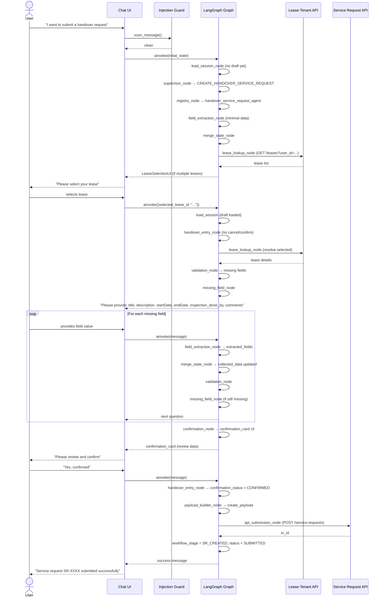

# Handover Workflow

## Overview

The chatbot currently supports one fully-implemented workflow: **CREATE_SR** (Create Handover Service Request). Two additional stages — FM Review and RDD Review — are defined in the schema as placeholders for future implementation.

The workflow is stage-driven: each stage defines its own `required_fields`, `required_documents`, and `role`. The authoritative source of truth is `app/agents/schemas/handover_schema.py`.

---

## CREATE_SR Workflow



### Stage Definition

**Source:** `handover_schema.py` → `CREATE_SR_STAGE`

```python
CREATE_SR_STAGE = StageDefinition(
    stage="CREATE_SR",
    role="MALL_MANAGER",
    required_fields=(
        "tenant_profile_id",   # backend-derived from lease
        "property_id",         # backend-derived from lease
        "lease_code",          # backend-derived from lease
        "lease_id",            # backend-derived from lease
        "brand_id",            # backend-derived from lease
        "mall",                # backend-derived from lease (display name)
        "brand",               # backend-derived from lease (display name)
        "unit_codes",          # backend-derived from lease
        "city",                # backend-derived from lease
        "contracted_area",     # backend-derived from lease
        "title",               # auto-generated: handover-{lease_code}-{description_slug}
        "description",         # user-supplied (optional — empty string is valid)
        "startDate",           # user-supplied (ISO 8601 YYYY-MM-DD)
        "endDate",             # user-supplied (ISO 8601 YYYY-MM-DD)
        "inspection_done_by",  # user-supplied — must be "FM_MANAGER" or "OPERATIONS"
        "comments",            # user-supplied (optional — empty string is valid)
    ),
    required_documents=(),     # No documents required for CREATE_SR stage
)
```

---

## FM Workflow

The FM (Facilities Management) review stage represents the review step after the initial service request is submitted.

**Stage key:** `FM_REVIEW`  
**Role:** `FM_MANAGER`  
**Status:** Schema fully defined; graph routing and agent nodes not yet implemented.

```python
FM_REVIEW_STAGE = StageDefinition(
    stage="FM_REVIEW",
    role="FM_MANAGER",
    required_fields=(
        "unit_readiness_date",    # user-supplied (date when unit is ready)
        "expected_handover_date", # user-supplied (expected handover date)
    ),
    required_documents=(
        "SR_HANDOVER_CHECKLIST",
        "SR_HANDOVER_SITE_SURVEY",
        "SR_COP_CHECKLIST_OTHER",
    ),
)
```

When implemented, this stage will accept `workflow_stage = "FM_REVIEW"` from a webhook or status poll, require the FM documents listed above, and route to a dedicated FM review agent.

---

## RDD Workflow

The RDD (Real Estate Development Division) review stage is the final approval step.

**Stage key:** `RDD_REVIEW`  
**Role:** `DD_ENGINEER`  
**Status:** Schema fully defined; graph routing and agent nodes not yet implemented.

```python
RDD_REVIEW_STAGE = StageDefinition(
    stage="RDD_REVIEW",
    role="DD_ENGINEER",
    required_fields=(
        "guideLineLink",          # user-supplied
        "actual_handover_date",   # user-supplied (ISO 8601)
        "fitout_start_date",      # user-supplied (ISO 8601)
        "fitout_end_date",        # user-supplied (ISO 8601)
        "trading_date",           # user-supplied (ISO 8601)
    ),
    required_documents=("DR_SR_HANDOVER_REPORT",),
)
```

The RDD validation enforces a date ordering constraint: `actual_handover_date ≤ fitout_start_date ≤ fitout_end_date ≤ trading_date`.

---

## Required Fields

### Field Classification

Fields in `HandoverExtractedFields` are classified into three groups:

| Classification | Description | Example Fields |
|---------------|-------------|----------------|
| `BACKEND_ONLY_FIELDS` | Set by the system from lease data; **never** accepted from user or LLM | `tenant_profile_id`, `property_id`, `brand_id`, `lease_id` |
| `USER_SUPPLIED_FIELDS` | Collected from the user through conversation | `title`, `description`, `startDate`, `endDate`, `inspection_done_by`, `comments` |
| `EXTRACTABLE_FIELDS` | Can be extracted by the LLM from user messages | Subset of user-supplied fields |

**`BACKEND_PROTECTED_FIELDS`** in `merge_state_node.py` — list of keys that `merge_state_node` will refuse to overwrite even if the LLM extracts a value for them.

### Field Extraction Confidence

`merge_state_node` applies a confidence threshold of **0.6**. Extracted fields with `confidence < 0.6` are discarded and not merged into `collected_data`. The rich extraction shape is `{field_name: {"value": str, "confidence": float}}`.

### Auto-Generated Fields

`title` is never asked of the user and is not in `EXTRACTABLE_FIELDS`. It is auto-generated by `merge_state_node` as soon as both `lease_code` and `description` are available:

```
title = "handover-{lease_code}-{first-5-words-of-description-as-slug}"
```

When `description` is empty (user explicitly said "no description"), the title becomes `"handover-{lease_code}"`.

### Lease-Confirmed Field Lock

Once `lease_id` is resolved in `collected_data`, the fields `lease_code`, `mall`, and `brand` become immutable (`_LEASE_CONFIRMED_FIELDS` in `merge_state_node.py`). Subsequent LLM extractions cannot overwrite the confirmed lease identity.

### Confirmation Display Fields

The `confirmation_card` UI shows a human-meaningful subset of `collected_data` (title, description, dates, mall, brand, unit codes, `inspection_done_by`, comments). Internal IDs (`tenant_profile_id`, `lease_id`, etc.) are not displayed to the user.

---

## Required Documents

```python
# CREATE_SR stage
CREATE_SR_STAGE.required_documents = ()  # empty — no documents required

# FM_REVIEW stage
FM_REVIEW_STAGE.required_documents = (
    "SR_HANDOVER_CHECKLIST",
    "SR_HANDOVER_SITE_SURVEY",
    "SR_COP_CHECKLIST_OTHER",
)

# RDD_REVIEW stage
RDD_REVIEW_STAGE.required_documents = ("DR_SR_HANDOVER_REPORT",)

# All document types (used for MIME/type validation on upload)
ALL_DOCUMENT_TYPES = frozenset(FM_ALLOWED_DOCUMENTS + RDD_REQUIRED_DOCUMENTS)
```

The upload endpoint (`POST /api/v1/upload`) enforces:
- MIME type allowlist: `application/pdf`, `image/jpeg`, `image/png`.
- `document_type` must be in `ALL_DOCUMENT_TYPES`.
- `PermissionService.ensure_can_create_request` is called before processing.

---

## Validation Rules

`ValidationService` (`app/agents/services/validation_service.py`) runs after every `merge_state_node`. Errors are stored in `state["validation_errors"]` as:

```python
{
    "field":           str,   # field name; "_form" for cross-field, "_permission" for permission checks
    "validation_type": str,   # "required" | "enum" | "date_range" | "rdd_date_order" | "document_type" | "permission"
    "status":          str,   # "PASSED" | "FAILED"
    "message":         str,   # human-readable error
    "blocking":        bool,  # True = blocks confirmation and submission
}
```

**Blocking errors prevent all of:** routing to `confirmation_node`, routing to `payload_builder_node`, and the `api_submission_node` guard check.

**Validation rules by type:**

| Rule | Type | Stage | Description |
|------|------|-------|-------------|
| Required fields | `required` | All | All fields in the stage's `required_fields` must be present and non-empty. Integer `0` and `False` are valid; `None`, `""`, `[]` are missing. Optional fields (`description`, `comments`, `notes`) only fail when `None` (empty string is acceptable). |
| `inspection_done_by` enum | `enum` | `CREATE_SR` | Must be one of: `"FM_MANAGER"` or `"OPERATIONS"`. |
| `startDate` < `endDate` | `date_range` | `CREATE_SR` | Both must be ISO 8601 (`YYYY-MM-DD`); `endDate` must be strictly after `startDate`. Checked only when both dates are present. |
| RDD date chain | `rdd_date_order` | `RDD_REVIEW` | `actual_handover_date ≤ fitout_start_date ≤ fitout_end_date ≤ trading_date`. |
| Document type | `document_type` | `FM_REVIEW`, `RDD_REVIEW` | Document type must be known (`ALL_DOCUMENT_TYPES`) and permitted for the current stage. |
| Permission | `permission` | All | Role must be authorised to act on the current stage per `PERMISSION_MAP`. |

**Rule application order in `ValidationService.validate_draft()`:**
1. Required field validation
2. `inspection_done_by` enum check (when field is present)
3. `startDate` < `endDate` (when both present)
4. RDD date chain ordering (RDD_REVIEW only)
5. Document type validation (for each uploaded document)
6. Permission check (when `role` is provided)

---

## Payload Structure

**Builder:** `app/services/payload_builder_service.py` → `build_create_handover_payload(collected_data)`

The builder validates that all `_REQUIRED_DATA_KEYS` are present in `collected_data` before assembling the payload. These keys include all `CREATE_SR_STAGE.required_fields` plus additional keys resolved during lease lookup: `lease_brand_mall`, `contract_id`.

### Top-Level Payload Shape

```json
{
  "service_category": "FIT_OUT_AND_HANDOVER",
  "sub_category": "HANDOVER",
  "lease_code": "LC-12345",
  "lease_id": "uuid-...",
  "tenant_profile_id": "uuid-...",
  "property_id": "uuid-...",
  "title": "Handover request for Unit A-101",
  "service_request_id": "",
  "payload": {
    "inspectionDoneBy": "John Smith",
    "company_name": "Tenant Brand Ltd.",
    "description": "Handover request for fit-out completion...",
    "startDate": "2026-06-01",
    "endDate": "2026-06-15",
    "comments": "All fit-out work completed per approved drawings.",
    "mall": "Riyadh Park",
    "brand": "Tenant Brand",
    "lease": "LC-12345 / Unit A-101",
    "unit_codes": ["A-101"],
    "city": "Riyadh",
    "contracted_area": 250.0
  }
}
```

After a successful API response, `api_submission_node` extracts the returned `sr_id` and stores it in `backend_refs.sr_id`. It also sets:
- `workflow_stage = "SR_CREATED"`
- `status = "SUBMITTED"`
- `state["service_request_id"] = sr_id`

The `ConversationStateService.save_checkpoint` then persists the updated `ServiceRequestDraft` with `sr_id` and `service_request_status = "SUBMITTED"`.
