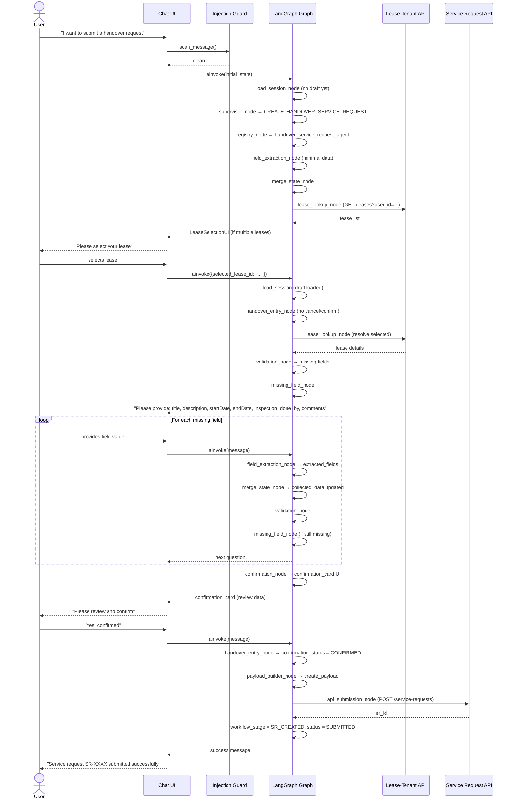

# Handover Workflow

## Essential Reading

The sections in this document reference concepts, nodes, and rules that are defined in detail across the docs listed below. Read these alongside this file — the cross-references below indicate exactly where each companion doc is needed.

| Doc | Why it is needed for this file |
|-----|-------------------------------|
| [`agent-design.md`](agent-design.md) | **Most important companion.** Defines every graph node referenced throughout this file — CREATE_SR nodes (`supervisor_node`, `field_extraction_node`, `merge_state_node`, `lease_lookup_node`, `validation_node`, `confirmation_node`, `payload_builder_node`, `api_submission_node`) and FM/RDD nodes (`sr_status_sync_node`, `fm_review_entry_node`, `rdd_review_entry_node`, `fm_confirmation`, `fm_payload_builder_node`, `fm_api_submission_node`, `rdd_confirmation`, `rdd_payload_builder_node`, `rdd_api_submission_node`, `preview_node`). Also covers the full routing flowchart, `ServiceRequestGraphState` type, `handover_entry_node` confirmation parsing, the agent registry, and the `_AGENT_ENTRY_NODES` dispatch table. |
| [`security-guardrails.md`](security-guardrails.md) | Required for three specific sections here: (1) the **Injection Guard** step in the CREATE_SR sequence diagram — explains `scan_message()`, risk scoring, and what happens on detection; (2) the **Backend-Derived Field Protection** in the Required Fields section — explains `BACKEND_PROTECTED_FIELDS`, the `HandoverExtractedFields` Pydantic validator, and the confidence threshold; (3) the **Confirmation Enforcement** section — explains the two-layer confirmation guard (`handover_entry_node` keyword matching + `api_submission_node` hard guards). |
| [`architecture.md`](architecture.md) | Provides the system-level context for this workflow — how the LangGraph graph sits inside FastAPI, how `ChatOrchestrationService` orchestrates the turn, the DB schema for `service_request_drafts` (where `collected_data` is persisted), and the integration diagram showing the chatbot's relationship to the Cenomi Lease-Tenant API and Service Request API. |
| [`api-reference.md`](api-reference.md) | Covers the two external-facing endpoints directly referenced here: (1) `POST /api/chat/service-request` — the chat endpoint that triggers the CREATE_SR graph run; (2) `POST /api/v1/upload` — the upload endpoint referenced in the Required Documents section (MIME validation, document type enforcement). |
| [`extensibility-guide.md`](extensibility-guide.md) | Essential for the **FM Workflow** and **RDD Workflow** sections. The extensibility guide explains what is already wired (entry nodes, graph routing, payload builders, confirmation and submission nodes) and what remains to be completed (real file upload, status sync validation, structured frontend actions). Also covers Path B for adding entirely new service request agent types. |
| [`debugging-guide.md`](debugging-guide.md) | Useful when troubleshooting issues that arise in this workflow — specifically: lease lookup failures (lease not found / multiple matches), validation errors not clearing, missing fields appearing despite user providing them, and payload builder errors. References the SQL queries needed to inspect `service_request_drafts.collected_data` at each stage. |

---

## Overview

The chatbot supports three workflow stages for the Handover Service Request: **CREATE_SR**, **FM_REVIEW**, and **RDD_REVIEW**. All three are fully implemented — graph nodes, routing, payload builders, confirmation gates, and submission nodes are wired end-to-end. What remains is completing the real platform file upload integration and structured frontend actions (see `extensibility-guide.md` for the precise pending list).

The workflow is stage-driven: each stage defines its own `required_fields`, `required_documents`, and `role`. The authoritative source of truth is `app/agents/schemas/handover_schema.py`.

---

## CREATE_SR Workflow


```mermaid
sequenceDiagram
    actor User
    participant Chat as Chat UI
    participant Guard as Injection Guard
    participant Graph as LangGraph Graph
    participant Lease as Lease-Tenant API
    participant SRAPI as Service Request API

    User->>Chat: "I want to submit a handover request"
    Chat->>Guard: scan_message()
    Guard-->>Chat: clean
    Chat->>Graph: ainvoke(initial_state)
    Graph->>Graph: load_session_node (no draft yet)
    Graph->>Graph: supervisor_node → CREATE_HANDOVER_SERVICE_REQUEST
    Graph->>Graph: registry_node → handover_service_request_agent
    Graph->>Graph: field_extraction_node (minimal data)
    Graph->>Graph: merge_state_node
    Graph->>Lease: lease_lookup_node (GET /leases?user_id=...)
    Lease-->>Graph: lease list
    Graph-->>Chat: LeaseSelectionUI (if multiple leases)
    Chat-->>User: "Please select your lease"

    User->>Chat: selects lease
    Chat->>Graph: ainvoke({selected_lease_id: "..."})
    Graph->>Graph: load_session (draft loaded)
    Graph->>Graph: handover_entry_node (no cancel/confirm)
    Graph->>Lease: lease_lookup_node (resolve selected)
    Lease-->>Graph: lease details
    Graph->>Graph: validation_node → missing fields
    Graph->>Graph: missing_field_node
    Graph-->>Chat: "Please provide: title, description, startDate, endDate, inspection_done_by, comments"

    loop For each missing field
        User->>Chat: provides field value
        Chat->>Graph: ainvoke(message)
        Graph->>Graph: field_extraction_node → extracted_fields
        Graph->>Graph: merge_state_node → collected_data updated
        Graph->>Graph: validation_node
        Graph->>Graph: missing_field_node (if still missing)
        Graph-->>Chat: next question
    end

    Graph->>Graph: confirmation_node → confirmation_card UI
    Graph-->>Chat: confirmation_card (review data)
    Chat-->>User: "Please review and confirm"

    User->>Chat: "Yes, confirmed"
    Chat->>Graph: ainvoke(message)
    Graph->>Graph: handover_entry_node → confirmation_status = CONFIRMED
    Graph->>Graph: payload_builder_node → create_payload
    Graph->>SRAPI: api_submission_node (POST /service-requests)
    SRAPI-->>Graph: sr_id
    Graph->>Graph: workflow_stage = SR_CREATED, status = SUBMITTED
    Graph-->>Chat: success message
    Chat-->>User: "Service request SR-XXXX submitted successfully"
```

### Stage Definition

**Source:** `handover_schema.py` → `CREATE_SR_STAGE`

```python
CREATE_SR_STAGE = StageDefinition(
    stage="CREATE_SR",
    role="MALL_MANAGER",
    required_fields=(
        "tenant_profile_id",   # backend-derived from lease
        "property_id",         # backend-derived from lease
        "lease_code",          # backend-derived from lease
        "lease_id",            # backend-derived from lease
        "brand_id",            # backend-derived from lease
        "mall",                # backend-derived from lease (display name)
        "brand",               # backend-derived from lease (display name)
        "unit_codes",          # backend-derived from lease
        "city",                # backend-derived from lease
        "contracted_area",     # backend-derived from lease
        "title",               # auto-generated: handover-{lease_code}-{description_slug}
        "description",         # user-supplied (optional — empty string is valid)
        "startDate",           # user-supplied (ISO 8601 YYYY-MM-DD)
        "endDate",             # user-supplied (ISO 8601 YYYY-MM-DD)
        "inspection_done_by",  # user-supplied — must be "FM_MANAGER" or "OPERATIONS"
        "comments",            # user-supplied (optional — empty string is valid)
    ),
    required_documents=(),     # No documents required for CREATE_SR stage
)
```

---

## FM Workflow

The FM (Facilities Management) review stage represents the review step after the initial service request is submitted.

**Stage key:** `FM_REVIEW`  
**Role:** `FM_MANAGER`  
**Status:** Fully implemented. Graph nodes (`fm_review_entry`, `fm_confirmation`, `fm_payload_builder`, `fm_api_submission`) are wired. `sr_status_sync_node` transitions the session into this stage when the platform signals `FM_MANAGER IN_PROGRESS`.

```python
FM_REVIEW_STAGE = StageDefinition(
    stage="FM_REVIEW",
    role="FM_MANAGER",
    required_fields=(
        "unit_readiness_date",    # user-supplied (date when unit is ready)
        "expected_handover_date", # user-supplied (expected handover date)
    ),
    required_documents=(
        "SR_HANDOVER_CHECKLIST",
        "SR_HANDOVER_SITE_SURVEY",
        "SR_COP_CHECKLIST_OTHER",
    ),
)
```

**Actions supported:** `save_fm_progress` (PATCH `status=IN_PROCESS`) and `approve_fm_review` (PATCH `status=APPROVED`). See `build_fm_review_payload` and `build_fm_approve_payload` in the Payload Structure section below.

---

## RDD Workflow

The RDD (Real Estate Development Division) review stage is the final approval step.

**Stage key:** `RDD_REVIEW`  
**Role:** `DD_ENGINEER`  
**Status:** Fully implemented. Graph nodes (`rdd_review_entry`, `rdd_confirmation`, `rdd_payload_builder`, `rdd_api_submission`) are wired. `sr_status_sync_node` transitions the session into this stage when the platform signals `DD_ENGINEER IN_PROGRESS`.

```python
RDD_REVIEW_STAGE = StageDefinition(
    stage="RDD_REVIEW",
    role="DD_ENGINEER",
    required_fields=(
        "guideLineLink",          # user-supplied
        "actual_handover_date",   # user-supplied (ISO 8601)
        "fitout_start_date",      # user-supplied (ISO 8601)
        "fitout_end_date",        # user-supplied (ISO 8601)
        "trading_date",           # user-supplied (ISO 8601)
    ),
    required_documents=("DR_SR_HANDOVER_REPORT",),
)
```

**Action supported:** `submit_rdd_report` (POST `status=REPORT_SUBMITTED` with existing `service_request_id`). See `build_rdd_report_payload` in the Payload Structure section below.

---

## Required Fields

### Field Classification

Fields in `HandoverExtractedFields` are classified into three groups:

| Classification | Description | Example Fields |
|---------------|-------------|----------------|
| `BACKEND_ONLY_FIELDS` | Set by the system from lease data; **never** accepted from user or LLM | `tenant_profile_id`, `property_id`, `brand_id`, `lease_id` |
| `USER_SUPPLIED_FIELDS` | Collected from the user through conversation | `title`, `description`, `startDate`, `endDate`, `inspection_done_by`, `comments` |
| `EXTRACTABLE_FIELDS` | Can be extracted by the LLM from user messages | Subset of user-supplied fields |

**`BACKEND_PROTECTED_FIELDS`** in `merge_state_node.py` — list of keys that `merge_state_node` will refuse to overwrite even if the LLM extracts a value for them.

### Field Extraction Confidence

`merge_state_node` applies a confidence threshold of **0.6**. Extracted fields with `confidence < 0.6` are discarded and not merged into `collected_data`. The rich extraction shape is `{field_name: {"value": str, "confidence": float}}`.

### Auto-Generated Fields

`title` is never asked of the user and is not in `EXTRACTABLE_FIELDS`. It is auto-generated by `merge_state_node` as soon as both `lease_code` and `description` are available:

```
title = "handover-{lease_code}-{first-5-words-of-description-as-slug}"
```

When `description` is empty (user explicitly said "no description"), the title becomes `"handover-{lease_code}"`.

### Lease-Confirmed Field Lock

Once `lease_id` is resolved in `collected_data`, the fields `lease_code`, `mall`, and `brand` become immutable (`_LEASE_CONFIRMED_FIELDS` in `merge_state_node.py`). Subsequent LLM extractions cannot overwrite the confirmed lease identity.

### Confirmation Display Fields

The `confirmation_card` UI shows a human-meaningful subset of `collected_data` (title, description, dates, mall, brand, unit codes, `inspection_done_by`, comments). Internal IDs (`tenant_profile_id`, `lease_id`, etc.) are not displayed to the user.

---

## Required Documents

```python
# CREATE_SR stage
CREATE_SR_STAGE.required_documents = ()  # empty — no documents required

# FM_REVIEW stage
FM_REVIEW_STAGE.required_documents = (
    "SR_HANDOVER_CHECKLIST",
    "SR_HANDOVER_SITE_SURVEY",
    "SR_COP_CHECKLIST_OTHER",
)

# RDD_REVIEW stage
RDD_REVIEW_STAGE.required_documents = ("DR_SR_HANDOVER_REPORT",)

# All document types (used for MIME/type validation on upload)
ALL_DOCUMENT_TYPES = frozenset(FM_ALLOWED_DOCUMENTS + RDD_REQUIRED_DOCUMENTS)
```

The upload endpoint (`POST /api/v1/upload`) enforces:
- MIME type allowlist: `application/pdf`, `image/jpeg`, `image/png`.
- `document_type` must be in `ALL_DOCUMENT_TYPES`.
- `PermissionService.ensure_can_create_request` is called before processing.

---

## Validation Rules

`ValidationService` (`app/agents/services/validation_service.py`) runs after every `merge_state_node`. Errors are stored in `state["validation_errors"]` as:

```python
{
    "field":           str,   # field name; "_form" for cross-field, "_permission" for permission checks
    "validation_type": str,   # "required" | "enum" | "date_range" | "rdd_date_order" | "document_type" | "permission"
    "status":          str,   # "PASSED" | "FAILED"
    "message":         str,   # human-readable error
    "blocking":        bool,  # True = blocks confirmation and submission
}
```

**Blocking errors prevent all of:** routing to `confirmation_node`, routing to `payload_builder_node`, and the `api_submission_node` guard check.

**Validation rules by type:**

| Rule | Type | Stage | Description |
|------|------|-------|-------------|
| Required fields | `required` | All | All fields in the stage's `required_fields` must be present and non-empty. Integer `0` and `False` are valid; `None`, `""`, `[]` are missing. Optional fields (`description`, `comments`, `notes`) only fail when `None` (empty string is acceptable). |
| `inspection_done_by` enum | `enum` | `CREATE_SR` | Must be one of: `"FM_MANAGER"` or `"OPERATIONS"`. |
| `startDate` < `endDate` | `date_range` | `CREATE_SR` | Both must be ISO 8601 (`YYYY-MM-DD`); `endDate` must be strictly after `startDate`. Checked only when both dates are present. |
| RDD date chain | `rdd_date_order` | `RDD_REVIEW` | `actual_handover_date ≤ fitout_start_date ≤ fitout_end_date ≤ trading_date`. |
| Document type | `document_type` | `FM_REVIEW`, `RDD_REVIEW` | Document type must be known (`ALL_DOCUMENT_TYPES`) and permitted for the current stage. |
| Permission | `permission` | All | Role must be authorised to act on the current stage per `PERMISSION_MAP`. |

**Rule application order in `ValidationService.validate_draft()`:**
1. Required field validation
2. `inspection_done_by` enum check (when field is present)
3. `startDate` < `endDate` (when both present)
4. RDD date chain ordering (RDD_REVIEW only)
5. Document type validation (for each uploaded document)
6. Permission check (when `role` is provided)

---

## Payload Structure

**Builder:** `app/agents/services/payload_builder_service.py`

All four builders are pure deterministic functions — no LLM calls, no I/O. They validate required keys before assembling the payload and raise `ValueError` with a descriptive message if any key is absent or empty.

---

### CREATE_SR — `build_create_handover_payload(data)`

Required keys in `data` (all backend-derived except user-supplied fields): `mall`, `brand`, `lease_code`, `title`, `startDate`, `endDate`, `description`, `inspection_done_by`, `lease_brand_mall`, `unit_codes`, `contracted_area`, `city`, `brand_id`, `tenant_profile_id`, `contract_id`, `property_id`, `lease_id`.

Full payload shape (exact match of what the function returns):

```json
{
  "payload": {
    "mall": "Jawharat Jeddah",
    "brand": "Under Armour",
    "lease": "T0028604",
    "notes": "",
    "title": "handover-T0028604-unit-ready-for-handover",
    "endDate": "2026-06-15",
    "comments": "",
    "startDate": "2026-06-01",
    "attachments": "",
    "description": "Unit ready for handover",
    "documents_ids": [],
    "guideLineLink": "",
    "inspectionDoneBy": "FM_MANAGER",
    "lease_brand_mall": "T0028604 - Under Armour - Jawharat Jeddah",
    "inspection_done_by": "FM_MANAGER",
    "document_status_map": [],
    "unit_readiness_date": "",
    "expected_handover_date": "",
    "company_name": "116",
    "tenant_contact": "",
    "user_action": null,
    "unit_codes": ["FF050"],
    "contracted_area": 420,
    "city": "Jeddah",
    "brand_id": 123,
    "tenant_profile_id": 116,
    "contract_id": 456,
    "property_id": 789,
    "startDateLT": "01/06/2026 12:00 AM",
    "endDateLT": "15/06/2026 12:00 AM"
  },
  "title": "handover-T0028604-unit-ready-for-handover",
  "tenant_profile_id": 116,
  "property_id": 789,
  "service_category": "FIT_OUT_AND_HANDOVER",
  "sub_category": "HANDOVER",
  "lease_code": "T0028604",
  "lease_id": 456,
  "service_request_id": ""
}
```

Notes:
- `inspectionDoneBy` and `inspection_done_by` are both sent (platform requires both spellings).
- `startDateLT` / `endDateLT` are optional localised display variants; default to `""` when absent.
- `company_name` is set to `str(tenant_profile_id)` (platform convention).
- `documents_ids`, `document_status_map`, `guideLineLink`, `unit_readiness_date`, `expected_handover_date` are all empty/null at CREATE time — filled in during FM/RDD stages.
- Top-level `status` is **not sent** during initial create.

After a successful API response, `api_submission_node` extracts the returned `sr_id` and stores it in `backend_refs.sr_id`. It also sets:
- `workflow_stage = "SR_CREATED"`
- `status = "SUBMITTED"`
- `state["service_request_id"] = sr_id`

---

### FM_REVIEW — `build_fm_review_payload(data, backend_refs)` and `build_fm_approve_payload(data, backend_refs, comment)`

**Save progress** (`status=IN_PROCESS`): called when FM user clicks "Save Progress". Requires `unit_readiness_date` and `expected_handover_date` in `data`; `sr_id` and `uploaded_documents` (list of doc UUIDs) in `backend_refs`.

**Approve** (`status=APPROVED`): same shape but with `status="APPROVED"` and optional `comment`. Top-level `lease_code` / `lease_id` are omitted per the Postman shape for approval.

The payload carries the original `create_payload.payload` inner fields plus the FM-specific additions (`unit_readiness_date`, `expected_handover_date`, `documents_ids`, `document_status_map`, `document_saved: true`).

---

### RDD_REVIEW — `build_rdd_report_payload(data, backend_refs)`

**Submit report** (`status=REPORT_SUBMITTED`): called when DD Engineer submits the handover report. Requires the four RDD date fields and `guideLineLink` in `data`; `sr_id`, `uploaded_documents` (FM doc IDs), and `rdd_document_id` in `backend_refs`.

RDD date values are normalised from ISO (`YYYY-MM-DD`) to `DD/MM/YYYY` per the Postman collection shape. The `document_status_map` contains FM document entries (blank status) plus the RDD report entry (`document_status: "APPROVED"`).

The RDD validation enforces a date ordering constraint: `actual_handover_date ≤ fitout_start_date ≤ fitout_end_date ≤ trading_date`.
