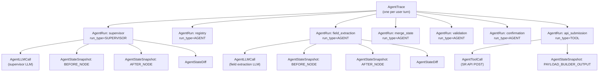

# Observability

## Overview

The observability system records every graph execution as a structured trace containing nested runs, state snapshots, state diffs, LLM calls, and tool calls. All data is stored in PostgreSQL and queryable via REST API and the Admin UI.

**Core class:** `TraceManager` (`app/observability/trace_manager.py`)  
**Decorator:** `@trace_node` (`app/observability/decorators.py`)  
**Sanitization:** `sanitize_state_for_trace` (`app/observability/serializers.py`)  
**Redaction:** `redact_payload` (`app/observability/redaction.py`)

---

## Trace Hierarchy

Each user turn produces exactly one `AgentTrace`. Within that trace, each instrumented graph node produces one `AgentRun`. LLM and tool calls produce nested child runs and associated call records.



**Parent-child runs:** `AgentRun.parent_run_id` links LLM child runs to their parent node run. The `_build_run_tree` helper in `app/api/routes/traces.py` reconstructs this tree for the detail API response.

---

## Trace Schema

**Model:** `AgentTrace` (table: `agent_traces`)

| Column | Type | Description |
|--------|------|-------------|
| `id` | UUID | Primary key |
| `session_id` | UUID FK | Links to `chat_sessions` |
| `status` | string | `"RUNNING"` → `"COMPLETED"` or `"FAILED"` |
| `metadata` | JSONB | Turn metadata (user_id, message preview, etc.) |
| `started_at` | timestamp | `TraceManager.start_trace` call time |
| `finished_at` | timestamp | `TraceManager.finish_trace` call time |

**Lifecycle:**

1. `TraceManager.start_trace(session_id, metadata)` → inserts row with `status = "RUNNING"`.
2. `TraceManager.finish_trace(trace_id, final_state)` → updates `status = "COMPLETED"`, captures `AFTER_TRACE` snapshot.
3. `TraceManager.fail_trace(trace_id, error)` → updates `status = "FAILED"` (called from injection guard path and on unhandled exceptions).

> **Known behaviour:** `finish_trace` calls `capture_state_snapshot(..., run_id=None, snapshot_type="AFTER_TRACE")`. `capture_state_snapshot` returns early when `run_id` is `None`, so the after-trace snapshot is currently a no-op. The trace status is still updated correctly.

---

## Run Schema

**Model:** `AgentRun` (table: `agent_runs`)

| Column | Type | Description |
|--------|------|-------------|
| `id` | UUID | Primary key |
| `trace_id` | UUID FK | Parent trace |
| `parent_run_id` | UUID FK nullable | Parent run (for nested LLM/tool runs) |
| `name` | string | Node name (e.g. `"supervisor"`, `"field_extraction"`) |
| `run_type` | string | `"SUPERVISOR"` \| `"AGENT"` \| `"LLM"` \| `"TOOL"` |
| `status` | string | `"RUNNING"` → `"COMPLETED"` or `"FAILED"` |
| `output` | JSONB | The **partial state dict** returned by the node (not the full merged state) |
| `latency_ms` | integer | Derived from monotonic timers in `TraceManager` |
| `started_at` | timestamp | |
| `finished_at` | timestamp | |

---

## LLM Call Logging

**Model:** `AgentLLMCall` (table: `agent_llm_calls`)

Captured by `TraceManager.capture_llm_call(run_id, request, response, latency_ms)`.

**Fields:**

| Column | Type | Description |
|--------|------|-------------|
| `run_id` | UUID FK | Parent run |
| `request` | JSONB | Model, messages, temperature, max_tokens |
| `response` | JSONB | Structured output (parsed Pydantic model as dict), token usage |
| `latency_ms` | integer | LLM round-trip time |

**Called from:**

- `supervisor_node` — captures `SupervisorDecision` with reasoning stripped before storage.
- `field_extraction_node` — captures `HandoverExtractedFields` output.

**Chain-of-thought stripping:** `sanitize_state_for_trace` removes keys matching CoT patterns (e.g. `reasoning`, `chain_of_thought`) before any state is persisted. LLM `response` captures the parsed structured output, not the raw model output.

---

## Tool Call Logging

**Model:** `AgentToolCall` (table: `agent_tool_calls`)

Captured by `TraceManager.capture_tool_call(run_id, tool_name, input, output, latency_ms)`.

**Fields:**

| Column | Type | Description |
|--------|------|-------------|
| `run_id` | UUID FK | Parent `TOOL` run |
| `tool_name` | string | e.g. `"create_service_request"` |
| `input` | JSONB | Redacted request payload |
| `output` | JSONB | Redacted API response |
| `latency_ms` | integer | External API round-trip time |

**Called from:** `api_submission_node`. The `PAYLOAD_BUILDER_OUTPUT` state snapshot is also captured here (with redacted `create_payload`).

---

## State Snapshots

**Model:** `AgentStateSnapshot` (table: `agent_state_snapshots`)

Captured by `TraceManager.capture_state_snapshot(run_id, state, snapshot_type)`.

| `snapshot_type` | When captured |
|----------------|---------------|
| `BEFORE_NODE` | Before each `@trace_node`-decorated node executes |
| `AFTER_NODE` | After each `@trace_node`-decorated node returns |
| `PAYLOAD_BUILDER_OUTPUT` | In `api_submission_node` — the redacted `create_payload` |
| `AFTER_TRACE` | Attempted in `finish_trace` (currently no-op when `run_id=None`) |

**State sanitization** before storage: `sanitize_state_for_trace` is applied to every state before `capture_state_snapshot` stores it. This removes:

- `trace_manager` (runtime object, not serializable)
- DB sessions and SQLAlchemy objects
- CoT keys (`reasoning`, `chain_of_thought`, etc.)
- Applies `redact_payload` to any `backend_refs.create_payload`

---

## State Diffs

**Model:** `AgentStateDiff` (table: `agent_state_diffs`)

Captured by `TraceManager.capture_state_diff(run_id, before_state, after_state)`.

`build_json_diff(before, after)` computes a structured diff showing which keys were added, removed, or changed. Stored as JSONB in `agent_state_diffs.diff`.

Format:
```json
{
  "added": {
    "collected_data.title": "Handover request for Unit A-101"
  },
  "removed": {},
  "changed": {
    "workflow_stage": {
      "before": null,
      "after": "CREATE_SR"
    }
  }
}
```

State diffs are captured **once per `@trace_node` run** — after the node completes, comparing the input state (before snapshot) to the output state (after snapshot).

---

## Redaction Policy

**Module:** `app/observability/redaction.py`

`redact_payload(data: dict) -> dict` performs recursive key-based redaction. Any key whose name matches the redact list has its value replaced with `"[REDACTED]"`.

**Redacted key patterns (from implementation):**

- `jwt_secret_key`, `authorization`, `password`, `token`
- Nested within `create_payload`: `tenant_profile_id`, `property_id`, `brand_id`, `lease_id` (internal IDs)
- CoT / chain-of-thought fields

Redaction is applied:
- On all state snapshots (`PAYLOAD_BUILDER_OUTPUT` in particular)
- On `AgentToolCall.input` and `AgentToolCall.output`
- In the observability REST API response models (`traces.py` serialization)

---

## Observability UI

The Admin UI is at `/admin/agent-observability` in the Next.js frontend.

**Components** (`frontend/components/observability/`):

| Component | Purpose |
|-----------|---------|
| `TraceList` | Paginated list of traces with status, session, duration |
| `TraceDetail` | Expanded trace with run tree |
| `ReplayViewer` | Step-by-step replay of state transitions |
| `LLMCallViewer` | Shows LLM request/response for a run |
| `ToolCallViewer` | Shows tool call input/output |
| `StateDiffViewer` | Visual diff of state before/after each node |

**API consumed:**

- `GET /api/observability/traces` — paginated trace list (query params: `session_id`, `agent`, `status`, `limit`, `offset`)
- `GET /api/observability/traces/{trace_id}` — trace detail with full run tree
- `GET /api/v1/observability/metrics/summary` — aggregate metrics

> **Mismatch note:** The frontend `listTraces` client may send `active_agent` as a query param, while the backend `GET /api/observability/traces` expects `agent`. Verify against `app/api/routes/traces.py` param names when building integrations.
