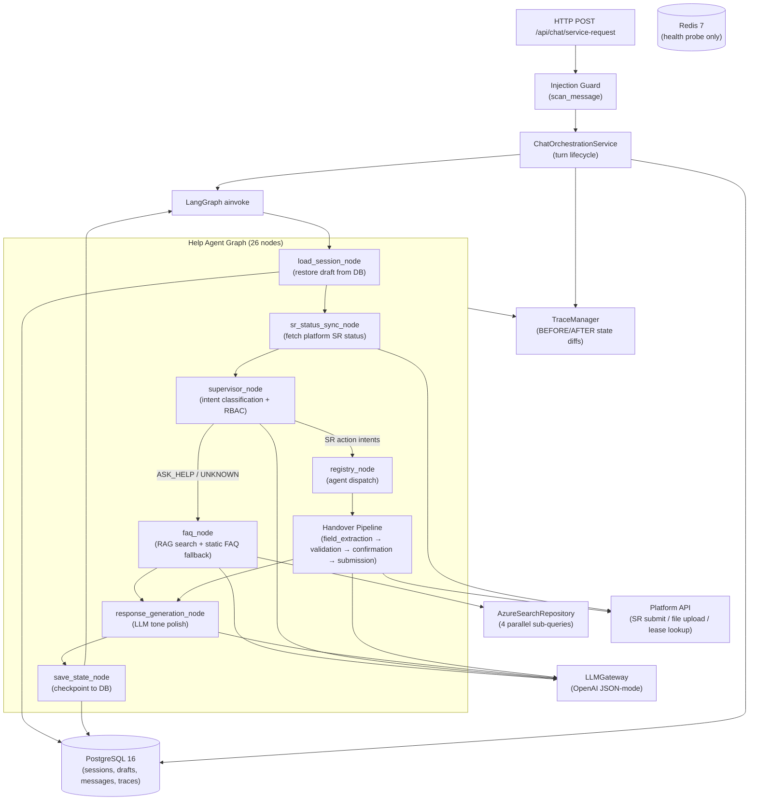

# Agent Pipeline — Production Readiness Assessment

> **Date:** July 2026  
> **Scope:** Full Help Agent pipeline — HTTP layer → LangGraph graph → LLM gateway → persistence → observability  
> **Verdict:** Architecture and patterns are production-grade. Seven critical gaps must be closed before a live deployment. Fifteen operational hardening items should follow shortly after.

---

## Table of Contents

1. [Pipeline Map](#1-pipeline-map)
2. [What Is Already Production-Grade](#2-what-is-already-production-grade)
3. [Critical — Must Fix Before Go-Live](#3-critical--must-fix-before-go-live)
4. [Should Fix — Operational Hardening](#4-should-fix--operational-hardening)
5. [Nice to Have — Polish](#5-nice-to-have--polish)
6. [Per-Stage Assessment](#6-per-stage-assessment)
7. [Summary Scorecard](#7-summary-scorecard)

---

## 1. Pipeline Map

Every chat turn traverses the following stages in order:



---

## 2. What Is Already Production-Grade

These areas are solid and require no changes before deployment.

| Area | Evidence |
|------|----------|
| **Fully async I/O** | FastAPI, SQLAlchemy async, `httpx.AsyncClient`, `openai.AsyncOpenAI` — no blocking calls in the hot path |
| **Graceful LLM degradation** | Every node that calls the LLM wraps in `try/except`; falls back to a static message rather than raising |
| **FAQ RAG fallback** | `faq_node` wraps the entire embed → search → format pipeline in a single `try/except`; static `FAQ_SYSTEM_PROMPT` is always the safety net |
| **Prompt injection scanning** | `scan_message()` runs before the graph; `is_high_risk` blocks the turn and logs without persisting the raw message |
| **Trace redaction** | `redact_payload` auto-redacts any key containing `api_key`, `secret`, `token`, `password`, etc. — recursively through nested dicts |
| **@trace_node decorator** | Every node automatically captures BEFORE/AFTER state snapshots and state diffs; tracing errors never crash the node |
| **Per-turn state isolation** | `load_session_node` pops transient fields (`missing_fields`, `faq_sources`) before each turn — stale state never carries forward |
| **Cloud-agnostic RAG** | `EmbeddingProvider` and `SearchRepository` Protocols; swap provider with one env var change, zero node code changes |
| **httpx graceful shutdown** | `AzureSearchRepository.close()` called from FastAPI lifespan via `close_integrations()` |
| **Field extraction retry** | `FieldExtractionService` retries up to `MAX_RETRIES=2` on parse/validation failures |
| **DB transaction safety** | `get_db_session()` commits on success, rolls back on any exception — no partial writes |
| **Injection guard at HTTP layer** | High-risk content never enters the graph or the message store |
| **Structured logging** | `structlog` used throughout new integration code; all log events carry `reason=`, `latency_ms=`, `hits=` etc. |

---

## 3. Critical — Must Fix Before Go-Live

These are security or data-loss issues that cannot be shipped as-is.

---

### C1. `RBAC_ENFORCE` defaults to `false`

**File:** `app/core/config.py`, `app/core/security.py`

The default is shadow mode: malformed or missing JWTs become anonymous `AuthContext` objects. All chat traffic proceeds without authentication. The `chat.py` route then falls back to the `user_id` field in the **request body** as the identity.

```python
# config.py — current default
rbac_enforce: bool = Field(default=False, ...)

# security.py — shadow mode result
return AuthContext(subject_id="anonymous", roles=frozenset())
```

**Fix:** Set `RBAC_ENFORCE=true` in production `.env`. Add a startup assertion that `RBAC_ENFORCE` is `true` when `ENVIRONMENT=production`.

---

### C2. No session ownership check

**File:** `app/services/chat_orchestration_service.py`

`_load_or_create_session` loads any session by UUID without verifying that `user_id` matches the session owner. Combined with C1 (body-supplied `user_id`), any caller who learns or guesses a `session_id` can read and write another user's conversation.

```python
async def _load_or_create_session(self, session_id, user_id):
    existing = await self._session_repo.get_by_id(session_id)
    # ← no check: existing.user_id == user_id
    if existing is not None:
        return existing
```

**Fix:** Add `if existing.user_id != user_id: raise HTTPException(403)` after loading. Enforce `RBAC_ENFORCE=true` so `user_id` comes from the JWT, not the body.

---

### C3. Identity comes from request body when JWT is absent

**File:** `app/api/routes/chat.py`

```python
effective_user_id = (
    auth.subject_id
    if auth.subject_id not in ("anonymous", "unauthenticated")
    else body.user_id   # ← attacker-controlled
)
```

**Fix:** When `RBAC_ENFORCE=true`, reject any turn where `auth.subject_id` is `"anonymous"` or `"unauthenticated"` — do not fall through to `body.user_id`.

---

### C4. `JWT_SECRET_KEY` defaults to `"change-me"`

**File:** `app/core/config.py`

```python
jwt_secret_key: str = Field(default="change-me", ...)
```

**Fix:** Add a startup assertion that `jwt_secret_key != "change-me"` when `ENVIRONMENT=production`. Generate a cryptographically random 64-char key for production.

---

### C5. No LLM / graph-level timeout

**File:** `app/agents/llm/gateway.py`, `app/services/chat_orchestration_service.py`

`openai.AsyncOpenAI` is created without a `timeout=` argument. The SDK default is effectively unbounded (~600 s). A single hung LLM call occupies a worker for up to 10 minutes.

```python
# gateway.py — no timeout
self._client = openai.AsyncOpenAI(api_key=api_key, base_url=base_url or None)
```

**Fix:**

```python
import openai

self._client = openai.AsyncOpenAI(
    api_key=api_key,
    base_url=base_url or None,
    timeout=openai.Timeout(total=30.0, connect=5.0, read=25.0),
    max_retries=2,
)
```

Add an `asyncio.wait_for` timeout around `graph.ainvoke()` in `ChatOrchestrationService.process_turn()` (recommended: 60 s).

---

### C6. Silent draft persistence failure

**File:** `app/agents/graph/nodes/shared/save_state_node.py`

If `save_checkpoint` raises (e.g. transient DB error), the graph returns `{}`, the orchestration service records a success, the user receives a reply, and the draft state is silently lost. The user's next turn starts from the wrong state with no indication anything went wrong.

```python
# save_state_node.py
except Exception:
    log.exception("save_state_node.failed", ...)
    return {}   # ← graph continues; caller never knows
```

**Fix:** Expose a `persistence_failed: bool` flag in the state and surface it in the API response's `state` object, or raise so `ChatOrchestrationService` can increment a metric and optionally retry.

---

### C7. `OPENAI_API_KEY` not validated at startup

**File:** `app/agents/llm/gateway.py`

`LLMGateway.from_settings()` passes `settings.openai_api_key or ""`. The gateway is created successfully with an empty string; the first real LLM call fails with a 401 at runtime.

**Fix:** Add a startup lifespan check:

```python
# main.py lifespan
if not settings.openai_api_key:
    raise RuntimeError("OPENAI_API_KEY is required but not set.")
```

---

## 4. Should Fix — Operational Hardening

These are not blockers but will cause real pain at production scale.

---

### S1. No retry on supervisor or `response_generation` LLM calls

`FieldExtractionService` already retries up to `MAX_RETRIES=2`. The supervisor and `response_generation_node` make single LLM attempts. A transient 503 from OpenAI produces a degraded or fallback response.

**Fix:** Add `max_retries=2` to `openai.AsyncOpenAI` (covers SDK-level retries on 429/5xx) — this single change covers all call sites. For supervisor JSON parse failures, add a one-shot retry in `supervisor_node`.

---

### S2. DB connection pool not tuned; engine not disposed on shutdown

**File:** `app/db/session.py`, `app/main.py`

Default `pool_size=5` with `max_overflow=10` may exhaust under concurrent turns (each turn makes 5–8 DB calls). The engine is never disposed on shutdown, leaking connections on redeploy.

**Fix:**

```python
# db/session.py
engine = create_async_engine(
    settings.database_url,
    pool_pre_ping=True,
    pool_size=10,
    max_overflow=20,
    pool_recycle=1800,
    pool_timeout=30,
)
```

```python
# main.py lifespan
yield
await engine.dispose()
await close_integrations()
```

---

### S3. Readiness probe requires Redis but Redis is unused by chat

**File:** `app/api/routes/health.py`

`GET /ready` pings Redis. If Redis is down, the readiness probe fails and the service is removed from load balancers — even though all chat functionality (PostgreSQL, OpenAI) is healthy. This causes false-negative deploy failures.

**Fix:** Make the Redis ping in `/ready` non-fatal (return a degraded status rather than 503), or remove it from the critical path until Redis is actually used in the chat flow.

---

### S4. Redis client has no timeout, retry, or lifecycle management

**File:** `app/core/redis.py`

The Redis client is created without `socket_timeout` or `socket_connect_timeout` and is never closed in the lifespan shutdown hook.

**Fix:** Add `socket_timeout=5`, `socket_connect_timeout=2`, and call `await redis_client.aclose()` in the lifespan shutdown.

---

### S5. `settings.llm_confidence_threshold` is configured but never wired

**File:** `app/agents/prompts/supervisor_prompt.py` vs `app/core/config.py`

`LLM_CONFIDENCE_THRESHOLD` is a documented env var (default `0.6`) but the supervisor uses a hardcoded constant from the prompt module. Changing the env var has no effect.

```python
# supervisor_prompt.py — hardcoded, ignores settings
CONFIDENCE_THRESHOLD = 0.6
```

**Fix:** Import `settings.llm_confidence_threshold` in `supervisor_node.py` or `supervisor_prompt.py` and use it for the routing threshold check.

---

### S6. Supervisor logs LLM `reasoning` at INFO

**File:** `app/agents/graph/nodes/supervisor_node.py`

Chain-of-thought reasoning from the supervisor LLM is emitted at `INFO` level and will appear in any log aggregator (Datadog, Splunk, CloudWatch). This may contain user message fragments and internal classification rationale.

**Fix:** Log `reasoning` at `DEBUG` level only, or strip it entirely from structured log fields.

---

### S7. JWT claim parsing can raise unhandled `ValueError` → 500

**File:** `app/core/security.py`

```python
tuple(int(x) for x in payload.get("unique_property_ids", []))
```

If the JWT claim contains non-integer values, this raises `ValueError` which propagates as a 500 — not a 401.

**Fix:** Wrap in `try/except ValueError` and return a 401 with an appropriate `WWW-Authenticate` header.

---

### S8. Session continuity bypasses supervisor RBAC re-check on follow-up turns

**File:** `app/agents/graph/help_agent_graph.py`

When `active_agent` is set in session state, `_route_after_supervisor` skips the supervisor node entirely. If the user's JWT role changes between turns (e.g. role demoted mid-session), the old RBAC decision is honoured until the session is cleared.

**Fix:** Re-check role permissions against the current turn's `auth_context` even when `active_agent` is set, before routing to the agent entry node.

---

### S9. No 429 / rate-limit backoff for OpenAI or platform APIs

The `LLMGateway` and the platform HTTP client (`httpx.AsyncClient`) have no explicit 429 handler. OpenAI SDK retries (added in S1) help for LLM calls, but the platform API client has no retry logic at all.

**Fix:** Add `tenacity` or a manual exponential-backoff wrapper to the platform API client for 429 and 503 responses.

---

### S10. `TraceManager` in-memory dicts can grow unbounded

**File:** `app/observability/trace_manager.py`

`_run_start_times` and `_trace_start_times` are populated by `start_run`/`start_trace`. If a worker is killed mid-turn (SIGKILL, OOM), `finish_*` never runs and the entries are never removed.

**Fix:** Add a TTL-based cleanup (e.g. remove entries older than 10 minutes in a periodic task, or use `weakref` / a bounded `OrderedDict`).

---

### S11. `choices[0]` without empty-list guard in LLMGateway

**File:** `app/agents/llm/gateway.py`

```python
raw = response.choices[0].message.content or "{}"
```

If the API returns an empty `choices` list (rare but possible), this raises `IndexError` rather than a clean `OpenAIError`.

**Fix:**

```python
if not response.choices:
    raise openai.APIError("Empty choices in LLM response", request=None, body=None)
raw = response.choices[0].message.content or "{}"
```

---

### S12. `sr_id` sync has no caller authorization guard

**File:** `app/agents/graph/nodes/shared/sr_status_sync_node.py`

The node calls the platform `GET /service-requests/{sr_id}` with no check that the calling user owns the SR. Authorization is delegated entirely to the platform API — if the platform API is misconfigured or allows broad access, any user who sends `sr_id` can read any SR.

**Fix:** After fetching, assert that `result["created_by"] == state["user_id"]` (or the platform-supplied ownership field) and return `{}` with a warning if the check fails.

---

### S13. Injection guard is POC-grade

**File:** `app/core/injection_guard.py`

The guard uses regex substring matching with a hardcoded threshold. It has no Unicode normalization, no homoglyph handling, and the threshold (`0.7`) is not configurable.

**Fix for production:** Add input normalization (`unicodedata.normalize("NFKC", text)`), make `HIGH_RISK_THRESHOLD` a settings field, and consider supplementing with an LLM-based classifier for borderline inputs.

---

## 5. Nice to Have — Polish

| # | Issue | File |
|---|-------|------|
| N1 | Unpinned deps (`>=`) — non-reproducible builds | `pyproject.toml` |
| N2 | No Sentry / OpenTelemetry — only custom trace tables | `pyproject.toml` |
| N3 | `response_generation` LLM call not recorded in TraceManager | `response_generation_node.py` |
| N4 | Mixed `structlog` vs stdlib `logging` in `response_generation_node`, `supervisor_node` | Multiple nodes |
| N5 | CORS `allow_methods/headers=["*"]` — tighten for production | `main.py` |
| N6 | No FK: `chat_sessions.user_id → users.id` — orphan rows possible | `db/models.py` |
| N7 | Full user messages stored in `agent_traces` with no retention policy — PII growth | `db/models.py` |
| N8 | Terminal paths (SUBMITTED/FAILED) still trigger the response_generation LLM call | `response_generation_node.py` |
| N9 | `compiled_graph` singleton not refreshed on hot reload in dev | `help_agent_graph.py` |
| N10 | `LLM_BASE_URL` / `temperature` hardcoded in `LLMGateway.from_settings()` — not all settings wired | `gateway.py` |
| N11 | Legacy `ObservabilityTrace` table alongside `AgentTrace` — simplify ops/migrations | `db/models.py` |
| N12 | No gunicorn / process-manager guidance for production deployment | `pyproject.toml` |

---

## 6. Per-Stage Assessment

### HTTP Layer (`app/api/routes/`, `app/core/`)

| Component | Status | Key Gap |
|-----------|--------|---------|
| Request validation (Pydantic) | ✅ Solid | — |
| JWT parsing | ⚠️ Partial | JWT claim `ValueError` → 500 (S7) |
| RBAC enforcement | ❌ Critical | Defaults to off (C1); body `user_id` fallback (C3) |
| Injection guard | ⚠️ Partial | POC-grade regex only (S13) |
| Rate limiting | ❌ Missing | No `slowapi` / 429 handling |
| CORS | ⚠️ Partial | Wildcard methods/headers (N5) |

---

### Orchestration Layer (`app/services/chat_orchestration_service.py`)

| Component | Status | Key Gap |
|-----------|--------|---------|
| Turn lifecycle (audit, trace, persist) | ✅ Solid | — |
| Session ownership check | ❌ Critical | No `user_id` vs session owner check (C2) |
| Graph timeout | ❌ Critical | No `asyncio.wait_for` around `graph.ainvoke` (C5) |
| Persistence failure visibility | ❌ Critical | Silent failure in `save_state_node` (C6) |

---

### LLM Gateway (`app/agents/llm/gateway.py`)

| Component | Status | Key Gap |
|-----------|--------|---------|
| JSON-mode enforcement | ✅ Solid | — |
| Latency measurement | ✅ Solid | — |
| API key validation at startup | ❌ Critical | Not checked; fails at first call (C7) |
| Request timeout | ❌ Critical | SDK default (~600 s) (C5) |
| Retry logic | ⚠️ Partial | Add `max_retries=2` to SDK client (S1) |
| Empty `choices` guard | ⚠️ Missing | `IndexError` on edge case (S11) |

---

### Graph — Shared Infrastructure Nodes

| Node | Status | Key Gap |
|------|--------|---------|
| `load_session_node` | ✅ Solid | Transient fields correctly popped each turn |
| `sr_status_sync_node` | ⚠️ Partial | No caller ownership check (S12) |
| `supervisor_node` | ⚠️ Partial | RBAC bypassed on follow-up turns (S8); confidence threshold not wired (S5); `reasoning` logged at INFO (S6) |
| `response_generation_node` | ⚠️ Partial | No trace capture; mixed logging; runs on terminal paths (N3, N4, N8) |
| `save_state_node` | ❌ Critical | Silent persistence failure (C6) |

---

### Graph — FAQ Path (`app/agents/graph/nodes/faq/`)

| Component | Status | Key Gap |
|-----------|--------|---------|
| RAG pipeline (embed → search → format) | ✅ Solid | Full `try/except` fallback |
| Static-prompt fallback | ✅ Solid | Always executes on any RAG error |
| `faq_sources` always a list | ✅ Solid | `[]` returned on all fallback paths |
| Inline source citations | ✅ Solid | `[Source: ...]` preserved by `response_generation_prompt` instruction |
| Latency logging | ✅ Solid | `embed_ms`, `search_ms`, `hits` all logged |
| `faq_sources` in API response | ✅ Solid | Wired through `ChatTurnResult` → `ServiceRequestChatResponse` |
| `faq_sources` in message metadata | ✅ Solid | Persisted in assistant message `metadata` JSONB |

---

### Graph — Handover SR Pipeline

| Component | Status | Key Gap |
|-----------|--------|---------|
| Field extraction with retry | ✅ Solid | `MAX_RETRIES=2` |
| Validation (date chains, required fields) | ✅ Solid | Deterministic code, not LLM |
| HITL confirmation | ✅ Solid | Explicit `confirm`/`cancel` action routing |
| Platform API submission | ⚠️ Partial | No 429/retry on platform API (S9) |
| Lease lookup | ⚠️ Partial | No retry on lease API |

---

### Persistence (`app/db/`, `app/services/conversation_state_service.py`)

| Component | Status | Key Gap |
|-----------|--------|---------|
| DB transaction safety | ✅ Solid | Commit/rollback in session helper |
| `pool_pre_ping` | ✅ Solid | Stale connections detected |
| Pool sizing | ❌ Missing | Default `pool_size=5`; no recycle/timeout (S2) |
| Engine shutdown | ❌ Missing | `engine.dispose()` not called in lifespan (S2) |
| Draft persistence failure alerting | ❌ Critical | Log only, no metric/flag (C6) |

---

### Observability (`app/observability/`)

| Component | Status | Key Gap |
|-----------|--------|---------|
| `@trace_node` BEFORE/AFTER snapshots | ✅ Solid | Auto-captures `faq_sources` diffs |
| Credential redaction | ✅ Solid | `api_key` substring match covers all new RAG keys |
| `faq_sources` in trace state diff | ✅ Solid | No code change needed |
| TraceManager in-memory dict cleanup | ⚠️ Missing | Entries leak on worker kill (S10) |
| `response_generation` LLM not traced | ⚠️ Missing | Cost/latency gap (N3) |

---

### Infrastructure

| Component | Status | Key Gap |
|-----------|--------|---------|
| Redis readiness probe | ❌ Misconfigured | Fails prod deploy when Redis is down but chat works (S3) |
| Redis lifecycle | ❌ Missing | No timeout, retry, or shutdown close (S4) |
| `httpx.AsyncClient` shutdown | ✅ Solid | `close_integrations()` wired in lifespan |
| Dependency versions | ⚠️ Loose | All `>=`, non-reproducible (N1) |

---

## 7. Summary Scorecard

| Pipeline Stage | Ready? | Blockers |
|----------------|--------|----------|
| HTTP / Auth layer | ⚠️ No | C1, C3 (RBAC off; body user_id) |
| Session management | ⚠️ No | C2 (no ownership check) |
| Security (JWT, injection) | ⚠️ No | C4 (default secret); S7 (ValueError); S13 (regex-only guard) |
| LLM Gateway | ⚠️ No | C5 (no timeout); C7 (no startup key check) |
| Graph infrastructure | ⚠️ No | C5 (no graph timeout); C6 (silent persistence failure) |
| FAQ / RAG path | ✅ Yes | None — fully fallback-safe |
| Handover SR pipeline | ✅ Yes | S9 (no platform retry — operational) |
| Persistence / DB | ⚠️ No | S2 (pool tuning); S3/S4 (Redis) |
| Observability | ✅ Yes | Minor gaps (S10, N3) |
| **Overall** | **⚠️ Not yet** | **7 critical items to close** |

---

## Recommended Fix Order

**Week 1 — Security (C1–C4):** Enable `RBAC_ENFORCE`, add session ownership check, reject body `user_id` when JWT is valid, rotate `JWT_SECRET_KEY`.

**Week 1 — Resilience (C5, C7):** Add `timeout` + `max_retries` to `openai.AsyncOpenAI`; add startup key validation; wrap `graph.ainvoke` with `asyncio.wait_for(60s)`.

**Week 2 — Data integrity (C6, S2):** Surface persistence failures in the API response state; tune DB pool; add `engine.dispose()` to lifespan.

**Week 2 — Operational (S3–S6):** Decouple Redis from readiness probe; wire `llm_confidence_threshold` to supervisor; move `reasoning` to DEBUG.

**Week 3 — Hardening (S7–S13):** JWT `ValueError` guard; RBAC re-check on session continuity; platform API retry; injection guard normalization; TraceManager TTL cleanup.
