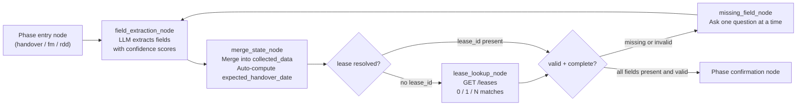

# RDD Agent — Technical Reference

> **Agent identifier:** `rdd_agent`
> **Lifecycle:** RDD Handover Service Request — three sequential workflow phases
> **Entry point:** Activated by the Help Agent supervisor when intent is `CREATE_RDD_SERVICE_REQUEST`, `UPDATE_RDD_SERVICE_REQUEST`, or `APPROVE_RDD_SERVICE_REQUEST`
>
> **Related docs:**
> - [`help-agent-pipeline.md`](help-agent-pipeline.md) — Help Agent (supervisor + FAQ) that routes to this agent
> - [`production-readiness.md`](production-readiness.md) — Production gap assessment

---

## Table of Contents

1. [Overview](#1-overview)
2. [Lifecycle Architecture](#2-lifecycle-architecture)
3. [Phase 1 — CREATE_SR (Mall Manager)](#3-phase-1--create_sr-mall-manager)
4. [Phase 2 — FM_REVIEW (FM Manager / Operations)](#4-phase-2--fm_review-fm-manager--operations)
5. [Phase 3 — RDD_REVIEW (DD Engineer)](#5-phase-3--rdd_review-dd-engineer)
6. [Shared Pipeline Nodes](#6-shared-pipeline-nodes)
7. [WorkflowConfig](#7-workflowconfig)
8. [RBAC — Role Permissions](#8-rbac--role-permissions)
9. [State Schema](#9-state-schema)
10. [File Structure](#10-file-structure)
11. [Adding a New Phase (Extension Guide)](#11-adding-a-new-phase-extension-guide)

---

## 1. Overview

The **RDD Agent** handles the complete Handover Service Request lifecycle for the Cenomi Mall Management Platform. It is a single LangGraph agent (`rdd_agent`) that owns all three sequential workflow phases from SR creation through final approval.

### Core design principles

| Principle | Implementation |
|-----------|---------------|
| **One agent, one lifecycle** | `rdd_agent` stays active in `chat_sessions.active_agent` for the entire lifecycle across all three phases |
| **Sequential phases enforced by platform** | `sr_status_sync_node` reads the live platform SR status each turn and routes to the correct phase entry node |
| **LLM extracts, code validates** | Field extraction is LLM-assisted; all validation, date constraints, and submission logic is deterministic Python |
| **Per-phase confirmation** | Each phase has its own confirmation card before API submission |
| **Shared pipeline** | `field_extraction → merge_state → lease_lookup → validation → missing_field` is identical across all phases |
| **HITL at every stage** | No automatic submission; every phase requires explicit user confirmation |

### Roles involved

| Role | Phase | Action |
|------|-------|--------|
| `MALL_MANAGER` | CREATE_SR | Creates the SR, provides inspection details |
| `FM_MANAGER` or `OPERATIONS` | FM_REVIEW | Reviews SR, uploads FM documents, sets handover dates |
| `DD_ENGINEER` | RDD_REVIEW | Uploads handover report, submits final RDD review |

---

## 2. Lifecycle Architecture

```mermaid
flowchart LR
    subgraph lifecycle ["RDD Agent Lifecycle (rdd_agent)"]
        subgraph p1 ["Phase 1 — CREATE_SR"]
            direction TB
            MM["Mall Manager"]
            P1E["handover_entry_node"]
            P1F["field_extraction\nmerge_state\nlease_lookup\nvalidation"]
            P1C["confirmation_node\n(17 fields)"]
            P1S["api_submission_node\nPOST /service-requests"]
            MM --> P1E --> P1F --> P1C --> P1S
        end

        subgraph p2 ["Phase 2 — FM_REVIEW"]
            direction TB
            FM["FM Manager\nor Operations"]
            P2E["fm_review_entry_node"]
            P2F["field_extraction\nmerge_state\nvalidation"]
            P2C["fm_confirmation_node\n(dates + docs)"]
            P2S["fm_api_submission_node\nPATCH /service-requests"]
            FM --> P2E --> P2F --> P2C --> P2S
        end

        subgraph p3 ["Phase 3 — RDD_REVIEW"]
            direction TB
            RDD["DD Engineer"]
            P3E["rdd_review_entry_node"]
            P3F["field_extraction\nmerge_state\nvalidation"]
            P3C["rdd_confirmation_node\n(dates + report)"]
            P3S["rdd_api_submission_node\nPATCH /service-requests"]
            RDD --> P3E --> P3F --> P3C --> P3S
        end

        P1S -->|"platform notifies FM Manager\nSR status → FM_REVIEW"| p2
        P2S -->|"platform notifies DD Engineer\nSR status → RDD_REVIEW"| p3
        P3S -->|"SR_COMPLETED"| DONE["Lifecycle complete"]
    end
```



### Phase sequencing

The platform's own status machine drives phase transitions:

1. Mall Manager creates SR → platform status becomes `FM_REVIEW`
2. `sr_status_sync_node` detects `FM_REVIEW` → routes to `fm_review_entry_node`
3. FM Manager approves → platform status becomes `RDD_REVIEW`
4. `sr_status_sync_node` detects `RDD_REVIEW` → routes to `rdd_review_entry_node`
5. DD Engineer submits → platform status becomes `SR_COMPLETED`

No code-side sequence enforcement is needed — the platform API is the source of truth.

---

## 3. Phase 1 — CREATE_SR (Mall Manager)

### Trigger

Intent `CREATE_RDD_SERVICE_REQUEST` classified by the supervisor → registry resolves `rdd_agent` → `handover_entry_node`.

### Entry node — `handover_entry_node.py`

Handles:
- Explicit UI `action_override` (`confirm`, `cancel`, `upload_document`, `cancel_update`)
- Workflow cancel/restart phrases → clears all state
- Confirmation card response parsing (`yes` / `no` phrases)

### Required fields (17)

| Field | Source | Description |
|-------|--------|-------------|
| `tenant_profile_id` | Backend (lease lookup) | Tenant profile identifier |
| `property_id` | Backend (lease lookup) | Mall property identifier |
| `lease_code` | User → Backend | Lease code (e.g. `T0028604`) |
| `lease_id` | Backend (lease lookup) | Contract/lease UUID |
| `brand_id` | Backend (lease lookup) | Brand identifier |
| `mall` | Backend (lease lookup) | Mall display name |
| `brand` | Backend (lease lookup) | Brand display name |
| `lease` | Backend (lease lookup) | Lease display label |
| `unit_codes` | Backend (lease lookup) | Unit code list |
| `city` | Backend (lease lookup) | City |
| `contracted_area` | Backend (lease lookup) | Area in sqm |
| `title` | User (optional) or auto-generated | `handover-{lease_code}-{description_slug}` |
| `description` | User | Purpose of handover inspection |
| `startDate` | User | Inspection start date (YYYY-MM-DD) |
| `endDate` | User | Inspection end date (must be after startDate) |
| `inspection_done_by` | User | `FM_MANAGER` or `OPERATIONS` |
| `comments` | User (optional) | Additional notes |

**Backend-derived fields** (10): resolved automatically from the Lease-Tenant API — never asked of the user.
**Auto-generated fields**: `title` is generated from `lease_code` + first 5 words of `description` if the user does not provide one.

### Validation rules

| Rule | Blocking |
|------|---------|
| All required fields present and non-empty | Yes |
| `inspection_done_by` ∈ `{FM_MANAGER, OPERATIONS}` | Yes |
| `startDate` < `endDate` (strict — equal dates rejected) | Yes |
| Past dates rejected | Yes |
| `lease_id` confirmed before submission | Yes |

### Submission

`api_submission_node.py` → `POST /service-requests` (platform API). Returns `sr_id` (e.g. `SR-2026-00741`) stored in `backend_refs.sr_id`.

### Conversation flow (5–8 turns)

```
Turn 1: "Create a handover SR for Under Armour"
  → Extracts brand="Under Armour"
  → Lease lookup: T0028604 at Jawharat Jeddah (auto-fills 10 backend fields)
  → Reply: "Found your lease. What is the purpose of this handover?"

Turn 2–4: Collects description, startDate, endDate, inspection_done_by, comments

Turn 5: Shows confirmation card (all 17 fields)
  → User: "Confirm"

Turn 6: Submits SR → returns SR-2026-00741
```

---

## 4. Phase 2 — FM_REVIEW (FM Manager / Operations)

### Trigger

FM Manager or Operations opens the SR from their notification or SR list. The frontend sends `sr_id` in the request body → `sr_status_sync_node` reads platform status `FM_REVIEW` → routes to `fm_review_entry_node`.

### Entry node — `fm_review_entry_node.py`

Handles:
- Role guard: only `FM_MANAGER` or `OPERATIONS` may act
- `fm_action` detection in `backend_refs` (save-progress vs approve actions)
- Document upload coordination

### Required fields (2)

| Field | Source | Description |
|-------|--------|-------------|
| `unit_readiness_date` | FM Manager | Date the unit is ready for handover (YYYY-MM-DD) |
| `expected_handover_date` | Auto-computed | `unit_readiness_date + 7 days` (computed by `merge_state_node`) |

### Required documents (3)

| Document type | Description |
|---------------|-------------|
| `SR_HANDOVER_CHECKLIST` | SR Handover Checklist (PDF/JPEG/PNG) |
| `SR_HANDOVER_SITE_SURVEY` | SR Handover Site Survey (PDF/JPEG/PNG) |
| `SR_COP_CHECKLIST_OTHER` | COP Checklist / Other document |

Documents are uploaded via `POST /api/v1/upload` with `document_type` form field. The upload route checks `CAN_FM_REVIEW_HANDOVER_SR` permission.

### Actions

| Action | Description |
|--------|-------------|
| Save progress | `fm_action=save` — saves collected data, does not advance the lifecycle |
| Approve | `fm_action=approve` — submits FM review, advances SR to `RDD_REVIEW` |
| Reject | `fm_action=reject` — returns SR to Mall Manager for corrections |

### Submission

`fm_api_submission_node.py` → `PATCH /service-requests/{sr_id}` (platform API).

### Conversation flow (2–4 turns)

```
FM Manager opens SR from notification
  → sr_status_sync detects FM_REVIEW → routes to fm_review_entry

Turn 1: "What dates do I need to provide?"
  → Explains unit_readiness_date; expected_handover_date is auto-computed

Turn 2: "Unit ready 2026-07-15"
  → unit_readiness_date=2026-07-15, expected_handover_date=2026-07-22 (auto)

Turn 3: FM Manager uploads 3 documents via upload interface

Turn 4: Confirmation card → Approve
  → FM review submitted → SR advances to RDD_REVIEW
```

---

## 5. Phase 3 — RDD_REVIEW (DD Engineer)

### Trigger

DD Engineer opens SR from notification. Frontend sends `sr_id` → `sr_status_sync_node` reads platform status `RDD_REVIEW` → routes to `rdd_review_entry_node`.

### Entry node — `rdd_review_entry_node.py`

Handles:
- Role guard: only `DD_ENGINEER` may act
- `rdd_action` detection in `backend_refs` (submit vs final-approve)
- Document upload coordination

### Required fields (5)

| Field | Source | Description |
|-------|--------|-------------|
| `guideLineLink` | DD Engineer | URL to the handover guideline document |
| `actual_handover_date` | DD Engineer | Date the unit was actually handed over |
| `fitout_start_date` | DD Engineer | Fit-out works start date |
| `fitout_end_date` | DD Engineer | Fit-out works end date |
| `trading_date` | DD Engineer | Date the unit starts trading |

### Date chain constraint

All four dates must satisfy this strict ordering:
```
actual_handover_date ≤ fitout_start_date ≤ fitout_end_date ≤ trading_date
```
Violation of this constraint is a blocking validation error.

### Required documents (1)

| Document type | Description |
|---------------|-------------|
| `DR_SR_HANDOVER_REPORT` | Final RDD Handover Report (PDF/JPEG/PNG) — uploaded with `APPROVED` status flag |

The upload route checks `CAN_RDD_REVIEW_HANDOVER_SR` permission. The `DR_SR_HANDOVER_REPORT` type automatically receives `document_type_status=APPROVED` on upload.

### Submission

`rdd_api_submission_node.py` → `PATCH /service-requests/{sr_id}` (platform API). On success the SR status becomes `SR_COMPLETED` and the lifecycle ends.

### Conversation flow (2–4 turns)

```
DD Engineer opens SR from notification
  → sr_status_sync detects RDD_REVIEW → routes to rdd_review_entry

Turn 1: "What do I need to provide?"
  → Explains 5 date fields and the handover report

Turn 2–3: Collects dates, validates date chain constraint

Turn 4: Uploads DR_SR_HANDOVER_REPORT → Confirmation card → Submit
  → SR_COMPLETED
```

---

## 6. Shared Pipeline Nodes

These nodes run identically for all three phases. They sit between the phase entry node and the phase-specific confirmation node.



| Node | File | Responsibility |
|------|------|----------------|
| `field_extraction_node` | `handover/field_extraction_node.py` | LLM extracts field values with per-field confidence (≥ 0.6 threshold) |
| `merge_state_node` | `handover/merge_state_node.py` | Merges extracted fields into `collected_data`; auto-computes `expected_handover_date`; protects backend-derived fields |
| `lease_lookup_node` | `handover/lease_lookup_node.py` | Calls Lease-Tenant API; resolves 10 backend fields; handles 0/1/N match cases |
| `validation_node` | `handover/validation_node.py` | Validates required fields, date ordering, enum constraints |
| `missing_field_node` | `handover/missing_field_node.py` | Asks exactly one missing field per turn using `WorkflowConfig.field_questions` |

---

## 7. WorkflowConfig

The `rdd_agent`'s entire configuration is declared in one `WorkflowConfig` object registered in `WORKFLOW_CONFIG_REGISTRY`.

```python
# app/agents/registries/workflow_config.py

WorkflowConfig(
    agent_name="rdd_agent",
    extraction_prompt=HANDOVER_EXTRACTION_SYSTEM_PROMPT,
    field_questions=HANDOVER_FIELD_QUESTIONS,       # field → question string per phase

    # Phase routing: workflow_stage → graph node name
    stage_sync_nodes={
        "FM_REVIEW":  "fm_review_entry",
        "RDD_REVIEW": "rdd_review_entry",
        # CREATE_SR has no sync entry — it is the default entry via _AGENT_ENTRY_NODES
    },

    # Phases in which field collection runs
    collection_stages=frozenset({"CREATE_SR", "FM_REVIEW", "RDD_REVIEW"}),

    # Confirmation node per phase
    confirmation_nodes={
        "CREATE_SR":  "confirmation",
        "FM_REVIEW":  "fm_confirmation",
        "RDD_REVIEW": "rdd_confirmation",
    },

    # Stages that end the lifecycle (supervisor gets control again)
    terminal_stages=frozenset({"SR_CREATED", "SR_COMPLETED"}),

    # Fields resolved by backend APIs — never asked of the user
    backend_fields=frozenset({
        "tenant_profile_id", "property_id", "brand_id", "lease_id",
        "contract_id", "unit_codes", "city", "contracted_area",
        "lease_brand_mall", "lease",
    }),

    # Fields auto-computed by merge_state_node
    auto_generated_fields=frozenset({"title", "expected_handover_date"}),

    # Fields to ask when backend fields are unresolved
    lease_trigger_fields=("lease_code", "lease_brand_mall"),

    # Supervisor intents that activate this agent
    action_intents=frozenset({
        "CREATE_RDD_SERVICE_REQUEST",
        "UPDATE_RDD_SERVICE_REQUEST",
        "APPROVE_RDD_SERVICE_REQUEST",
    }),
)
```

Shared nodes (`field_extraction_node`, `missing_field_node`, `_route_after_sync`, `_route_after_validation`) read from this config at runtime — no hard-coded phase names in shared code.

---

## 8. RBAC — Role Permissions

| Role | Permitted SR intents | Phase access |
|------|---------------------|-------------|
| `MALL_MANAGER` | `CREATE_RDD_SERVICE_REQUEST`, `UPDATE_RDD_SERVICE_REQUEST` | Phase 1 (CREATE_SR) |
| `FM_MANAGER` | `APPROVE_RDD_SERVICE_REQUEST` | Phase 2 (FM_REVIEW) |
| `OPERATIONS` | `APPROVE_RDD_SERVICE_REQUEST` | Phase 2 (FM_REVIEW — save only, cannot approve independently) |
| `DD_ENGINEER` | *(none — phase 3 triggered by `sr_status_sync`, not by intent)* | Phase 3 (RDD_REVIEW) |
| `ADMIN` | All intents | All phases |

All roles additionally have read intents: `ASK_HELP`, `CHECK_SERVICE_REQUEST_STATUS`, `PREVIEW_SERVICE_REQUEST`, `UNKNOWN`.

Permission enforcement happens at two points:
1. **Supervisor RBAC** (`supervisor_node.py`) — intent checked against `ROLE_PERMITTED_INTENTS` before any workflow node runs
2. **Phase entry RBAC** (`permission_service.py`) — `ensure_can_*` checks at the entry node level for fine-grained action control

---

## 9. State Schema

The RDD agent uses `ServiceRequestGraphState` (defined in `app/agents/graph/state.py`). Key fields written by RDD agent nodes:

| Field | Type | Written by | Description |
|-------|------|-----------|-------------|
| `active_agent` | `str \| None` | supervisor, registry | `"rdd_agent"` for all three phases |
| `intent` | `str \| None` | supervisor | `CREATE_RDD_SERVICE_REQUEST` etc. |
| `service_category` | `str \| None` | supervisor | `"FIT_OUT_AND_HANDOVER"` |
| `sub_category` | `str \| None` | supervisor | `"HANDOVER"` |
| `workflow_stage` | `str \| None` | sr_status_sync, entry nodes | `"CREATE_SR"`, `"FM_REVIEW"`, `"RDD_REVIEW"` |
| `collected_data` | `dict` | merge_state_node | All user-supplied + backend-resolved field values |
| `extracted_fields` | `dict` | field_extraction_node | LLM proposals (pre-merge) with confidence scores |
| `missing_fields` | `list[str]` | missing_field_node | Fields still needed from the user |
| `lease_matches` | `list[dict]` | lease_lookup_node | Candidate leases when multiple found |
| `selected_lease` | `dict \| None` | handover_entry, merge_state | User-selected lease |
| `documents` | `list[dict]` | upload route | Uploaded document metadata |
| `confirmation_status` | `str \| None` | entry nodes | `PENDING`, `CONFIRMED`, `REJECTED` |
| `confirmation_required` | `bool` | confirmation nodes | True when awaiting user confirmation |
| `backend_refs` | `dict` | api_submission nodes | `sr_id`, `service_request_status` |
| `validation_errors` | `list[dict]` | validation_node | Blocking and non-blocking field errors |
| `response_message` | `str` | all nodes | Draft message for response_generation |
| `response_ui` | `dict` | confirmation nodes | Structured UI payload (confirmation card, etc.) |
| `status` | `str` | all nodes | `IN_PROGRESS`, `WAITING_FOR_USER`, `READY_TO_SUBMIT`, `SUBMITTED`, `COMPLETED`, `FAILED` |

---

## 10. File Structure

```
app/agents/
├── registry.py                              ← SERVICE_REQUEST_AGENT_REGISTRY entry for rdd_agent
├── registries/
│   └── workflow_config.py                   ← WorkflowConfig for rdd_agent (_build_rdd_config)
├── schemas/
│   └── handover_schema.py                   ← StageDefinition, required fields, document types
├── prompts/
│   └── handover_extraction_prompt.py        ← LLM field extraction system prompt
└── graph/
    └── nodes/
        └── handover/                        ← All rdd_agent node implementations
            ├── __init__.py
            │
            ├── Phase 1 — CREATE_SR
            ├── handover_entry_node.py        ← Phase 1 entry: confirmation + cancel parsing
            ├── payload_builder_node.py       ← Phase 1: build POST /service-requests payload
            ├── api_submission_node.py        ← Phase 1: POST /service-requests
            ├── confirmation_node.py          ← Shared confirmation logic (used by all phases)
            │
            ├── Phase 2 — FM_REVIEW
            ├── fm_review_entry_node.py       ← Phase 2 entry: FM role guard + action dispatch
            ├── fm_payload_builder_node.py    ← Phase 2: build PATCH payload
            ├── fm_api_submission_node.py     ← Phase 2: PATCH /service-requests (approve/save)
            │
            ├── Phase 3 — RDD_REVIEW
            ├── rdd_review_entry_node.py      ← Phase 3 entry: DD role guard + action dispatch
            ├── rdd_payload_builder_node.py   ← Phase 3: build PATCH payload
            ├── rdd_api_submission_node.py    ← Phase 3: PATCH /service-requests (submit/approve)
            │
            └── Shared pipeline (all phases)
                ├── field_extraction_node.py  ← LLM field extraction with confidence scores
                ├── merge_state_node.py       ← Merge + auto-compute + protect backend fields
                ├── lease_lookup_node.py      ← Lease-Tenant API resolution
                ├── validation_node.py        ← Field + date constraint validation
                ├── missing_field_node.py     ← One-question-at-a-time missing field prompts
                └── preview_node.py           ← SR draft/submitted preview
```

---

## 11. Adding a New Phase (Extension Guide)

To add a **Phase 4** to the RDD lifecycle (e.g. a final sign-off by a Senior Engineer):

### Step 1 — Define the phase fields and documents

Add a new `StageDefinition` in `app/agents/schemas/handover_schema.py`:

```python
SENIOR_REVIEW_STAGE = StageDefinition(
    stage="SENIOR_REVIEW",
    role="SENIOR_ENGINEER",
    required_fields=("sign_off_date", "sign_off_notes"),
    required_documents=("SR_SENIOR_SIGN_OFF",),
)
STAGE_REGISTRY["SENIOR_REVIEW"] = SENIOR_REVIEW_STAGE
```

### Step 2 — Register the phase in WorkflowConfig

Update `_build_rdd_config()` in `app/agents/registries/workflow_config.py`:

```python
stage_sync_nodes={
    "FM_REVIEW":       "fm_review_entry",
    "RDD_REVIEW":      "rdd_review_entry",
    "SENIOR_REVIEW":   "senior_review_entry",   # new
},
collection_stages=frozenset({"CREATE_SR", "FM_REVIEW", "RDD_REVIEW", "SENIOR_REVIEW"}),
confirmation_nodes={
    "CREATE_SR":      "confirmation",
    "FM_REVIEW":      "fm_confirmation",
    "RDD_REVIEW":     "rdd_confirmation",
    "SENIOR_REVIEW":  "senior_confirmation",    # new
},
```

### Step 3 — Implement new phase nodes

Create `app/agents/graph/nodes/handover/senior_review_entry_node.py`, `senior_payload_builder_node.py`, `senior_api_submission_node.py`.

### Step 4 — Wire into the graph

In `app/agents/graph/help_agent_graph.py`:

```python
# Add nodes
graph.add_node("senior_review_entry", senior_review_entry_node)
graph.add_node("senior_confirmation", confirmation_node)
graph.add_node("senior_payload_builder", senior_payload_builder_node)
graph.add_node("senior_api_submission", senior_api_submission_node)

# Add edges to _route_after_sync (auto-handled via WorkflowConfig)
# Add edges for the new phase pipeline
```

### Step 5 — DB migration

The `active_agent` and `workflow_stage` columns are plain text — no schema migration needed for adding a phase. The new stage name (`SENIOR_REVIEW`) is automatically handled by the existing `WorkflowConfig` routing.

### What does NOT change

When you update `WorkflowConfig`, these shared nodes automatically pick up the new phase:

| Node | What it adapts automatically |
|------|------------------------------|
| `field_extraction_node` | Uses `workflow_cfg.extraction_prompt` |
| `missing_field_node` | Uses `workflow_cfg.field_questions` and `backend_fields` |
| `_route_after_sync` | Maps new `stage_sync_nodes` entry |
| `_route_after_validation` | Maps new `collection_stages` and `confirmation_nodes` entries |

---

## Appendix — Document Upload Reference

All document uploads go through `POST /api/v1/upload`:

| Form field | Value |
|-----------|-------|
| `file` | The file (multipart) |
| `document_type` | One of `ALL_DOCUMENT_TYPES` |
| `session_id` | Chat session UUID (to load draft backend refs) |
| `sr_id` | Optional — overrides draft-derived sr_id |

Permission check by document type:

| Document type | Required permission | Role |
|---------------|--------------------|----|
| `SR_HANDOVER_CHECKLIST`, `SR_HANDOVER_SITE_SURVEY`, `SR_COP_CHECKLIST_OTHER` | `CAN_FM_REVIEW_HANDOVER_SR` | FM_MANAGER, OPERATIONS |
| `DR_SR_HANDOVER_REPORT` | `CAN_RDD_REVIEW_HANDOVER_SR` | DD_ENGINEER |
| Others | `CAN_RAISE_HANDOVER_SR` | MALL_MANAGER |

Returned response includes `document_id` which is written back to the draft's `documents` list for subsequent graph turns.
