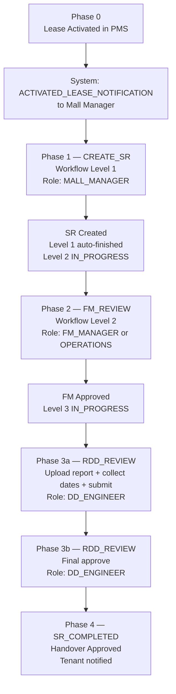

# RDD Lifecycle — Full Stage-by-Stage Reference

**Audience:** Developers, QA, and business stakeholders  
**Scope:** Fit-Out & Handover → **Handover** service request (`FIT_OUT_AND_HANDOVER / HANDOVER`)  
**Sources of truth:** [`handover_schema.py`](../backend/app/agents/schemas/handover_schema.py), [`payload_builder_service.py`](../backend/app/agents/services/payload_builder_service.py), [`handover-business-flow.md`](../../rdd_life_cycle/handover-business-flow.md)

> **What "RDD" means here:** In this system, **RDD** refers to the **RDD Project Manager** role (`DD_ENGINEER` on the platform). The Handover SR is the lifecycle they own the final stage of.

---

## End-to-End Lifecycle Diagram



---

## Phase 0 — Lease Activation (System Trigger)

| Item | Detail |
|---|---|
| **Actor** | PMS / Backend System |
| **Trigger** | `pms_lease_activation_date` reached |
| **Data produced** | Pre-filled tenant + lease context on the Handover form |
| **System action** | Fires `ACTIVATED_LEASE_NOTIFICATION` to the Mall Manager for that mall/lease |
| **No chatbot involvement** | Pure platform/PMS event |
| **Next** | Mall Manager opens the pre-filled form → Phase 1 |

---

## Phase 1 — CREATE_SR (Workflow Level 1)

**Chatbot `workflow_stage`:** `CREATE_SR` → `SR_CREATED`  
**Platform SR status after:** `IN_PROCESS` (Level 1 auto-finished, Level 2 `IN_PROGRESS`)  
**Role required:** `MALL_MANAGER`  
**Permission:** `CAN_RAISE_HANDOVER_SR`

### Data Required

| Field | Source | Description |
|---|---|---|
| `lease_code` | User / LLM extraction | Identifies the lease |
| `mall` | User / LLM extraction | Mall name |
| `brand` | User / LLM extraction | Tenant brand |
| `description` | User / LLM extraction | Short handover context (optional) |
| `startDate` | User / LLM extraction | Inspection window start |
| `endDate` | User / LLM extraction | Inspection window end |
| `inspection_done_by` | User / LLM extraction | `FM_MANAGER` or `OPERATIONS` |
| `comments` | User / LLM extraction | Context for approvers (optional) |
| `tenant_profile_id` | Backend API (lease lookup) | Never asked of user |
| `property_id` | Backend API (lease lookup) | Never asked of user |
| `lease_id`, `brand_id` | Backend API (lease lookup) | Never asked of user |
| `unit_codes`, `city`, `contracted_area` | Backend API (lease lookup) | Never asked of user |
| `title` | Backend-computed | Auto-generated: `handover-{lease_code}-{slug}` |

### Action

- Chatbot collects missing user-supplied fields via conversational LLM extraction
- On confirmation: `POST /service-requests` with `service_category=FIT_OUT_AND_HANDOVER`, `sub_category=HANDOVER`
- Platform returns `sr_id` → stored in `backend_refs.sr_id`

### Platform Workflow State After CREATE

| Level | Role | Status |
|---|---|---|
| 1 | Mall Manager | **FINISHED** (automatic) |
| 2 | FM Manager or Operations | **IN_PROGRESS** |
| 3 | DD_Engineer (RDD PM) | **YET_TO_START** |

### Transition to FM_REVIEW

`sr_status_sync_node` does `GET /service-requests/{sr_id}` and detects that `FM_MANAGER` or `OPERATIONS` operation is `IN_PROGRESS` → sets `workflow_stage = FM_REVIEW`.

---

## Phase 2 — FM_REVIEW (Workflow Level 2)

**Chatbot `workflow_stage`:** `FM_REVIEW`  
**Platform SR status progression:** `IN_PROCESS` (save) → `APPROVED` (FM approves)  
**Role required:** `FM_MANAGER` or `OPERATIONS`  
**Permission:** `CAN_FM_REVIEW_HANDOVER_SR` (save/upload), `CAN_APPROVE_FM_HANDOVER_SR` (approve)

### Data Required

| Field | Source | Description |
|---|---|---|
| `unit_readiness_date` | User / LLM extraction | Date the unit is physically ready |
| `expected_handover_date` | Backend-computed | `unit_readiness_date + 7 calendar days` — never asked |

### Documents Required

| Document Type | Business Name | Purpose |
|---|---|---|
| `SR_HANDOVER_CHECKLIST` | Handover Checklist | Confirms handover prerequisites |
| `SR_HANDOVER_SITE_SURVEY` | Site Survey | Records site condition |
| `SR_COP_CHECKLIST_OTHER` | COP / Other Checklist | Compliance / mall-specific checks |

Documents are uploaded via `POST /api/upload` (handled outside the graph). Their UUIDs are stored in `backend_refs.uploaded_documents`.

### Actions (Two Sub-steps)

1. **Save progress** — `PATCH /service-requests/{sr_id}` with `status=IN_PROCESS`  
   Triggered by `action_override=save_fm_progress` → `fm_action="save_progress"`  
   Sets `backend_refs.fm_status = "IN_PROCESS"`

2. **Approve** — `PATCH /service-requests/{sr_id}` with `status=APPROVED`  
   Triggered by `action_override=approve_fm_review` → `fm_action="approve"`  
   Sets `backend_refs.fm_status = "APPROVED"`  
   Platform advances `DD_ENGINEER` operation → `IN_PROGRESS`

### Transition to RDD_REVIEW

`sr_status_sync_node` detects `DD_ENGINEER` operation is `IN_PROGRESS` → sets `workflow_stage = RDD_REVIEW`.

---

## Phase 3a — RDD_REVIEW: Submit Report (Workflow Level 3, Sub-step 1)

**Chatbot `workflow_stage`:** `RDD_REVIEW` (stays here after this step)  
**`backend_refs.rdd_status`:** unset → `REPORT_SUBMITTED`  
**Role required:** `DD_ENGINEER` (RDD Project Manager)  
**Permission:** `CAN_RDD_REVIEW_HANDOVER_SR`

### Data Required

| Field | Source | Description |
|---|---|---|
| `guideLineLink` | User / LLM extraction | Tenant fit-out guidelines URL (RDD-only) |
| `actual_handover_date` | User / LLM extraction | Date unit was physically handed to tenant |
| `fitout_start_date` | User / LLM extraction | When tenant starts fit-out works |
| `fitout_end_date` | User / LLM extraction | When tenant completes fit-out works |
| `trading_date` | User / LLM extraction | When store opens for trading |

**Date ordering rule** (enforced by `validate_rdd_date_order`):

```
actual_handover_date ≤ fitout_start_date ≤ fitout_end_date ≤ trading_date
```

Each date must be on or after the previous one. Validation fails and blocks submission if violated.

**Date format:** Stored as `YYYY-MM-DD` in `collected_data`; converted to `DD/MM/YYYY` in the API payload by `_to_ddmmyyyy()`.

### Document Required

| Document Type | Business Name | Upload param |
|---|---|---|
| `DR_SR_HANDOVER_REPORT` | Handover Meeting Report | `document_type_status=APPROVED` |

Upload endpoint: `PUT /files?document_type_id=DR_SR_HANDOVER_REPORT&document_type_status=APPROVED&sr_id={sr_id}&...`  
Returns `document_id` UUID → stored as `backend_refs.rdd_document_id`.

### Action

`POST /service-requests` with `status=REPORT_SUBMITTED`

Key payload structure:
```json
{
  "status": "REPORT_SUBMITTED",
  "service_request_id": "{sr_id}",
  "service_category": "FIT_OUT_AND_HANDOVER",
  "sub_category": "HANDOVER",
  "payload": {
    "guideLineLink": "https://...",
    "documents_ids": ["<fm-doc-1>", "<fm-doc-2>", "<rdd-doc-uuid>"],
    "document_status_map": [
      {"id": "<fm-doc>", "document_status": "", "actual_handover_date": "", ...},
      {
        "id": "<rdd-doc-uuid>",
        "document_status": "APPROVED",
        "actual_handover_date": "DD/MM/YYYY",
        "fitout_start_date": "DD/MM/YYYY",
        "fitout_end_date": "DD/MM/YYYY",
        "trading_date": "DD/MM/YYYY"
      }
    ],
    "unit_readiness_date": "...",
    "expected_handover_date": "..."
  }
}
```

### What Happens

- Platform SR status → `REPORT_SUBMITTED`
- `backend_refs.rdd_status = "REPORT_SUBMITTED"`
- `workflow_stage` stays `RDD_REVIEW` — lifecycle not yet complete
- Audit event: `sr.rdd.report_submitted`

### Transition to Phase 3b

The UI shows the **Final Approve** button. User triggers `action_override=approve_rdd_final`.  
`sr_status_sync_node` reads platform status `REPORT_SUBMITTED` → confirms `rdd_status = REPORT_SUBMITTED`.

---

## Phase 3b — RDD_REVIEW: Final Approve (Workflow Level 3, Sub-step 2)

**Chatbot `workflow_stage`:** `RDD_REVIEW` → `SR_COMPLETED` on success  
**`backend_refs.rdd_status`:** `REPORT_SUBMITTED` → `APPROVED`  
**Role required:** `DD_ENGINEER`  
**Permission:** `CAN_RDD_REVIEW_HANDOVER_SR`

### Data Required

No new fields collected. All data was captured in Phase 3a.  
Action is triggered by the **Final Approve** button: `action_override=approve_rdd_final`.

### Action

`PATCH /service-requests/{sr_id}` with `status=APPROVED`

Payload structure (minimal, per platform contract):
```json
{
  "status": "APPROVED",
  "service_request_id": "{sr_id}",
  "service_category": "FIT_OUT_AND_HANDOVER",
  "sub_category": "HANDOVER",
  "payload": {
    "current_sr_status": "REPORT_SUBMITTED",
    "sr_id": "{sr_id}",
    "comment": "",
    "user_action": null
  }
}
```

> **Note on `current_sr_status`:** This field is the pre-condition value — the state the SR is in **before** this action is applied. It must be `"REPORT_SUBMITTED"` (not `"APPROVED"`), matching the Postman collection contract. The top-level `status: "APPROVED"` is the desired new state.

> **Known gap:** The Postman collection for this PATCH sends a full merged payload (all documents, dates, SR fields). The chatbot sends a minimal body. Platform acceptance of the minimal body needs end-to-end verification in a real environment.

### What Happens

- Platform SR status → `APPROVED`
- `backend_refs.rdd_status = "APPROVED"`
- `workflow_stage = SR_COMPLETED`
- Audit event: `sr.rdd.final_approved`

---

## Phase 4 — SR_COMPLETED (Terminal)

**Chatbot `workflow_stage`:** `SR_COMPLETED`  
**Platform SR status:** `APPROVED`

| What happens | Detail |
|---|---|
| Tenant notification | Report and fit-out guidelines delivered via platform notifications |
| Downstream SRs | Handover, fit-out, and trading dates feed Operations confirmation SRs and fit-out dashboard |
| Chatbot state | Read-only; no further submissions permitted |

---

## Full Stage Transition Matrix

| From | Actor | Trigger | Platform API | `workflow_stage` after | `rdd_status` after |
|---|---|---|---|---|---|
| Lease active | PMS | `pms_lease_activation_date` | — | — | — |
| — | Mall Manager | Form submit | `POST /service-requests` | `SR_CREATED` → `FM_REVIEW` (sync) | — |
| FM_REVIEW | FM / Ops | Save progress | `PATCH` (IN_PROCESS) | `FM_REVIEW` | — |
| FM_REVIEW | FM / Ops | Approve | `PATCH` (APPROVED) | `FM_REVIEW` → `RDD_REVIEW` (sync) | — |
| RDD_REVIEW | RDD PM | Submit report | `POST` (REPORT_SUBMITTED) | `RDD_REVIEW` | `REPORT_SUBMITTED` |
| RDD_REVIEW | RDD PM | Final approve | `PATCH` (APPROVED) | `SR_COMPLETED` | `APPROVED` |

**Stage transitions are driven by `sr_status_sync_node`** — it reads `service_request_operations` from the platform on every turn and maps the current operation statuses to `workflow_stage`.

---

## Roles, Permissions, and Stage Ownership

| Role | Stage | Entry node guard | Permissions |
|---|---|---|---|
| `MALL_MANAGER` | `CREATE_SR` | (registry routing) | `CAN_RAISE_HANDOVER_SR` |
| `FM_MANAGER` | `FM_REVIEW` | `fm_review_entry_node` | `CAN_FM_REVIEW_HANDOVER_SR`, `CAN_APPROVE_FM_HANDOVER_SR` |
| `OPERATIONS` | `FM_REVIEW` | `fm_review_entry_node` | Same as `FM_MANAGER` |
| `DD_ENGINEER` | `RDD_REVIEW` | `rdd_review_entry_node` | `CAN_RDD_REVIEW_HANDOVER_SR` |

Role enforcement happens at **two layers**:

1. **Entry node** (`fm_review_entry_node`, `rdd_review_entry_node`): Role denied → returns `status=WAITING_FOR_USER` immediately.
2. **API submission node** (`fm_api_submission_node`, `rdd_api_submission_node`): Calls `permission_service.check(action, auth)` → denied → returns `status=FAILED`.

---

## Document Types Reference

| Type ID | Stage | Business Name | Role |
|---|---|---|---|
| `SR_HANDOVER_CHECKLIST` | FM_REVIEW | Handover Checklist | FM / Operations |
| `SR_HANDOVER_SITE_SURVEY` | FM_REVIEW | Site Survey | FM / Operations |
| `SR_COP_CHECKLIST_OTHER` | FM_REVIEW | COP / Other Checklist | FM / Operations |
| `DR_SR_HANDOVER_REPORT` | RDD_REVIEW | Handover Meeting Report | DD_Engineer |
| `SR_REJECTED_HANDOVER_REPORT` | RDD_REVIEW | Rejected Handover Report | DD_Engineer |

`DR_SR_HANDOVER_REPORT` must be uploaded with `document_type_status=APPROVED`. Its UUID is partitioned from FM docs by `document_upload_node` and stored as `backend_refs.rdd_document_id`.

---

## Key Date Glossary

| Field | Set by | Meaning |
|---|---|---|
| `pms_lease_activation_date` | PMS | Lease became active |
| `startDate` / `endDate` | Mall Manager | Inspection window |
| `unit_readiness_date` | FM / Operations | Unit physically ready to hand over |
| `expected_handover_date` | System (+7 days) | Target date for handover completion |
| `actual_handover_date` | RDD PM | Actual date of physical handover |
| `fitout_start_date` | RDD PM | Tenant fit-out begins |
| `fitout_end_date` | RDD PM | Tenant fit-out ends |
| `trading_date` | RDD PM | Store opens for trading |

---

## Graph Node Inventory (RDD Path)

| Node | File | Responsibility |
|---|---|---|
| `sr_status_sync` | `sr_status_sync_node.py` | Maps platform operations → `workflow_stage`; sets `rdd_status` |
| `rdd_review_entry` | `rdd_review_entry_node.py` | Role guard (`DD_ENGINEER`); dispatches `submit` / `final_approve` |
| `field_extraction` | `field_extraction_node.py` | LLM extracts date fields + `guideLineLink` |
| `merge_state` | `merge_state_node.py` | Merges extracted fields into `collected_data` |
| `validation` | `validation_node.py` | Enforces RDD date ordering and required fields |
| `rdd_confirmation` | `confirmation_node.py` | Shared confirmation gate (routed as `rdd_confirmation`) |
| `document_upload` | `document_upload_node.py` | Partitions `DR_SR_HANDOVER_REPORT` → `rdd_document_id`; FM docs → `uploaded_documents` |
| `rdd_payload_builder` | `rdd_payload_builder_node.py` | Calls `build_rdd_report_payload` or `build_rdd_approve_payload` |
| `rdd_api_submission` | `rdd_api_submission_node.py` | `POST` (submit) or `PATCH` (final approve); sets stage + audit |
| `response_generation` | `response_generation_node.py` | LLM generates user-facing response |
| `save_state` | `save_state_node.py` | Persists state to DB |

---

## Implementation Alignment Assessment

### Well-aligned with business requirements

- `handover_schema.py` — stage definitions, required fields, role assignments exactly match the business spec
- Date ordering validation (`validate_rdd_date_order`) correctly implements `actual ≤ fitout_start ≤ fitout_end ≤ trading`
- Two-step RDD model (submit → final approve) correctly modeled across entry, payload, and submission nodes
- `OPERATIONS` role correctly allowed in `fm_review_entry_node` alongside `FM_MANAGER`
- Document partitioning (`document_upload_node`) correctly separates FM docs from `DR_SR_HANDOVER_REPORT`
- Status sync correctly maps `DD_ENGINEER IN_PROGRESS` → `RDD_REVIEW` and `REPORT_SUBMITTED` → `rdd_status`
- Backend-derived fields (IDs from lease lookup) correctly excluded from LLM extraction
- Permission enforcement at both entry and API submission nodes
- `current_sr_status` in final approve payload corrected to `"REPORT_SUBMITTED"` (pre-action state, per Postman contract)

### Gaps requiring attention during testing

| Gap | Risk | Action |
|---|---|---|
| Final approve PATCH sends **minimal** body; Postman sends full merged payload | Platform may require full body in production | Verify in real environment with `cenomitestrdd@gmail.com` |
| `FM → RDD` transition relies on `sr_status_sync` GET on every turn | If platform is slow to advance operation, transition may be delayed by one turn | Monitor in E2E test |
| Real file upload (`PUT /files`) may be mocked in some environments | `rdd_document_id` must come from a real upload | Ensure upload route is pointing at live platform for E2E |
| Eval scenario S36 (DD Engineer Final Approve) disabled in mock mode | Cannot run automated final-approve path without a pre-seeded session | Seed session with `REPORT_SUBMITTED` status before running |

---

## Testing Reference

| Test file | What it covers |
|---|---|
| [`test_rdd_review_e2e.py`](../tests/integration/test_rdd_review_e2e.py) | Phase 3a and 3b node-level integration; date format; doc partitioning; chained flow |
| [`test_fm_review_e2e.py`](../tests/integration/test_fm_review_e2e.py) | FM_REVIEW save + approve; doc bridge; wrong role denied |
| [`test_handover_lifecycle.py`](../tests/integration/test_handover_lifecycle.py) | Full CREATE → FM → RDD path; status sync; cross-role blocking |
| [`test_role_stage_access.py`](../tests/integration/test_role_stage_access.py) | Role-to-stage access matrix: all 4 roles × FM + RDD entry and submission nodes |
| [`test_role_permission_map.py`](../tests/unit/test_role_permission_map.py) | Permission service shape; cross-role denials at permission level |
| [`test_permission_service_extended.py`](../tests/unit/test_permission_service_extended.py) | Action → permission mapping; role-specific enforcement |
| [`test_rdd_final_approve.py`](../tests/unit/test_rdd_final_approve.py) | `build_rdd_approve_payload` shape; builder branching; SR status sync |
| [`test_payload_builder_service.py`](../tests/unit/test_payload_builder_service.py) | Payload builder for all stages |

---

## Related Documents

| Document | Content |
|---|---|
| [`handover-business-flow.md`](../../rdd_life_cycle/handover-business-flow.md) | Business journey with swimlane diagram |
| [`handover-service-request (1).md`](../../rdd_life_cycle/handover-service-request%20(1).md) | Platform API reference; `sr_operations`; file upload params |
| [`agent-design.md`](./agent-design.md) | Stage-to-stage data contract; full routing mermaid |
| [`handover-workflow.md`](./handover-workflow.md) | Implementation notes; payload builder details |
| [`e2e-lifecycle-test-scenarios.md`](./e2e-lifecycle-test-scenarios.md) | Postman step-by-step test scenarios |
